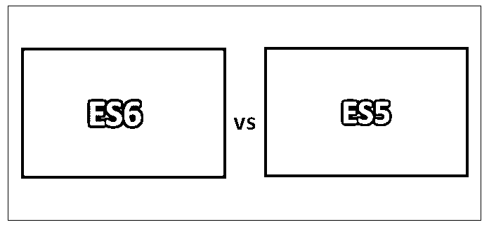
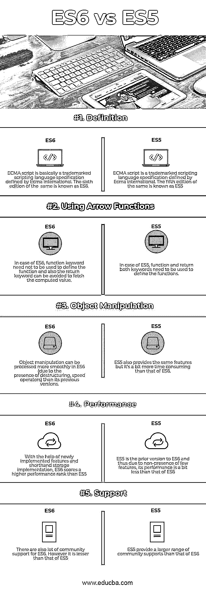

# ES6 vs ES5

> [https://www . educba . com/es 6-vs-es 5/](https://www.educba.com/es6-vs-es5/)

## ES6 与 ES5 的区别

ES6 vs ES5 是[软件开发行业](https://www.educba.com/software-development-vs-web-development/)中[两种重要的脚本语言](https://www.educba.com/programming-languages-vs-scripting-languages/)。ES5 和 ES6 在本质上有一些相似之处，但在同一时间点上，ES6 和 ES5 也有许多不同之处。在这里，我们将对 ES6 和 ES5 进行详细的讨论。

ES 的完整形式是 ECMA 脚本，它基本上是一种由 ECMA 国际定义的注册商标的脚本语言。这主要用于万维网上的客户端脚本。ECMA 剧本的第一版于 1997 年 6 月出版。

<small>网页开发、编程语言、软件测试&其他</small>

ECMA 脚本的第六个版本被称为 ES6(也被称为 ECMA 脚本 2015)。

### ES6 和 ES5 的特点

ES6 包括以下重要特性:

#### ES6 功能

1.  箭头:这些是由' = > '语法描述的函数
2.  对象:对象文字用于支持原型赋值。
3.  类:ES6 类可以很容易地在基于原型的面向对象模式上实现
4.  析构:它允许绑定模式，这主要是基于模式匹配。
5.  字符串插值
6.  默认
7.  传播
8.  模块加载器
9.  弱集
10.  地图
11.  新图书馆
12.  承诺
13.  委托书

ECMA 脚本的第五版被称为 ES5 和 ECMA 脚本 2009。ES5 包括以下重要特性:

#### ES5 特性

1.严格模式:它基本上通过应用更多的检查和清理一些现有的特性
2 来帮助 [javascript 语言](https://www.educba.com/javascript-interview-questions/)更有效地执行。访问器:它允许用户通过使用方法来实现属性的获取和设置。
3。语法变化:

*   尾随逗号
*   多行字符串文字
*   使用保留字的属性键

4.额外的特性:在案例 ES5 中引入了一些额外的新特性。

形容词（adjective 的缩写）元编程:不同的原型用于相同的

*   object.getprototypeof()物件
*   Object.create()
*   Object.defineProperty()
*   Object.keys()
*   Object.seal()
*   Object.freeze()等。

b.新方法:

*   String.prototype.trim()
*   Array.isArray()
*   Array.prototype.indexOf()
*   Array.prototype.map()

碳（carbon 的缩写）括号运算符
d. JSON 的用法:

*   JSON.parse()
*   JSON.stringify()

e.特定于 JSON 的内置对象:

*   Boolean.prototype.toJSON()
*   Number.prototype.toJSON()
*   String.prototype.toJSON()

### 利弊

就像硬币的两面，ES6 和 ES5 都有一些优点和缺点。

**ES6 优点:**

1.  在 ES6 实施的情况下，已经启用了尾部调用优化功能。
2.  在 ES6 的情况下，不需要使用 function 关键字来定义函数，也可以避免使用 return 关键字来获取计算出的值。
3.  使用这种语言实现脚本时，字符串模板和句柄插值可以更成熟地使用。
4.  这种脚本语言可以使用对象文字的速记语法。
5.  使用这个版本，核心代码可以用更清晰的语法方式来表示。

**ES6 缺点:**

1.  从支持和网络的角度来看，与 ES5 相比，它有所欠缺。
2.  从浏览器支持和运行时比较的角度来看，在承受重对象负载时，它有时会轻微抖动。
3.  它有时会对最佳和标准的编码实践造成一点混乱。
4.  与普通的 java 脚本相比，从学习的角度来看，这可能有点棘手。

**ES5 优点:**

1.  使用 ES5，用户将能够在字符串上实现属性访问数组[]特性
2.  保留字可以用作属性名。
3.  它支持并处理多行字符串文字的实现
4.  使用这个版本，核心代码可以用更清晰的语法方式来表示
5.  这个版本可以清楚地描述所有的功能及其相应的用法

**ES5 缺点:**

1.  ES6 中已经实现的新特性在 ES5 中并不存在。
2.  它有时会对最佳和标准的编码实践造成一点混乱。
3.  与普通的 java 脚本相比，从学习的角度来看，这可能有点棘手。

### ES6 和 ES5 的面对面比较(信息图)

以下是 ES6 和 ES5 的五大区别:

### ES6 与 ES5 的主要区别

ES6 vs ES5 都是市场上的热门选择；让我们讨论一下 ES6 和 ES5 之间的一些主要区别:

1.  Import 语句特性是这个新实现的 ECMA 脚本版本 6 的一部分，而 ES5 却不是这样。
2.  在 ES6 的情况下，异步函数和生成器可以用作新特性的一部分。
3.  从支持的角度来看，ES5 比 ES6 提供了更多的[支持。](https://www.educba.com/es6-interview-questions/)
4.  在 ES6 的情况下，“const”和“let”关键字可以用于不可变和块脚本对象，而这在 ES5 中不存在。

### ES6 和 ES5 对比表

ES6 和 ES5 之间的主要比较讨论如下:

| **ES6 与 ES5 的比较基础** | **ES6** | **ES5** |
| **定义** | ECMA 脚本基本上是由 Ecma 国际定义的注册商标的脚本语言规范。第六版同样被称为 ES6。 | ECMA 脚本是由 Ecma 国际定义的注册商标的脚本语言规范。第五版同样被称为 ES5。 |
| **使用箭头功能** | 在 ES6 的情况下，不需要使用 function 关键字来定义函数，也可以避免使用 return 关键字来获取计算值。 | 在 ES5 的例子中，function 和 return 这两个关键字都需要用来定义函数。 |
| **物体操纵** | 与之前的版本相比，ES6 可以更流畅地处理对象操作(由于析构和速度操作符的存在)。 | ES5 也提供了同样的特性，但是它比 ES6 更费时间。 |
| **性能** | 在新实现的特性和简化的存储实现的帮助下，ES6 比 ES5 获得了更高的性能排名。 | ES5 是 ES6 的早期版本，因此，由于缺少一些特性，它的性能比 ES6 稍差 |
| **支持** | ES6 也有很多社区支持。不过比 ES5 的小。 | ES5 比 ES6 提供了更大范围的社区支持 |

### 结论

在一系列因素上比较 ES5 和 ES6 之后，可以得出结论，这是两种主要的脚本语言，ES6 是它们之间较新的版本，但在同一时间点上，ES6 和 ES5 各有利弊。因此，基于项目需求的类型、工作时间和所有其他讨论的方面，应该选择 ES6 还是 ES5 来达到期望的目标。

### 推荐文章

这是 ES6 和 ES5 之间最大区别的指南。在这里，我们讨论了 ES6 和 ES5 的直接比较、主要差异、信息图和比较表。您也可以看看以下文章——

1.  [Typescript 与 ES6 的区别](https://www.educba.com/typescript-vs-es6/)
2.  [Jquery](https://www.educba.com/bootstrap-vs-jquery/) [vs 引导](https://www.educba.com/bootstrap-vs-jquery/)
3.  [Asp.net](https://www.educba.com/node-js-vs-asp-net/)[vs node . js——哪个更好](https://www.educba.com/node-js-vs-asp-net/)
4.  [c# vs Js–令人敬畏的对比](https://www.educba.com/c-sharp-vs-js/)
5.  [C#与 JavaScript:函数](https://www.educba.com/c-sharp-vs-javascript/)
6.  [Bootstrap 4 的优势备忘单](https://www.educba.com/bootstrap-4-cheat-sheet/)

