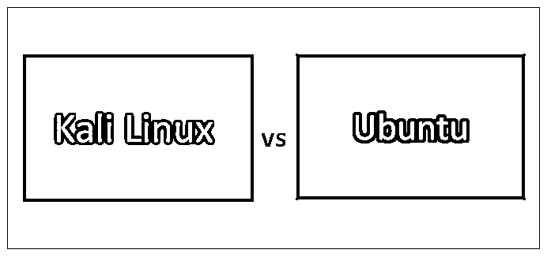

# Kali Linux vs Ubuntu

> 原文：<https://www.educba.com/kali-linux-vs-ubuntu/>

## Kali Linux 和 Ubuntu 的区别

Kali Linux 基本上是基于 Debian 的 Linux 发行版。它的主要动机是高级渗透测试和安全审计。这包括许多旨在保护和确保信息安全的工具。Ubuntu 是基于 Debian 的 Linux 发行版。这是一个开源发行版。Ubuntu 被认为是适合初学者的基于 Linux 的发行版，由 Canonical Ltd .赞助。这个操作系统的主要目标是个人电脑。但是，它也可以在服务器上使用。

### 人的本质

Ubuntu 的初级版本包括一个 GNOME 或 GNU 网络对象模型环境。GNOME 基本上是一个 GUI(图形用户界面)和一组 Linux 中的桌面应用程序。GNOME 让 Ubuntu 变得用户友好和高效。除了正规发行版之外，Ubuntu 还有很多变种。这些变体是 Ubuntu Server Edition，Edubuntu，用于家庭学校和教育机构 Ubuntu Studio，用于与多媒体相关的应用程序 Kubuntu，采用 Kool 桌面环境(KDE)；JeOS，基本上是 Ubuntu 的轻量级版本，用于虚拟应用程序；以及 Xubuntu，专门为处理能力有限的计算机系统设计。Ubuntu 基本上包含了学校、组织、企业或家庭所需的一切。Ubuntu Software Centre 已经预装了应用程序，如办公套装、电子邮件、浏览器、媒体应用程序和数千种其他游戏。Ubuntu 可以免费下载。

<small>网页开发、编程语言、软件测试&其他</small>

### Kali Linux

Kali Linux 于 2013 年 3 月 13 日发布，是 BackTrack Linux 的重建版。它是在 Debian 开发的完全标准下开发的。它包含大约 600 个[渗透测试工具](https://www.educba.com/penetration-testing-tools/)。Kali Linux 中删除了许多在回溯中不能正常工作的工具。Kali Linux 的主要功能是渗透测试[以及逆向工程](https://www.educba.com/reverse-engineering-tools/)和取证。Kali Linux 由进攻性安全公司开发、维护和资助。进攻性安全，为您的信息，是一个突出的信息安全培训公司。它处理信息安全。Kali Linux 是一个 Git 免费开源软件。

### Kali Linux 和 Ubuntu 的正面比较(信息图)

以下是 Kali Linux 与 Ubuntu 的 8 大区别

### Kali Linux 和 Ubuntu 的主要区别

两者都是市场上的热门选择；让我们讨论一些主要的区别:

*   Kali Linux 是一个专门的发行版，包含一些设计目的，包括渗透和取证测试。
*   Ubuntu 基本上是一个服务器和桌面发行版，也包含了很多用途。
*   Kali Linux 和 Ubuntu 有几个相似之处，因为它们都是基于 Debian 的。
*   Kali Linux 起源于直接基于 Ubuntu 的回溯。
*   同样，Kali Linux，Ubuntu 也是基于 Debian 的。
*   Kali Linux vs Ubuntu 的侧重点，从用途和特点来看，彼此都有很大的不同。
*   Kali Linux 和 Ubuntu 之间的主要区别是它们的目标受众受到 Kali Linux 和 Ubuntu 应用程序性质的影响。
*   Ubuntu 并不针对普通电脑用户以外的任何特定类型的受众。
*   另一方面，Kali Linux 是专门为信息安全目的而制定的。因此，它的大部分工作都与安全和渗透测试应用程序有关。
*   正如我们所知，Ubuntu 是为普通电脑用户设计的，它的界面更加友好，它的外观也不那么科技化。
*   Kali Linux 具有 600 多种预安装的渗透工具以及实时引导功能。
*   Kali Linux 堪称漏洞测试的理想平台。
*   Ubuntu 由文字处理器、游戏、图形程序、电子邮件、日历等工具组成。
*   Ubuntu 也有管理工具，如命令行 greats 和 bash。除此之外，它还包括用于系统维护、安全和网络服务的标准 Gnu 工具包。
*   Kali Linux 有一些限制，因为它的 GUI 在安全性方面受到限制。
*   Ubuntu 提供了包括 KDE 和 GNOME 在内的 GUI 界面选择。
*   如果你有很多命令行工作，Kali 可以很好地工作，因为它是一个窗口管理器，有很多屏幕类型的功能。
*   Kali Linux 更适用于安全专业人员工作站的安全服务器。

### Kali Linux vs Ubuntu 对比表

主要的比较讨论如下:

| ****的基础比较**** | **卡莉 Linux** | **Ubuntu** |
| **架构** | Linux 内核 | Ubuntu 架构 |
| **环境** | 土地神 | 一致 |
| **主要用途** | 渗透测试和道德黑客 Linux 发行版 | 提供用户友好的计算机使用。 |
| **移动支持** | 提供移动支持 | Ubuntu 可以成为 Android 的替代品。高端 Ubuntu 支持的智能手机可以替代 PC。 |
| **性质** | 与 Ubuntu 相比，不够用户友好 | 它的功能和特点使它适合于一般的计算机使用。 |
| **依赖注入** | 使用依赖注入 | 它使用依赖注入并允许修改 |
| **结构** | 基于 Debian | 基于 Debian 的开源软件 |
| **速度** | 额定速度 | 在某些平台上比 Kali Linux 慢 |

### 结论

它是由进攻性安全和马体 Aharoni 的进攻性安全通过一些变化的回溯，他们过去的信息安全测试 Linux 传输鉴于 Knoppix。核心工程师之一 raphal Hertzog 作为 Debian 专家和他们一起开发 Kali Linux。Kali Linux 可用于 HP Chromebook、BeagleBone Black、CubieBoard、CuBox、CuBox-I、EfikaMX、Odroid U2、Odroid XU、raspberry pi、Odroid XU3、Utility Pro、三星 Chromebook、SS808 和 Galaxy Note 10.1。Ubuntu 目前由 Canonical Ltd .支持。2005 年 7 月 8 日，马克·舒托沃尔斯和 Canonical 报告了 Ubuntu 基金会的成果，并提供了 1000 万美元的基础融资。

建立的动机是为了保证 Ubuntu 未来的每一次改编都能得到帮助和进步。邮票舒特尔沃斯描绘了建立目标，以保证 Ubuntu 企业的一致性。Ubuntu 将大多数软件划分为四个区域，以反映许可和可用支持水平的对比。自由软件包含了符合 Ubuntu 许可要求的软件，这些要求通常与 Debian 自由软件指南有关。特殊情况，尽管如此，在主要分类中包含固件，理由是尽管一些固件不允许被改变，它们的分散仍然是允许的。非自由软件一般不支持；然而，一些特殊的情况是强制性的非自由软件。受支持的非自由软件包含了可用于在某些硬件上运行 Ubuntu 的设备驱动程序，例如二进制图形卡驱动程序。

### 推荐文章

这是 Kali Linux 和 Ubuntu 之间主要区别的指南。在这里，我们还将讨论信息图和比较表的主要区别。你也可以看看下面的文章。

1.  [Linux 与 Mac——哪个更有用](https://www.educba.com/linux-vs-mac/)
2.  [Linux vs Solaris](https://www.educba.com/linux-vs-solaris/)
3.  [Linux 与 Ubuntu 的差异](https://www.educba.com/linux-vs-ubuntu/)
4.  [Linux vs Windows 10](https://www.educba.com/linux-vs-windows-10/)
5.  [Linux 与 Windows 服务器:差异](https://www.educba.com/linux-vs-windows-server/)
6.  [Linux vs BSD:好处](https://www.educba.com/linux-vs-bsd/)
7.  [Linux vs Android:好处](https://www.educba.com/linux-vs-android/)
8.  [iPhone 与 Android 的区别](https://www.educba.com/iphone-vs-android/)
9.  【Linux Mint 与 Ubuntu 的对比
10.  【Linux 与 BSD 的区别

