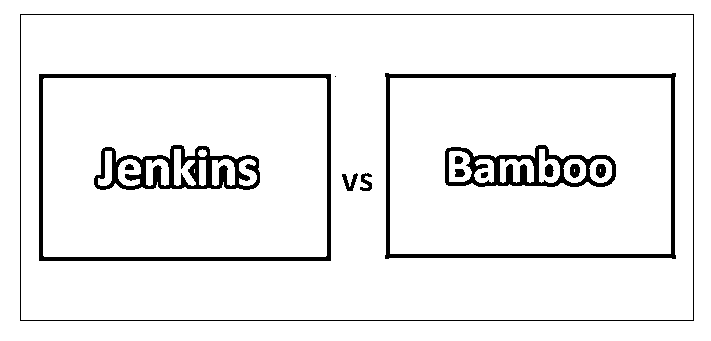

# 詹金斯 vs 竹子

> 原文：<https://www.educba.com/jenkins-vs-bamboo/>

## 詹金斯和竹子的区别

Bamboo 是来自 Atlassian 的 CI/CD 服务器。Bamboo 允许开发人员自动构建、集成并准备应用程序。Bamboo 与 Atlassian 的替代工具密切合作，如吉拉(项目管理)和 Hipchat(团队沟通)。Jenkins 是目前市场上最受欢迎的开放供应 CI/CD 工具。Jenkins 允许开发人员自动构建、集成和查看代码，就像他们提交给所提供的存储库一样。

### 竹子是什么？

竹子是强大的，只要你用比特斗和 JIRA 开发它，并愿意得到你的 CI 答案。此外，Bamboo 简单易用，用户可以在更短的时间内添加多个任务。希望有更简单的准备能力并愿意使用简单的 UI 的开发人员应该尝试一下。主要根据你的需求选择最简单的。

<small>网页开发、编程语言、软件测试&其他</small>

**竹子特性:**

简单直观的拖放式 UI，用于规划管道，支持持续任务、工作和连续交付的阶段原则。扇出/向内是微不足道的。

*   暂时禁用阶段、作业或任务是微不足道的。工作将在阶段之间被丢弃，阶段和任务将被丢弃以重新排序，如果你即将要做的事情没有完成，则会弹出警告。
*   尽管不像 GoCD 那样巧妙，但是也可以将管道连接起来；但是，我不得不承认这通常是竹子的弱点之一。
*   一个独立的准备管理器，在其中你可以简单地管理准备环境，跟踪你已经释放了什么，在哪里，以及从释放到 rotter 提交的完全可追溯性，因此包括 JIRA 问题。
*   自动检测新分支并构建它们。在分支构建中，常量管道以其他方式运行也是可行的(尽管是通过一个非常便宜的插件)。
*   构建工件通过每一次管道运行和部署被自动管理；没有人必须被迫在相关的外部存储库中存放工件。
*   正如你所料，与其他 Atlassian 产品的整合远远优于你将炮制的其他组合。

### 詹金斯是什么？

最初开发它是为了成为一个构建自动化工具，后来它发展成为一个多方面的平台，拥有超过 1400 个用于替代软件系统工具的插件。这些插件将 Jenkins 扩展到 5 个领域:平台、UI 管理、ASCII 文本文件管理和构建管理。这使得开发人员能够快速捕捉错误，并最终更快地部署大量。

**詹金斯特征:**

*   流行的开放供应，直接获得插件。(例如，Jenkins 有一个 test swarm [插件，我需要编写我自己的明确的制造脚本安排，试图在 bamboo 中同样轻量级地处理插件不存在的事实)](https://www.educba.com/jenkins-plugins/)
*   很容易得到完全不同的买家，并找到詹金斯的援助。
*   免费且易于安装
*   不进行程序化拉伸/组合

### Jenkins 和 Bamboo 之间的正面比较(信息图)

下面是詹金斯和竹子之间的 7 大区别

### Jenkins 和 Bamboo 的主要区别

两者都是市场上的热门选择；让我们讨论一些主要差异:

*   Jenkins 是一个由世界各地的开发人员支持的联合开放供应项目。而竹子是由它们的母公司开发和维护的工业工具
*   竹子是可比较的，而且用途简单；然而，用户界面并不漂亮。詹金斯瀑布想要竹子在这堂课。詹金斯的 UI 可能是一个非常小的额外的老学校；然而，新的蓝海界面是一次重大升级。
*   竹子的开箱选项较少；然而，它与 Atlassian 的工具堆栈的剩余部分进行了本机集成。这让 Bamboo 感觉到了额外的功能——富有，而不拥有期权本身。Jenkins 是 3 个工具中功能最少的；然而，它弥补了一个巨大的插件方案。
*   Jenkins 包含了一个大的插件方案，给了它无与伦比的定制和可扩展性。竹子正在慢慢发展它的生态系统；然而，以这种速度，它很可能永远也追不上。
*   作为一个相关的开放供应项目，Jenkins 包含了一个巨大的、有用的贡献者社区，他们互相提供支持。因此，詹金斯有大量的文件；然而，你不得不自己去梳理文件，找出或解决一个延缓剂。另一方面，Bamboo 提供了来自母公司的技术支持，同时用户群也在不断增长。Bamboo 用户可以注意到来自公司的积极支持和来自社区的众包支持的愉快结合。
*   许多中小型软件系统组只在云基础设施上运行。因此，一旦 Atlassian 停止使用 Bamboo cloud，一些 Bamboo 用户就很难在内部运行它。他们用比特桶管道取代了这项服务；然而，一些人认为这不是一个理想的替代品。Jenkins 继续在云服务器上运行。
*   作为一个开放的供应软件系统，詹金斯是完全没有参与使用，尽管你的规模。竹子是最昂贵的工具。起价仅为 10 美元；然而，它为这种价值提供了特别有限的专业知识。您必须以 880 美元的一次性价格为一个远程代理授权 Bamboo 的全部专业知识。

### 詹金斯 vs 竹子对比表

主要比较讨论如下:

| **比较的基础** | 詹金斯 | **竹子** |
| **开源** | Jenkin 是开源的 | 竹子不是开源的 |
| **定价逻辑** | 詹金斯自由了 | 它根据所需的构建代理数量收费 |
| **用**建造 | Java 编程语言 | Java 编程语言 |
| **操作系统** | Windows、Ubuntu、Red Hat、Mac OS | Windows、Linux、Solaris |
| **浏览器** | Chrome，Firefox，Internet Explorer | 火狐、Chrome、Safari、Edge |
| **插件支持** | 是的，它支持很多插件 | 与 Jenkins 相比，它不支持很多插件 |
| **支持** | 作为开源软件，它得到了社区的大力支持 | 与詹金斯相比，它没有得到多少支持 |

### 结论

很明显，这场对决的赢家可能很难预料。为了确定正确的 CI/CD 工具，您需要严格考虑您的预算；你是内部资源，因此，你希望在学习和设置上花费的时间量。如果你有 DIY 的角度，需要最实用的，那么 Jenkins 可能就是你的工具。如果您喜欢更好的用户专业知识和与您现有的学校堆栈集成在一起的工具，那么看看 Bamboo。

请记住，您的 CI/CD 工具只是赢得软件系统开发竞赛所需的工具之一。准备和应用观察同样是敏捷开发的必要组成部分。永远不要接受你拥有的方法；不断探索策略来提升你的技术和实践。

### 推荐文章

这是詹金斯和竹子之间最大差异的指南。在这里，我们还讨论了 Jenkins 与 Bamboo 的关键差异，并提供了信息图表和比较表。您也可以看看以下文章，了解更多信息–

1.  [WordPress vs Tumblr 上的惊人指南](https://www.educba.com/wordpress-vs-tumblr/)
2.  [树莓 Pi 3 vs 比格犬骨黑](https://www.educba.com/raspberry-pi-3-vs-beaglebone-black/)
3.  [Node JS vs Ruby on Rails](https://www.educba.com/node-js-vs-ruby-on-rails/)
4.  [PHP vs JavaScript](https://www.educba.com/php-vs-javascript/)

