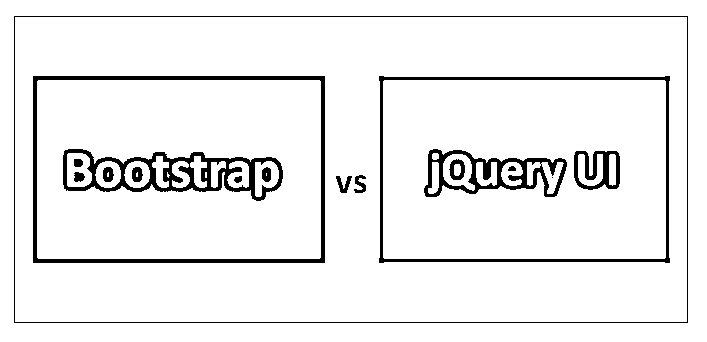

# 引导程序与 jQuery UI

> 原文：<https://www.educba.com/bootstrap-vs-jquery-ui/>

## Bootstrap 与 jQuery UI 的区别

Bootstrap 是一个开源框架，用于设计网站和 web 应用程序的前端。它使用 HTML、CSS 和 JavaScript。 [Bootstrap 是一个圆滑而强大的](https://www.educba.com/what-is-bootstrap/)移动前端框架，用于更快更简单的[web 开发](https://www.educba.com/web-development-software/)。还有许多其他的 web 框架，但是 Bootstrap 只关注前端开发。

jQuery 是一个 JavaScript 库，旨在简化 HTML 的客户端脚本。它是由 John Resig 在 2006 年创建的一个快速而简洁的库。jQuery 是开源的，免费提供，只有一个口号——写得更少，做得更多。它是最广泛使用和[部署的用于前端目的的 JavaScript 库](https://www.educba.com/javascript-interview-questions/)之一。它本质上支持多种浏览器和跨平台。

<small>网页开发、编程语言、软件测试&其他</small>

Bootstrap 是 Github 上排名第二的项目。它包含基于 HTML 和 CSS 的设计模板[，用于各种界面组件，如按钮、导航、表单等。它于 2011 年 8 月作为开源产品在 Github 上发布。马克·奥托和雅各布·桑顿在 Twitter 上开发了 bootstrap。使用自举有多种原因。它由贯穿整个库的移动优先样式组成。任何人只要有 HTML 和 CSS 的知识就可以开始使用 Bootstrap。它的官方网站也提供了很好的文档。](https://www.educba.com/html-vs-css/)

jQuery 简化了前端的脚本编写过程。它简化了 HTML 文档遍历、事件处理和动画。它还帮助 Ajax 调用快速应用程序开发。jQuery 特性集，包括 DOM 元素选择、遍历和操作，由选择器的引擎支持，创建了一种编程风格，将算法和 DOM 相关的数据结构结合在一起。jQuery 库遵循一种模块化的方法，允许创建动态网页，从而创建 web 应用程序。

Bootstrap 的响应式 CSS 同样适用于平板电脑、台式机和手机等各种设备。有多个响应式实用程序可用于此响应式支持。它提供了网格系统的基本结构、链接样式和背景。它还提供了一个全局 CSS 设置的特性，用可扩展类设计和增强的基本 HTML 元素，以及一个高级的网格系统。 [Bootstrap 提供了多个可重用的组件](https://www.educba.com/bootstrap-commands/),这些组件用于提供下拉菜单、导航、提醒、弹出窗口和更多 UI 功能。开发人员也可以定制这些组件以获得他们自己的版本。

jQuery 基本上是一个 DOM 操作库，因为它简化了查找、选择和操作 DOM 元素的过程。使用 jQuery 库，可以更容易、更快地定位 DOM 元素。文档中的元素可以通过改变它的一个属性或使它响应一个事件来找到它的某个属性。jQuery 还有助于事件处理，这超出了基本 DOM 元素选择和操作。事件分配和回调函数是在代码中的特定位置一步定义的。其他经常使用的 JavaScript 函数，比如淡入淡出，也包含在 jQuery 库中。可以很容易地添加新的事件、元素和方法，然后作为 jQuery 库的插件重用。这是在消除跨浏览器兼容性的同时完成的。

### Bootstrap 和 jQuery UI 之间的直接比较(信息图表)

下面是 Bootstrap 和 jQuery UI 之间的 8 大区别:

### Bootstrap 和 jQuery UI 之间的主要区别

Bootstrap vs jQuery UI 都是市场上的热门选择；让我们讨论一下 Bootstrap 和 jQuery UI 之间的一些主要区别:

*   Bootstrap 由 Twitter 中的 Bootstrap 核心团队设计和创建，而 jQuery 团队开发 jQuery。
*   Bootstrap 是用 HTML、 [CSS 和 JavaScript](https://www.educba.com/css-vs-javascript/) 编写的库，而 jQuery 是用 JavaScript 编写的。
*   Bootstrap 旨在关注网站的外观，而 jQuery 旨在通过减少冗长来简化 JavaScript 调用过程。
*   Bootstrap 以 [jQuery 插件](https://www.educba.com/jquery-plugins/)的形式提供了几个 JavaScript 组件，而 jQuery 提供了一个各种预写函数库。
*   Bootstrap 以开发 responsive 而闻名，这是 web 上的移动优先项目，而 jQuery 有自己的 UI 对应物，称为 jQuery mobile。
*   Bootstrap 有了一些大的更新，增加了一些很棒的新特性，而 jQuery 的更新频率比 Bootstrap 低。
*   Bootstrap 使用 [Bootstrap 网格系统](https://www.educba.com/bootstrap-interview-questions/)进行自由布局，而 jQuery UI 没有网格系统。
*   Bootstrap 具有很好的兼容性，并专注于响应式设计，而 jQuery 出现在响应式成为一个大词之前，因此与 Bootstrap 相比，jQuery UI 对它的支持较少。
*   Bootstrap 是基于 CSS3 的，在新的浏览器中看起来很棒，而 jQuery 及其 UI 组件功能看起来可能不如 Bootstrap 那么棒；它在旧浏览器中提供了一个更干净的回退。
*   Bootstrap 看起来非常专业，即使是它的基本模板也是如此，而与 Bootstrap 相比，jQuery UI 看起来陈旧过时。

### 引导和 jQuery UI 对照表

下面讨论 Bootstrap 和 jQuery UI 之间的主要比较:

| 【Bootstrap 与 jQuery UI 的比较基础 | **自举** | jquery ui |
| **开发** | 由 Twitter 开发 | 由 jQuery 项目组开发 |
| **功能** | 注重设计和外观 | 提供预先编写的函数来增强功能 |
| **目的** | 主要是一个 CSS 框架 | 让 JavaScript 更容易使用 |
| **市场** | Bootstrap 在市场份额上仍然落后于 jQuery | jQuery 在网络领域领先，拥有顶级网站 |
| **定制** | 可以通过覆盖默认 CSS 以多种方式对其进行定制 | 可以覆盖现有功能以提供新功能 |
| **方位** | 高度面向响应 | jQuery 的响应特性没有 Bootstrap 复杂 |
| **写入** | 用 HTML，CSS，JavaScript，Less， [Sass](https://www.educba.com/sass-interview-questions/) 编写 | 使用 JavaScript 编写 |
| **发布** | 于 2011 年 8 月 26 日首次发布， |

### 结论

Bootstrap 是一个[伟大的通用 CSS 库](https://www.educba.com/flexbox-properties/)，而 jQuery 专注于简洁形式的普通 JavaScript 函数。jQuery UI 和 Bootstrap 都有各自的优缺点。作为进入[网站设计世界](https://www.educba.com/website-design-layout/)的后来者，Bootstrap 不断更新，带来实质性的变化。作为一匹老马相比 [Bootstrap 更稳定](https://www.educba.com/install-bootstrap/)，重大变化不会伴随发布。最后，重要的是对前端的要求。响应式页面是网络世界的流行语，是 web 应用前端的主要方面。Bootstrap 对响应性的强大支持使它成为编写页面 CSS 的有力竞争者。jQuery 及其 UI 和移动函数库也是一个很好的选择，因为页面概念与服务器端技术集成得非常好。

这完全取决于设计或前端布局要求。Bootstrap 可以为您提供一种内聚的 CSS 方法，而通用 jQuery 库更适合 JavaScript 函数调用。开发人员的技能与前端布局和功能相结合，将决定其中一个或两个的使用。

### 推荐文章

这是引导程序和 jQuery UI 之间主要差异的指南。我们已经讨论了 Bootstrap 与 jQuery UI 的直接比较、键差异以及信息图和比较表。您也可以看看下面的 jQuery UI vs Bootstrap 文章来了解更多信息

1.  [角度 vs 敲除哪个有用](https://www.educba.com/angular-vs-knockout/)
2.  [Angular vs Bootstrap 想了解优势](https://www.educba.com/angular-vs-bootstrap/)
3.  [Angular vs JQuery](https://www.educba.com/angular-vs-jquery/)
4.  [Bootstrap](https://www.educba.com/angular-vs-bootstrap/)[vs Angular](https://www.educba.com/angular-vs-bootstrap/)
5.  [JavaScript vs JQuery](https://www.educba.com/javascript-vs-jquery/)
6.  [Bootstrap vs WordPress](https://www.educba.com/bootstrap-vs-wordpress/)
7.  [MongoDB vs PostgreSQL:有什么好处](https://www.educba.com/mongodb-vs-postgresql/)
8.  [MongoDB vs Hadoop:好处](https://www.educba.com/hadoop-vs-mongodb/)
9.  [MongoDB vs Postgres:好处](https://www.educba.com/mongodb-vs-postgres/)
10.  [MongoDB vs Oracle:有什么特点](https://www.educba.com/mongodb-vs-oracle/)
11.  [MongoDB vs DynamoDB:有哪些功能](https://www.educba.com/mongodb-vs-dynamodb/)
12.  [MongoDB vs SQL:哪个最好](https://www.educba.com/mongodb-vs-sql/)
13.  [Bootstrap 4 备忘单最佳指南](https://www.educba.com/bootstrap-4-cheat-sheet/)

