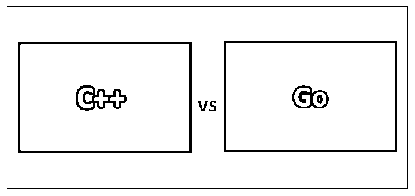

# c++ vs . Go

> 原文：<https://www.educba.com/c-plus-plus-vs-go/>

## C++和 Go 的区别

C++是一种面向对象的通用编程语言。它主要用于系统编程、嵌入式编程和非常复杂的系统。它已经是继 Java 之后第三个最常用的编程语言，C. GO 是一种编程语言。它具有静态的、强的和结构型的学科。Go 编程语言是开源的。它支持多种跨平台操作系统，如 Windows、Linux、Macintosh OS 等。

### C++

它是程序性的、多范例的、功能性的，于 1985 年首次出现。它由比雅尼·斯特劳斯特鲁普设计，在贝尔实验室开始研发。文件扩展名类似于。c，。抄送，。cpp，。c++、。h，。hh，。hpp 等。C++由 ISO(国际标准化组织)标准化，最新版本于 2017 年发布。C++影响了许多编程语言，如 Java、C#。

<small>网页开发、编程语言、软件测试&其他</small>

### 走

GO 是谷歌在 2009 年创造的一种编程语言。它是由罗布·派克、肯·汤普森和罗伯特·格里斯默设计和开发的。Go 编程语言是开源的，并获得了 BSD 许可。像 C++和 Java 一样，Go 支持大型系统的静态类型和可伸缩性。C 语言传统上启发了它。它在语法和编程特性方面具有简单性和安全性。

### C++和 Go 的正面比较(信息图表)

下面是 C++和 Go 的 9 大区别

### C++和 Go 的主要区别

两者都是市场上的热门选择；让我们讨论一些主要的区别:

*   C++是一种中级语言，运行在各种跨平台操作系统上，如 Windows、UNIX、Macintosh OS 等。而 Go 编程语言通常被称为 Golang，具有过程化、面向对象、并发和多范式等特点。
*   C++支持数据隐藏、封装、继承和多态，也有主要的核心组件，如[标准模板库 C++](https://www.educba.com/c-plus-plus-standard-template-library/) 标准模板库(STL)，而 Go 支持环境支持特性，如动态语言。
*   C++支持具有 ANSI(美国国家标准协会)标准的可移植性，这是主要的 C++ IDE 制造商所支持的，而 Go 具有不同的数据类型，如 Boolean、String、Numeric、Derived 等。
*   C++支持不同的操作符，比如算术操作符、逻辑操作符、位操作符、关系操作符、赋值操作符和其他操作符，而 Go 支持 C++中存在的所有操作符。
*   C++支持文件和流、异常处理、动态内存、名称空间、模板、预处理器和多线程等。，而 Go 支持通道和轻量级流程的内置并发特性。
*   C++具有命名空间、引用、模板、隐式方法重载等特性，而 Go 具有不同的特性，如指针、结构、切片、范围、映射、递归、函数、接口、类型嵌入和错误处理以及快速编译过程。
*   在 C++中，调用方法将在编译时决定，而在 Objective C 中，调用方法将在运行时决定，而 Go 具有一些有益的特性，如运算符重载(间接且不支持)、类型继承、断言、泛型编程、跨不同包的循环依赖和指针算法。
*   在 C++中，对象是空的，并且不能在所有使用解引用的情况下被安全地处理；那么将抛出运行时错误，而 Go 编程语言具有错误处理功能，例如通过实现类型检查和错误结构来处理简化的重复错误，以避免运行时出现错误。
*   在 C++中，运算符重载是受支持的，并且更加可移植和简单，而 Go 编程语言不支持运算符重载，因为它会增加复杂性，同样的情况可以通过使用指针接收器在结构上实现以避免复杂性。
*   在 C++中，内存是在运行时在对象堆上分配的，而 Go 编程语言在堆、堆栈和数据段上分配内存，并且还使用垃圾收集来提高程序或应用程序的性能。
*   在 C++中，类对象是正常声明的。它们类似于一般的面向对象编程语言。相比之下，Go 使用结构类型而不是类来创建和管理对象中的数据，并使用访问修饰符来控制对对象及其属性的访问。
*   在 C++中，标准库包含两个部分，即标准函数库和面向对象的类库，而 Go 没有任何类似对象的特性，但它只检查被定义为“struct”的结构的数据类型。

### C++与 Go 对照表

主要比较如下所述:

| **比较的基础** | **C++** | **出发** |
| **设计** | 它被设计成面向对象和过程化的 | 它是由具有简单特性的 C 编程语言设计和影响的。 |
| **继承** | 它允许多重继承 | 它不允许多重继承，因为它不支持基于类的声明。 |
| **优化** | 它在编译过程中提供了 SIMD 优化 | 它不在其编译器中提供优化 |
| **类** | struts 和类在 c++中是一样的 | Go 不支持基于类的声明，而是有接口来支持对象。 |
| **执照** | 这是开源项目 2.0 | 它是根据 BSD 许可证授权的 |
| **类型** | 它是静态类型 | 它是一门静态的、强有力的打字学科 |
| **多态性** | 编译时检查 C++中的参数多态性 | 多态性在 Go 编程语言中并不存在 |
| **布尔运算符** | C++使用 true、false 和 bool | Go 有逻辑运算符，而不是布尔运算符 |
| **模板** | C++有 STL(标准模板库)库 | Go 没有模板库 |

### 结论

C++是一种编程语言，目前主要用于硬件编程和嵌入式设备，也用于大多数可以开发大型软件系统的系统编程。Go 主要用于大型软件系统的开发，尤其是在谷歌内部，以开发和维护内部项目，而 C++是开源的，可用于大多数硬件和嵌入式应用程序，但在使用编程功能和被管理的数据方面缺乏安全性。

微软的大多数桌面应用程序开发和大多数现代应用程序都使用 C++。Objective C 用于开发 Swift 应用程序。Go 编程语言可以用来编写代码，维护基础设施和平台级的工具和应用。我希望现在你已经对 C++和 Go 有了一个更公平的概念。请继续关注我们的博客，获取更多类似的文章。

### 推荐文章

这是 C++和 Go 之间最大差异的指南。在这里，我们还将讨论信息图和比较表的主要区别。您也可以看看以下文章，了解更多信息–

1.  [C 与 c++–哪个更有用](https://www.educba.com/c-vs-c-plus-plus/)
2.  [Node.js vs Go](https://www.educba.com/node-js-vs-go/)
3.  [C++与 Java 的最大区别](https://www.educba.com/c-plus-plus-vs-java/)
4.  [围棋](https://www.educba.com/python-vs-go/) [vs Python](https://www.educba.com/python-vs-go/)
5.  [C 与 C++性能对比:惊人指南](https://www.educba.com/c-vs-c-plus-plus-performance/)
6.  [C++ vs Objective C:区别](https://www.educba.com/c-plus-plus-vs-objective-c/)
7.  [Node.js vs PHP 性能:好处](https://www.educba.com/node-js-vs-php-performance/)
8.  [C++向量 vs 数组:有哪些函数](https://www.educba.com/c-plus-plus-vector-vs-array/)
9.  [C++ vs Visual C++:主要特点是什么](https://www.educba.com/c-plus-plus-vs-visual-c-plus-plus/)
10.  [C vs C#:有哪些令人惊艳的功能](https://www.educba.com/c-vs-c-sharp/)

