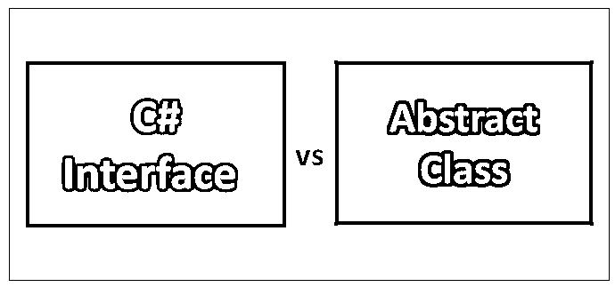

# C#接口与抽象类

> 原文：<https://www.educba.com/c-sharp-interface-vs-abstract-class/>

## C#接口和抽象类的区别

C#是一种面向对象的编程语言。Net 框架开发桌面应用程序和 web 应用程序。它是由微软为公共语言基础设施开发和设计的。它于 2000 年首次发布。在 C#中，抽象用于隐藏不必要的细节。这意味着它将关注对象能做什么，而不是它如何工作。它用于大型复杂的程序。抽象类 vs 接口 C#用来实现这一点。在抽象类中，我们可以创建需要由派生类实现的功能。接口允许我们定义功能，但不能实现它。派生类扩展了接口并实现了那些功能。

C#语言的开发理念是使编程变得简单、现代、通用。它还支持软件工程原则，如强类型、动态检查和垃圾收集。此外，C#语言具有强大的功能，如可移植性、类型化、元编程、方法和函数、属性、内存访问、多态性、LINQ 和函数式编程。

<small>网页开发、编程语言、软件测试&其他</small>

C#有一个通用的类型系统，分为两部分:引用类型和值类型。在 C#中，装箱用于将值类型对象转换为相应引用类型的值。装箱在 C#中是隐式的。取消装箱是指将引用类型对象的值转换为值类型的值。C#需要显式类型转换来取消装箱。

C#完全支持面向对象的概念，即封装、抽象、继承和多态。在 C#中，类被定义为程序和字段的结构。一个类主要由三部分组成，即名称、属性和操作。对象被称为类的实例，这有助于访问类的方法和字段。

在 C#中，封装是指将成员函数和数据成员绑定到一个类中。该类将其功能的一组方法、属性和特性封装到其他类中。在 C#中，可以使用方法重载和方法重写来实现多态性。它也被称为静态多态性(编译时)和动态多态性(运行时)。继承也用于由派生类继承基类成员。

### C#接口和抽象类的直接比较(信息图表)

下面是 C#接口和抽象类的 6 大区别。

### C#接口和抽象类的主要区别

两者都是市场上的热门选择；让我们讨论一些主要的区别:

*   在 C#中，一个类继承一个或多个接口。但是一个类只能继承一个抽象类。
*   在 C#中，接口不能有构造函数声明。抽象类可以有一个构造函数声明。
*   在 C#中，接口用于定义类的外部能力。抽象类用于定义一个类的实际身份，它被用作对象或同一类型。
*   在 C#中，如果各种实现只共享方法签名，则使用接口。一个抽象类被用在不同的实现中，它们是同类的，并且使用相同的行为或状态。
*   在 C#中，如果一个新方法被添加到接口中，我们需要跟踪所有接口是在哪里实现的，并添加那个方法。在抽象类中，如果添加了新方法，我们可以添加默认实现，因此所有现有代码都可以正常工作。

### C#接口与抽象类对照表

主要比较如下所述:

| **比较的基础** | **C#接口** | **C#抽象类** |
| **访问说明符** | 在 C#中，接口不能有函数的访问说明符。默认情况下，它是公共的。 | 在 C#中，抽象类可以访问函数的说明符。 |
| **实施** | 在 C#中，一个接口只能有一个签名，而不能有实现。 | 抽象类可以提供完整的实现。 |
| **速度** | 界面比较慢。 | 抽象类很快。 |
| **实例化** | 该接口是绝对抽象的，不能实例化。 | 抽象类不能被实例化。 |
| **字段** | 接口不能有字段。 | 抽象类可以定义字段和常量。 |
| **方法** | 该接口只有抽象方法。 | 抽象类可以有非抽象方法。 |

### 结论

在 C#中，抽象类 vs 接口 C#已经被用于数据抽象。当多个类需要实现接口时，接口比抽象类更好。接口的成员不能是静态的。抽象类的唯一完整成员可以是静态的。

C#不支持多重继承；接口主要用于实现多重继承。因为一个类可以实现多个接口，并且只能从一个抽象类继承。接口主要是在我们不需要实现方法或功能的时候使用。当[要求](https://www.educba.com/require-vs-import/)至少有一个默认实现时，就会用到抽象类。

这两个 C#接口和抽象类都是伟大的面向对象编程概念，在根据需求开发应用程序时被高度使用。这完全是由技术领导和业务需求共同选择的。在任何编程语言中，这两者都易于使用和学习。

### 推荐文章

这是 C#接口和抽象类之间主要区别的指南。在这里，我们还将讨论信息图和比较表的主要区别。您也可以看看以下文章，了解更多信息–

1.  [C#](https://www.educba.com/python-vs-c-sharp/) [vs Python](https://www.educba.com/python-vs-c-sharp/)
2.  [ASP.NET vs c#](https://www.educba.com/asp-net-vs-c-sharp/)
3.  [Java 接口 vs 抽象类](https://www.educba.com/java-interface-vs-abstract-class/)
4.  [Java vs C#](https://www.educba.com/java-vs-c-sharp/)
5.  [c#中的方法重载](https://www.educba.com/method-overloading-in-c-sharp/)
6.  [c#中的重载和重写](https://www.educba.com/overloading-and-overriding-in-c/)
7.  [C#接口|示例](https://www.educba.com/c-sharp-interface/)

