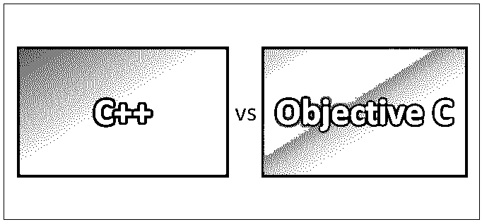

# C++与 Objective C

> 原文：<https://www.educba.com/c-plus-plus-vs-objective-c/>

## C++和 Objective C 的区别

C++是一种面向对象的通用编程语言。它主要用于系统编程、嵌入式编程和非常复杂的系统。文件扩展名类似于。c，。抄送，。cpp，。c++、。h，。hh，。hpp 等。C++影响了许多编程语言，如 Java、C#。它是仅次于 Java 和 C 的第三种最常用的编程语言。objective 也是一种面向对象的通用编程语言，加上 C 编程语言的闲聊式消息传递。它是静态和动态类型的编程语言。

### C++

它是程序性的、多范例的、功能性的，于 1985 年首次出现。它由比雅尼·斯特劳斯特鲁普设计，并在贝尔实验室开始开发。C++由 ISO(国际标准化组织)标准化，最新版本于 2017 年发布。C++具有命名空间、引用、模板、隐式方法重载等特性

<small>网页开发、编程语言、软件测试&其他</small>

### 目标 C

它是反射式的，基于类的，由 Brad Cox 和 Tom Love 在一家名为 Stepstone 的公司设计，于 1984 年首次出现。它支持跨平台应用程序，并且受到了 Small talk 和 C 编程语言的影响。Objective C 是 C 编程语言的超集。文件扩展名通常包括。m 或者。h，取决于它是程序文件还是头文件。

### C++和 Objective C 的直接比较(信息图表)

下面是 C++和 Objective C 的 9 大区别

### C++和 Objective C 的主要区别

两者都是市场上的热门选择；让我们讨论一些主要差异:

1.  C++是一种中级语言，运行在各种跨平台操作系统上，如 Windows、UNIX、Macintosh OS 等。，而 Objective C 是一种通用的、面向对象的编程语言，苹果公司在其操作系统和 APIs Cocoa 等中使用。
2.  C++支持数据隐藏、封装、继承和多态，还拥有主要的核心组件，如标准模板库(STL ),而 Objective C++除了 STL 之外，还支持与 c++相同的功能，并包括基础框架。
3.  C++支持具有 ANSI(美国国家标准协会)标准的可移植性，这是主要的 C++ IDE 制造商所支持的，而 Objective C 具有不同的数据类型、用于识别标识符的标记、声明和赋值以及用于定义常数的预处理器。
4.  C++支持不同的操作符，如算术操作符、逻辑操作符、位操作符、关系操作符、赋值操作符和其他操作符，Objective C 还支持不属于编译过程的相同操作符和预处理程序。
5.  C++支持文件和流、异常处理、动态内存、名称空间、模板、预处理器和多线程等。，而 Objective C 支持造型、扩展、动态绑定、协议、复合对象、内存管理和枚举。
6.  C++具有命名空间、引用、模板、隐式方法重载等特性，而 Objective C 允许动态调度、自动生成访问器来访问成员变量和属性，并允许方法和名称共享相同的标识符。
7.  在 C++中，调用一个方法将在编译时决定，而在 Objective C 中，调用一个方法将在运行时决定，Objective C 还有一些特殊的特性，比如添加或替换已经存在的类上的方法。
8.  在 C++中，对象是空的，并且不能在所有使用解引用的情况下被安全地处理；那么将抛出一个运行时错误，而 Objective C 有 nil，可以通过安全地向 nil 对象发送消息来安全地处理它。
9.  在 C++中，运算符重载是受支持的，并且更加可移植和简单，而 Objective C 不支持默认参数，但是可以通过多个方法操作来实现，并且也不支持私有成员。
10.  在 C++中，内存是在运行时在对象堆中分配的，而 Objective C 不支持基于堆栈的内存对象，在 Objective C 中分配内存是非常昂贵的，它在编写成功的程序以交付高效的应用程序中起着关键作用。
11.  在 C++中，类对象是正常声明的。它们类似于一般的面向对象编程语言。相比之下，Objective C 具有一个复合对象特性，在一个对象中嵌入了一个对象，这意味着一个私有的集群对象将被嵌入到主对象和一些原语方法中。
12.  在 C++中，标准库包含两部分，即标准函数库和面向对象类库，而 Objective C 具有快速枚举功能，集合是该功能的核心组件。

### C++与 Objective C 比较表

下面是最上面的比较:

| **比较的基础** | **C++** | **目标 C** |
| 设计 | 它被设计成面向对象和过程化的 | 它被设计成面向对象的，并具有 Smalltalk 消息传递功能。 |
| 遗产 | 它允许多重继承 | 它不允许多重继承 |
| 范例 | 它使用方法来调用实现的功能 | 它使用消息来调用实现的功能，因为它是基于 Smalltalk 消息实现的 |
| 班 | struts 和类在 c++中是一样的 | struts 和类被视为 |
| 许可证 | 这是开源项目 2.0 | 它是根据 GPL(通用公共许可证)授权的 |
| 类型 | 它是静态类型 | 它是动态类型 |
| 多态性 | 编译时检查 C++中的参数多态性 | Objective C 中的参数多态性是在编译时检查的 |
| 布尔运算符 | C++使用 true、false 和 bool | C++使用 YES，NO 和 BOOL |
| 模板 | C++有 STL(标准模板库)库 | 目标 C 缺少模板库 |

### 结论

C++是一种编程语言，目前主要用于硬件编程和嵌入式设备，也用于大多数可以开发大型软件系统的系统编程。Objective C 主要用于苹果产品如 Mac 或 iPhone 的操作系统如 OS X 和 iOS 的开发。Objective C 主要用于 Apple 操作系统，并仅限于 Apple 产品开发，而 C++是开源的，可用于大多数硬件和嵌入式应用程序，但在使用编程功能和被管理的数据方面缺乏安全性。它正被微软用于大多数桌面应用程序开发和大多数现代应用程序。Objective C 用于开发 Swift 应用程序。

### 推荐文章

这是 C++和 Objective C 之间的主要区别的指南。在这里，我们还讨论了信息图和比较表的主要区别。您也可以看看以下文章——

1.  [C 与 C++性能对比](https://www.educba.com/c-vs-c-plus-plus-performance/)
2.  [C#接口 vs 抽象类](https://www.educba.com/c-sharp-interface-vs-abstract-class/)
3.  [C++ vs Java](https://www.educba.com/c-plus-plus-vs-java/)
4.  [ASP.NET vs . NET](https://www.educba.com/asp-dot-net-vs-dot-net/)
5.  [C++向量 vs 数组:有什么特点](https://www.educba.com/c-plus-plus-vector-vs-array/)
6.  [C++向量与数组:差异](https://www.educba.com/c-plus-plus-vector-vs-array/)
7.  [C 与 C#:函数](https://www.educba.com/c-vs-c-sharp/)
8.  [Java 对象综合指南](https://www.educba.com/object-in-java/)
9.  [Python 中对象的完整指南及示例](https://www.educba.com/object-in-python/)

