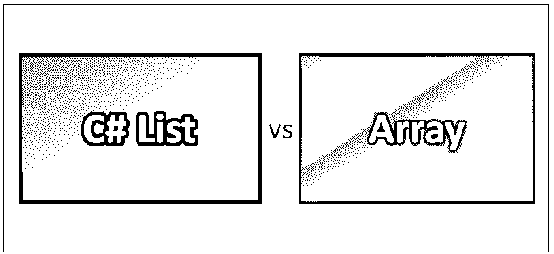

# C#列表与数组

> 原文：<https://www.educba.com/c-sharp-list-vs-array/>




## C#列表和数组的区别

C# List <t>类表示可以通过索引访问的强类型对象列表，它支持存储特定类型的值，而无需转换为对象或从对象转换。</t>

List <t>，其中参数 T 是列表中元素的类型。</t>

<small>网页开发、编程语言、软件测试&其他</small>

### 特征

列表的某些特征如下:

**在列表集合中添加整数值:**

```
List<int> intList = new List<int>();
intList.Add (2);
intList.Add (3);
intList.Add (4);
```

**在列表集合中添加字符串值:**

```
List<String> colors = new List<String>();
colors.add ("red");
colors.add ("white");
colors.add ("green");
```

**使用 for 循环从列表集合中检索项目:**

```
foreach(string color in colors) {
MessageBox.Show(color)
}
```

**在 C#中声明一个数组:**

```
datatype[] typeName;
```

// DataType 用于指定数组中元素的类型。

**初始化数组:**

```
double[] balance  = new double[50];
```

**给数组赋值:**

```
double[] balance = {23.0, 34.56, 44.32};
```

**访问数组元素:** 

```
Foreach (int value in balance) {
Console.WriteLine ("element is : "+ value);
}
```

**同时创建并初始化一个数组:**

```
Int[] steps = new int[6] {1, 2, 3, 4, 5, 6};
```

**将一个数组变量复制到另一个目标数组变量:**

```
Int[] count = steps;
```

目标和源都指向同一个内存位置。

### C#列表和数组的直接比较(信息图)

数组存储相同类型元素的固定大小的顺序集合。它用于存储数据集合，但是数组可以被认为是存储在连续内存位置的相同类型的变量的集合。所有数组都由连续的内存位置组成，最低地址对应于第一个元素，最高地址对应于最后一个元素。

下面是 C#列表与数组之间的 8 大区别


### C#列表和数组的主要区别

两者都是市场上的热门选择；让我们讨论一些主要差异:

1.  列表建立在数组的顶部，而数组是一个较低级别的数据结构。
2.  在 C#中，列表是以 API 的形式提供的，其父级是集合类，而数组是较低级别的数据结构，具有自己特定的属性。
3.  基于节点的概念，列表不是基于索引的，而数组是基于索引的数据结构，最低地址提供给第一个元素，最高地址提供给数组中的最后一个元素。
4.  列表本质上是动态的，即它们的大小随着更多元素的插入而自动增加，而数组是固定大小的结构，一旦初始化，就不能重置。
5.  列表更适合频繁插入和删除，而数组更适合频繁访问元素的场景。
6.  链表占用了更多的内存，因为链表中定义的每个节点都有自己的内存集，而数组是内存高效的数据结构。
7.  列表派生自集合，集合包含更一般的数据类型，而数组是固定的，存储更强的数据类型。
8.  列表中包含的节点的内存位置实际上不必是连续的，而数组中包含的元素及其内存位置实际上是连续的。
9.  List 的非连续属性使它们在访问元素时花费更多的时间，而 Array 的连续属性使它们在访问元素时效率很高。
10.  List leverage 泛型基本上是 ArrayList 的类型安全版本，会产生编译时错误，而 ArrayList 的类型安全，在速度和性能方面非常高效，支持多维。

### C#列表与数组对照表

下面是最上面的比较

| **比较的基础** | **列表** | **数组** |
| 创造 | 构建于阵列之上 | 基于索引概念的原始数据结构 |
| 记忆 | 占用比数组更多的内存 | 节省内存 |
| 长度 | 长度不同 | 固定尺寸长度 |
| 使用 | 频繁插入和删除 | 频繁元素访问 |
| 调整大小 | 调整列表大小本质上是动态的 | 调整数组的大小代价很高 |
| 结构 | 非连续存储器 | 连续存储位置 |
| 索引 | 基于非索引的结构 | 基于索引，最低地址在前，最高地址在后 |
| 接近 | 虽然基于元素的位置，但访问元素很耗时。 | 访问元素是一个常量时间操作，与元素位置无关。 |

### 结论

C#列表和数组都是不同的类型，具有不同的功能，并以不同的方式存储数据。这两种数据结构的存储能力和设计使它们以自己的方式独一无二。数组的大小是固定的，一旦被分配，就不能再从中添加或删除项；此外，所有元素必须属于同一类型。因此，就速度和性能而言，它是一种类型安全且最有效的线性数据结构。此外，数组支持多维度。该列表提供了更多的通用功能，并从集合 API 中派生出来。与数组不同，它们本质上是动态，可以随着元素的频繁插入和删除而自动调整大小。它本质上是数组列表数据结构的类型安全版本。类型安全特性意味着没有装箱或拆箱，这将提高性能，如果任何人试图添加错误类型的元素，它将生成编译时错误。

C# List vs 数组性能是一种线性数据结构，非常适合不同的场景。如果频繁地进行插入和删除，同时内存又不是一个约束条件，那么 List 是一个理想的选择，而在内存约束条件下频繁访问所需元素的场景中，Array 是一个更好的选择。这完全取决于用例及需求。数组本质上总是列表，但列表不是数组。array 允许两种类型的访问，直接访问和顺序访问，而 List 只允许顺序访问。这是因为这些数据结构在内存中的存储方式。由于 List 是从 Collection 派生出来的，它可以使用不同的实现；其中一个实现是 ArrayList，这个类使用数组作为数据结构来实现列表的行为。数组与连续内存的硬件概念密切相关，每个元素的大小都相同。基于各种场景，这两种性能思想都非常契合。归根结底，这是一天结束时的需求，尽管在当今世界，内存部分可以安全地靠边站，因为高内存已经成为一种规范。

### 推荐文章

这是 C#列表和数组之间主要区别的指南。在这里，我们还将讨论信息图和比较表的主要区别。您也可以看看以下文章——

1.  [数组列表](https://www.educba.com/java-list-vs-array-list/) [vs Java 列表——有价值的区别](https://www.educba.com/java-list-vs-array-list/)
2.  [关于 C 与 Java 的惊人指南](https://www.educba.com/c-vs-java/)
3.  [Java Vector 和 ArrayList](https://www.educba.com/java-vector-vs-arraylist/)
4.  [C#与 Js–惊人的差异](https://www.educba.com/c-sharp-vs-js/)
5.  [要求 vs 进口:想知道好处](https://www.educba.com/require-vs-import/)
6.  C 与 C#:最好的区别是什么
7.  [C# vs JavaScript:有什么特点](https://www.educba.com/c-sharp-vs-javascript/)


