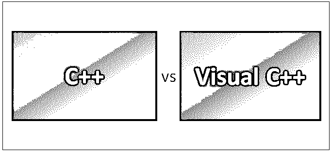

# C++与 Visual C++

> 原文：<https://www.educba.com/c-plus-plus-vs-visual-c-plus-plus/>

## C++和 Visual C++的区别

C++是 C 语言的增强和高级，是面向对象编程语言的通用。C++被认为是一种编译语言，这种语言的实现可以在许多平台上实现。Visual C++是软件巨头微软公司的集成开发环境(IDE)产品。它是为 C、C++和 C++/CLI 编程语言开发的。由于它是微软的产品，所以也被称为 VC++或微软的 Visual C++(简称为 MSVC)。

### C++

C++是由比雅尼·斯特劳斯特鲁普在 1985 年设计和开发的。最初，C++被称为“带类的 C ”,后来，在 1983 年被重新命名为 C++。C++是 C 家族的超集，它是许多人创建大规模应用程序的首选语言。符号++表示 C 中的增量运算符象征性地代表了 C 的高级版本。C++的主要基础是，它允许硬件访问和抽象，并且有效地执行，这使得 C++与其他编程语言相区别。

<small>网页开发、编程语言、软件测试&其他</small>

如前所述，C++是一种面向对象的编程语言。它有两个主要组成部分:

1.  它直接映射主要由 C 子集提供的硬件特征，
2.  基于硬件映射的零开销抽象。

与 C 语言类似，C++编程语言支持四种类型的内存管理:

*   静态存储持续时间对象。
*   线程存储持续时间对象。
*   自动存储持续时间对象和
*   动态存储持续时间对象。

### Visual C++

Visual C++是 1993 年 2 月开发的，但是稳定版是 2017 年 3 月做的。Visual C++是用 C++写的。Visual C++也是像 C++这样的编程语言的通用“C 套件”的一部分。

Visual C++被视为商业软件，提供免费版本。Visual C++包括许多代码库处理工具和开发工具，可与 Microsoft Windows 应用程序编程接口(API)和 Microsoft。NET 平台。

像许多其他编程语言一样，Visual C++包括用于创建一组不同的过程、函数调用和其他代码元素的库和运行时包。

VC++最初是作为一个独立的产品发布的，但后来它成为 Visual Studio 的一部分，然后它以试用版和免费软件的形式提供。

### C++和 Visual C++的直接比较(信息图表)

下面是 C++和 Visual C++之间的 6 大区别

### C++和 Visual C++的主要区别

两者都是市场上的热门选择；让我们讨论一些主要的区别:

1.  1.C++是面向对象的编程语言，而 Visual C++是 C 和 C++语言的集成开发环境(IDE)和编译器。
2.  在 C++中，编译器将 C++程序代码翻译成计算机可以理解和执行的机器代码。而 Visual C++有助于编写代码、编译和调试 C++源代码，并使之变得更加容易。
3.  C++编程语言是可移植的，因为其中的库可以在 C++应用程序中使用。而 Visual C++也有一些可以用于 Windows 的专用库，当您在 C++应用程序中使用这些内置库时，就有可能陷入 Windows。
4.  编写开发微软 DirectX API、Windows API 和微软。单独使用 C++的. NET 框架。但是开发微软 DirectX API、Windows API 和微软。NET 框架。
5.  C++编程语言是最常用的硬件设计和编程语言。由于 Visual C++是 IDE，所以用来编译执行。
6.  在性能方面，C++胜过 Visual C++。在应用程序开发周期的初始阶段，性能很高，而在应用程序开发周期的初始阶段，Visual C++的性能很低。但是用 C++维护开发后期是非常困难的。

### C++与 Visual C++比较表

主要比较讨论如下:

|  **对比的依据** | **C++** | **Visual C++** |
| **关于&的定义** | C++ is a high-level object-oriented programming language.在 C++中，编译器将代码翻译成计算机可以理解和执行的机器代码。 | Visual C++被认为是一种集成开发环境(IDE)。它有助于更容易地编写、编译和调试 C++源代码。 |
| **图书馆** | C++编程语言是可移植的，因为其中的库可以在 C++应用程序中使用。 | Visual C++也有一些可以用于 Windows 的专用库，当你在 C++应用程序中使用这些内置库时，就有可能陷入 Windows。 |
| **Writing code** | 通过单独使用 C++，很难编写代码来开发 Microsoft DirectX API、Windows API 和 Microsoft。NET 框架。 | Visual C++可用于编写代码来开发 Microsoft DirectX API、Windows API 和 Microsoft。NET 框架。因为 Visual C++基本上影响 C++与微软环境的兼容性。 |
| **工具** | C++是一种编程语言，它不包括调试器、代码编辑器和项目管理器。 | Visual C++包括许多工具，如调试器、代码编辑器、项目管理器等。 |
| **使用区域** | C++ programming language is mostly and commonly used to design hardware. The process is as follows:最初，设计是用 C++描述的。稍后将对其进行分析、架构上的修改并使其高效，最后，计划创建寄存器传输级硬件描述语言。 | Visual C++是一个集成开发环境(IDE)产品，C++代码将在其中编译和执行。 |
| **性能** | Performance is high for the initial part of the application development cycle compared to Visual C++.

但是在开发的后期，C++编程语言更容易维护。

 | The performance of Visual C++ is low for the initial part of the application development cycle compared to C++.但是在应用程序开发的后期编译和执行程序是一个很大的优势。 |

### 结论

C++是 C 语言的增强和高级，是面向对象编程语言的通用。而 Visual C++是软件的集成开发环境(IDE)产品。这是为编译 C、C++和 C++/CLI 编程语言而开发的。我希望现在你对这两者已经有了更好的理解。请继续关注我们的博客，获取更多类似的文章。

### 推荐文章

这是 C++和 Visual C++之间最大差异的指南。在这里，我们还将讨论信息图和比较表的主要区别。您也可以看看以下文章，了解更多信息–

1.  [c++编程语言的重要备忘单(基础知识)](https://www.educba.com/c-programming-language-basics/)
2.  [C++与 C#的有用对比](https://www.educba.com/c-plus-plus-vs-c-sharp/)
3.  [C++ vs Java](https://www.educba.com/c-plus-plus-vs-java/)
4.  [ASP.NET vs c#最高分](https://www.educba.com/asp-net-vs-c-sharp/)
5.  [C++向量与数组:差异](https://www.educba.com/c-plus-plus-vector-vs-array/)
6.  [Rust vs C++](https://www.educba.com/rust-vs-c/)

