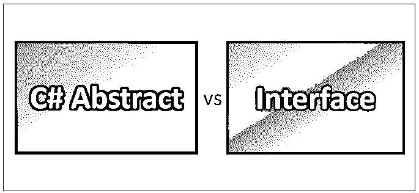

# C#抽象 vs 接口

> 原文：<https://www.educba.com/c-abstract-vs-interface/>

## C#抽象和接口的区别

抽象类和接口对于理解任何面向对象编程训练都是非常重要的方法学。通常这两者对于刚开始学习面向对象编程的人来说都是非常混乱的。如果我们定义了一个抽象类，但是没有实现任何东西，那么它看起来绝对像接口；没有人能够理解它们之间的区别，除了一个宣言。然而，在接口和抽象类之间有许多不同和相似之处。

抽象类是定义为抽象的简单类，不能实例化。一个抽象类必须被一些子类扩展，才能使用特定超类或抽象类的所有特性或功能。它实际上有助于维护超类或子类的适当层次。多个子类可以使用具有不同定义的相同功能名称。它确保应用程序应该遵循一些特定的层次结构或标准，这些层次结构或标准继承了应用程序适当的可解释的功能。

<small>网页开发、编程语言、软件测试&其他</small>

接口绝对不是一个类；它就像一个由特定的 word 接口定义的实体。接口从未定义任何定义；它完全依赖于一个特定的声明，该声明应该由多个类同时继承。多个类能够定义一个特定接口的单个声明的多个定义。它还拥有与抽象类相同的功能；它主要帮助维护具有不同定义的子类的相同层次结构。但是抽象类和接口之间的主要区别是扩展多个抽象类是不可能的，而继承多个接口是可能的。由于 C#不支持多重继承，所以接口提供了同样的功能。

### **C #抽象和接口的直接比较(信息图表)**

下面是 C#抽象与接口的主要比较

### C#抽象和接口的主要区别

下面解释了 C#抽象与接口之间的一些关键区别

1.  抽象类和接口实际上都被一个或多个子类使用。主要的限制是一个子类不能扩展多个抽象类，这意味着[多个继承](https://www.educba.com/multiple-inheritance-in-c-plus-plus/)是不可能的，而子类可以一次继承多个接口。
2.  摘要可以包含一个定义或者仅仅是一个方法的定义。子类，它扩展了抽象类可以使用的体方法，也可以解释体方法的任何具体定义的细节，使抽象方法的重写成为可能。抽象类应该至少有一个抽象方法(这意味着没有主体的方法的唯一定义)。接口只有方法的定义；它不应该包含 define 方法的任何主体细节。一个接口并利用它们的子类继承没有通过为多个子类动态地给出适当的主体细节来定义方法。
3.  一个抽象类可以有[不同的访问修饰符](https://www.educba.com/access-modifiers-in-c-sharp/)，比如 public、private 或 protected，所以抽象类中的任何方法或属性都可以定义不同的访问修饰符。而 for 接口不能给出任何访问修饰符，接口内定义的所有属性或方法都应该是公共访问修饰符，并且不能选择在接口内定义另一个访问修饰符。
4.  超类和子类的概念非常适合抽象类。抽象类可以被赋予子类的核心身份；它通常包含该特定子类的相似类型的对象。而接口通常定义一个类的一种特定类型的外围活动。假设我们有一个名为可移动的接口，现在这个接口可以被汽车和人类继承。而汽车和人是完全不同的类对象，它们之间没有任何关系。
5.  如果应用程序有各种各样的实现但那个特定实现的活动几乎相同，那么最好使用抽象类，在那里你可以定义那个特定的逻辑，并且所有的子类每次都能容易地访问相同的逻辑。例如，数据库连接，它通常被所有的子类使用，所以如果这个连接生成和关闭代码可以保存在一个抽象类中，那么任何子类访问它都非常容易。尽管多个实现希望只共享方法的签名，但接口总是更好。

### C#抽象与接口对照表

下面是 C#抽象与接口的比较表

| **BASIS FOR**

**比较**

 | **抽象类** | **界面** |
| 多重继承 | 一个子类只能扩展一个抽象类，不能扩展多个。 | 一个子类可以实现多个接口，这有助于恢复不支持 C#的多重继承特性。 |
| 类别定义 | 接口从不定义任何特定的定义体；它只保存由子类正确实现的定义。 | 抽象可以包含整个主体的定义，也可以包含唯一的定义，比如接口，它可以被任何子类覆盖。任何抽象类都应该至少有一个只保存定义细节的抽象方法；主体将在后面的子类中描述。 |
| 访问修饰符 | 接口的定义中从来没有任何访问修饰符。接口通常认为所有的属性都是公共的。 | 抽象类的定义可以有一个访问修饰符。所以所有的财产都可以是公有的、私有的或受保护的。 |
| 表演 | 通常需要多花一点时间来找出子类的相应方法。 | 比接口快一点。 |

### 结论

接口和抽象类主要用于以一种智能的方式管理多个实现，这样可以很容易地避免冗余代码，并且一切都在适当的层次和结构中。在多个实例中共享同一个签名的接口总是更好。假设 Pantaloons 有一个主分支，它在不同的位置也有多个分支。一个特定的产品可以在一个特定的位置以一种方式推出，而在其他位置，它以不同的方式推出。在这种情况下，同一产品在多个地点的逻辑 ic、shobe 应该不同；这种逻辑最好由接口来处理。现在，同一产品可能有一些共同的特点，需要在每一个分支机构推出该产品时加以强调。在这种情况下，为了避免代码冗余，在抽象类中添加相同的逻辑，并可以在不同分支的多个实现中使用。

### 推荐文章

这是 C#抽象与接口之间差异的有用指南；我们已经讨论了直接比较、关键差异和信息图表。您也可以阅读以下文章，了解更多信息——

1.  [C#接口 vs 抽象类](https://www.educba.com/c-sharp-interface-vs-abstract-class/)
2.  [Java 接口 vs 抽象类](https://www.educba.com/java-interface-vs-abstract-class/)
3.  [类型脚本接口 vs 类](https://www.educba.com/typescript-interface-vs-class/)
4.  [C#结构与类](https://www.educba.com/c-sharp-struct-vs-class/)

