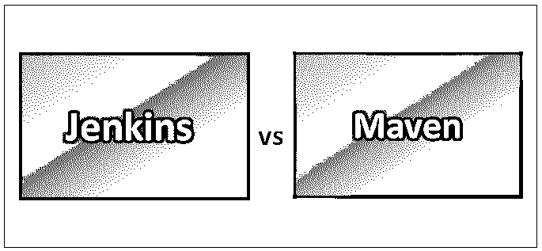
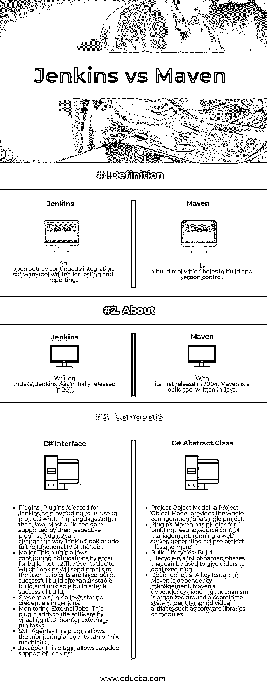

# 詹金斯 vs 梅文

> 原文：<https://www.educba.com/jenkins-vs-maven/>

## 詹金斯和梅文的区别

在 Jenkins 和 Maven 的比较中，已经掌握了扎实 Java 知识的初学者和软件开发人员可以从这篇 Jenkins vsMaven 文章中受益，这篇文章旨在分别启发学习者关于 Jenkins vs Maven 的工作原理和相关概念。EduCBA 为学生和专业人士提供了许多关于这些主题的课程，根据难度不同而有所不同，并提供了富有成效和令人满意的学习体验。

1.  Jenkins 可以定义为一个为测试和报告而开发的开源持续集成软件工具。它是用 Java 编程语言编写的。Jenkins 软件帮助开发人员快速找到并解决代码库中的缺陷，并自动完成构建。
2.  maven 是一个构建工具，是 ant 的继承者。它有助于构建和版本控制。

据估计，Jenkins 在全球拥有超过 1，000，000 名用户，是主要的持续交付和开发运维流程编排工具。Jenkins 被认为是当今最流行的自动化服务器。2017 年的 Jenkins 项目，Jenkins 的实践者社区在 2017 年举行了一次全球会议，他们成功地记录了 Jenkins 安装从 100000 增加到 150000 的 50%的活跃安装。在 2016 年詹金斯社区调查中，85%的社区调查受访者表示，他们公司对詹金斯的使用在过去一年中有所增加。此外，90%的人说他们使用 Jenkins 对他们的公司来说是至关重要的。2016 年 Jenkins 社区调查结果表明，通过在组织内扩大使用 Jenkins，Jenkins 的使用为现有用户和新用户提供了价值。maven 是一个构建工具，ANT 的后继者通常与 Jenkins 集成作为一个构建工具。正是在这个阶段，詹金斯和梅文之间的比较发生了。

<small>网页开发、编程语言、软件测试&其他</small>

### 詹金斯和梅文的正面比较(信息图)

以下是 Jenkins 和 Maven 之间的三大区别

### Jenkins 和 Maven 的主要区别

两者都是市场上的热门选择；让我们讨论一些主要差异:

*   Jenkins 是一个开源的持续集成程序，而 Maven 是一个构建工具。
*   Maven 于 2004 年初推出，而 Jenkins 于 2011 年推出。
*   依赖管理——Jenkins 构建可以高度参数化，Jenkins 可以轻松地将构建模块化为多个步骤，如编译、测试和打包。Maven 还可以将生产就绪的工件部署到远程服务器或软件存储库。

### 詹金斯 vs Maven 对比表

下面是詹金斯和梅文之间最上面的比较

| **比较的基础** | 詹金斯 | **胃** |
| **定义** | 为测试和报告编写了一个开源的持续集成软件工具。 | 它是一个构建工具，有助于构建和版本控制。 |
| **关于** | Jenkins 用 Java 编写，最初于 2011 年发布。 | 随着 2004 年第一次发布，Maven 是一个用 Java 编写的构建工具。 |
| **概念** | 插件——为 Jenkins help 发布的插件，增加了它在用 Java 以外的语言编写的项目中的用途。大多数构建工具都有各自的插件支持。插件可以改变 Jenkins 的外观或增加工具的功能。这个插件允许通过电子邮件为构建结果配置通知。Jenkins 将向用户收件人发送电子邮件的事件包括构建失败、不稳定构建后成功构建、成功构建后不稳定构建。*   Voucher-This allows the voucher to be stored in Jenkins. This plug-in increases the functionality of the software by making it monitor external running tasks. SSH Agent-This plugin allows monitoring agents running on nix machines. This plugin allows Jenkins Javadoc support.T13】 | 

*   项目对象模型——项目对象模型为单个项目提供了完整的配置。
*   插件——Maven 拥有用于构建、测试、源代码管理、运行 web 服务器、生成 Eclipse 项目文件等的插件。
*   构建生命周期——构建生命周期是一个命名阶段的列表，可以用来给目标执行下命令。
*   依赖性 Maven 的一个关键特性是依赖性管理。Maven 的依赖性处理机制是围绕一个坐标系统来组织的，该坐标系统标识了诸如软件库或模块之类的单个工件。

 |

### 结论

阿帕奇 Maven 被认为是詹金斯 vs Maven 比较中的明显赢家。其中一个原因是 Jenkins 使用 Jenkins Maven 插件打包和部署。虽然从表面上看，Jenkins 似乎在做大部分工作，但实际上是 Maven 插件在做所有繁重的工作。

### EDUCBA 课程

越来越多的组织使用 Jenkins 和 Maven，这将有助于开发人员获得这些技能的认证。以下是 EDUCBA 中关于 Jenkins 和 Maven 的课程，可以帮助开发人员提升他们的技能。

1.  **詹金斯教程**

本课程旨在介绍环境设置、Jenkins 管理和 Jenkins 配置。该课程非常适合软件测试人员、软件开发人员/工程师、IT 专业人员、移动和 Web 应用程序开发人员以及希望通过 Jenkins 和 Maven 扩展其技能组合的学生。本课程要求对软件开发生命周期有一个基本的了解。

2.  **与 Maven + Jenkins + Git 的持续集成**

这个课程基本上是教学习者所有关于构建工具的知识。它向您介绍了什么是构建工具，如何开始使用 Git 和 e Git 等构建工具，使用 Maven 执行代码以及使用 Jenkins 集成整体。该课程要求之前具备 SDLC 知识，面向软件开发人员/工程师、IT 专业人员、移动和 Web 应用程序开发人员和学生。

3.  **高级詹金斯训练**

本课程带领学员了解 Jenkins 的高级概念，如 BAT 文件、运行 ANT build、HTML 和 XML 报告以及电子邮件通知。该课程面向软件测试人员、软件开发人员/工程师、IT 专业人员、移动和网络应用程序开发人员和学生。本课程最好是在初学者了解了 SDLC 知识和 Jenkins 之后完成。

4.  **詹金斯培训–基础知识**

本课程向学员介绍 Jenkins 安装、配置、管理以及 Maven 构建的基础知识。该课程面向软件测试人员、软件开发人员/工程师、IT 专业人员、移动和 Web 应用程序开发人员和学生。

5.  **Java 构建工具——MAVEN 和 ANT**

该课程旨在帮助学习者探索关于 Java 构建工具(如 Maven 和 ANT)的所有信息。

6.  **胃**

本课程向学习者讲授 Maven、其安装、项目创建和构建生命周期。它面向的是在 Java 中广泛使用它的软件开发人员，以及希望了解 Maven 的初学者。

### 推荐文章

这是 Jenkins 和 Maven 之间最大差异的指南。在这里，我们还将讨论信息图和比较表的主要区别。您也可以看看以下文章——

1.  [詹金斯 vs 切尔莱西](https://www.educba.com/jenkins-vs-circleci/)
2.  [詹金斯 vs 竹子](https://www.educba.com/jenkins-vs-bamboo/)
3.  [Maven 面试问题](https://www.educba.com/maven-interview-questions/)
4.  [詹金斯 vs TeamCity](https://www.educba.com/jenkins-vs-teamcity/)
5.  [詹金斯 vs 哈德森](https://www.educba.com/jenkins-vs-hudson/)
6.  [格雷尔与梅文的区别](https://www.educba.com/gradle-vs-maven/)

