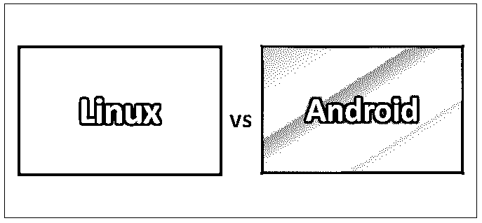
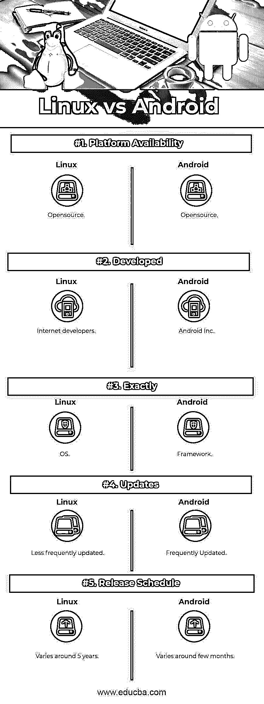

# Linux vs Android

> 原文：<https://www.educba.com/linux-vs-android/>

## Linux 和 Android 的区别

Linux 运行在市场上的许多系统上，它是基于社区的设置的主要部分。它是一个单片操作系统，操作系统本身完全从内核执行。Android 是一个开源操作系统，主要面向手机和平板电脑。在移动设备上，Android 扮演着至关重要的角色，但它恰恰是一个建立在 Linux 内核之上的框架。

### Linux 操作系统

Linux 是由一名芬兰学生 Linus Torvalds 开发的，目的是在市场上提供开源操作系统。Linux 基本上是 Unix 的衍生版本。

<small>网页开发、编程语言、软件测试&其他</small>

通常与商业的 UNIX 系统相比较，但是比面向桌面的系统更可靠，是高级用户和程序员的理想选择。

*   开放源代码，可以轻松下载
*   安装也很容易
*   安静稳定的操作系统
*   由一群互联网开发者开发

加入桌面市场。Linux 开发者决定将网络服务放在首位，办公应用程序放在最后。Linux 还为亚马逊、德国军队、美国邮局等组织提供贸易服务和数据库支持。特别是互联网提供商和互联网服务提供商越来越喜欢将 Linux 作为防火墙、代理服务器和 web 服务器，并且您会发现每个喜欢舒适的管理站的 UNIX 系统管理员都可以使用 Linux 盒子。作为一个 Linux 用户，现在有各种方法来彻底了解您的系统，但是不再需要掌握知识来使系统符合您的要求。

### 机器人

Android 主要是为了满足低功耗设备，使用 Java，在虚拟机上执行。安卓公司最初创建了这个平台，后来被谷歌收购。

Android 操作系统经常更新，每个版本都有一个新的名字。版本的频繁发布使得系统上的一些信息以相同的速度过时。Android OS 的常见功能，

*   [移动开发](https://www.educba.com/mobile-apps-development-tools/)开放平台
*   主要适用于移动设备的硬件参考
*   Linux 2.6 用于为系统供电
*   涉及应用程序和用户界面框架

这里，应用层充当顶层，拥有自己的一组运行中的库。所有这些库都是用 C/C++语言构建的。

### 达尔维克虚拟机

基于 Android 的系统使用自己的 VM，称为 Dalvik。常驻的 java 字节码不能在这里直接执行，因为 DVM 是建立在一个特殊的字节码上的，一个内置的工具被用来允许 Java 类到 DEX 的转换。

DVM 功能得到极大优化，以便在通常配备慢速 CPU 的移动设备上尽可能高效地运行。DVM 被实现为以优化的方式执行多个 VM。

### Linux 和 Android 的面对面比较(信息图表)

以下是 Linux 和 Android 之间的五大对比:

### Linux 和 Android 的主要区别

让我们讨论一下 Linux 和 Android 之间的一些主要区别:

*   Linux 主要是为个人和办公系统用户开发的，Android 是专门为移动和平板设备开发的。
*   与 LINUX 相比，Android 占有更大的份额。
*   通常，Linux 提供多种架构支持，而 Android 只支持两种主要架构，ARM 和 x86。ARM 平台在手机上广泛使用，而 Android-x86 主要面向移动互联网设备。这个功能是两个操作系统的根本区别，也是 Linux 和 Android 的关键区别。
*   电源管理是使用 APM 完成的，Android 主要依赖其电源管理模块，该模块与 Linux 电源扩展非常接近。
*   Linux 是一个流行的操作系统，而 Android 是一个在 Linux 内核上执行的框架。
*   Linux 系统使用磁驱动器，标准 Linux 系统使用 EXT 日志文件系统来提供健壮的文件系统，嵌入式系统使用 NOR 等固态存储设备来执行代码，使用 n and 来存储。另一方面，android 系统使用闪存来满足存储相关的需求。
*   Linux 系统使用 GNU C 库，Android 使用 C 库。启动 Android 设备时，内核的加载就像在 Linux 发行版上一样。尽管软件的大部分是不同的。GNU C 库与标准 Linux 发行版上使用的 android 没有关联。
*   Android 使用 Dalvik 虚拟机来运行其应用程序，一些顶级移动开发者使用 JVM 来执行。另一方面，Linux 不接受任何虚拟机来执行。

### Linux 与 Android 对比表

下面是 Linux 和 Android 之间最重要的比较:

| 【Linux 与 Android 的对比基础 | **LINUX** | **安卓** |
| **平台可用性** | 开源 | 开源 |
| **发达** | 互联网开发者 | 安卓公司 |
| **确切地说** | 操作系统（Operating System） | 结构 |
| **更新** | 更新频率较低 | 经常更新 |
| **发布时间表** | 大约 5 年不等 | 几个月左右变化 |

### 结论

Android 是一个开源操作系统，用于移动设备、平板设备，运行在 Linux 内核发行版之上。在移动设备上，Android 扮演着至关重要的角色，但它恰恰是一个建立在 Linux 内核之上的框架。另一方面，Linux 是一个传统的操作系统，非常适合桌面和系统用户。

### 推荐文章

这是 Linux 和 Android 之间最大区别的指南。在这里，我们用信息图和比较表来讨论 Linux 和 Android 之间的主要区别。您也可以看看以下文章，了解更多信息–

1.  [OS X vs Linux](https://www.educba.com/os-x-vs-linux/)
2.  [Android 开发职业](https://www.educba.com/careers-in-android-development/)
3.  [Linux vs Mac](https://www.educba.com/linux-vs-mac/)
4.  [安卓面试问题](https://www.educba.com/android-interview-questions/)
5.  [iPhone 与 Android |最大差异](https://www.educba.com/iphone-vs-android/)

