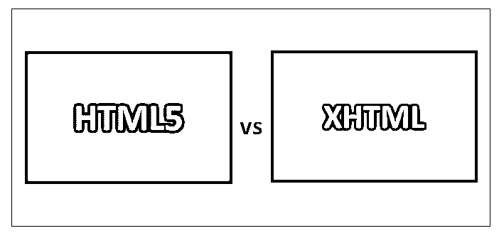

# HTML5 与 XHTML

> 原文：<https://www.educba.com/html5-vs-xhtml/>

## HTML5 和 XHTML 的区别

HTML 是主要为网络开发的语言。这是第一种基于互联网的语言。几乎所有显示在浏览器中的东西都是通过 HTML 完成的。HTML 是 T2 网站开发过程的核心。HTML 可以被定义为具有静态的结构、组织和内容。首先，[基本 HTML](https://www.educba.com/basic-html-tags/) 文档(也称为标记文档)被创建，然后网站的其他动态方面通常被嵌入到该文件中，不管是添加交互性的基于 JavaScript 的函数[还是将网站连接到其数据源的服务器端脚本，然后还有向页面添加样式元素的 CSS 文件。所有这些文件都可以被链接到 HTML 文件上，使之几乎像一个网站的主干。](https://www.educba.com/javascript-interview-questions/)

HTML5 vs XHTML 是 HTML 的更新[版本。XHTML 本质上是带有一些附加特性的 HTML4，而 HTML5 是最新版本。](https://www.educba.com/versions-of-html/)

<small>网页开发、编程语言、软件测试&其他</small>

在这篇 HTML5 和 XHTML 的文章中，我们将比较这些技术的主要优点，并理解它们在 HTML5 和 XHTML 之间的主要区别。

### HTML5 和 XHTML 的面对面比较(信息图表)

以下是 HTML5 和 XHTML 的 8 大区别:

### HTML5 和 XHTML 的主要区别

HTML5 vs XHTML 都是市场上的热门选择；让我们讨论一下 HTML5 和 XHTML 之间的一些主要区别。HTML5 实际上并不是对 XHTML 的拒绝。 [HTML5 拥有 HTML 4 和 XHTML 的一些最常用的](https://www.educba.com/html5-semantics/)特性，下面也提到了:

#### 1 – Simple doctype

XHTML 的 doctype 定义(或者最常提到的样板代码，每个[网页](https://www.educba.com/design-web-page-in-html/)都以它开始)实际上非常复杂。例如，即使是在课堂上教书和在 [HTML5](https://www.educba.com/what-is-html5/) 上写书的人也永远不会记住 doctype。他们总是不得不复制和粘贴它。另一方面，HTML5 的文档定义非常简单明了。它是如此的简单，以至于再一次有可能根据记忆创建一个网页。

#### 2–内容和风格分离

HTML5 通常不包含 HTML 4 中的样式标签。相反，HTML5 要求开发人员对所有类型的样式都使用 CSS。类似地，框架和基于表格的布局也不被鼓励，而是支持 [CSS 样式的布局](https://www.educba.com/css3-interview-questions/)。

#### 3–验证支持

验证实际上是一个非常有用的工具，因此 HTML5 可以像 XHTML 一样被验证。W3C 验证器现在支持 HTML5，许多其他验证工具也即将上线。验证是一种消除编码错误的简单方法，一旦用户开始向代码文档添加编程支持，它可以大大简化编码。

#### 4–严格的传统

HTML5 的编码标准比另一个变体 HTML 4 更类似于 XHTML。尽管在 HTML5 中仍然有可能使用非标准编码，但大多数时候开发人员使用 XHTML 的严格标准来确保代码对其他人来说更容易阅读并且更可预测。

#### 5–与 CSS 和其他编程语言紧密集成

HTML5 最重要的特点就是谦逊，大概吧。虽然 HTML 仍然占据主导地位，并且是互联网的中心语言，但当将控制权分配给其他语言时，HTML5 显然是赢家。 [HTML5 被设计为](https://www.educba.com/html5-semantics/)一种机制，将许多附加技术结合在一起，如用于视觉布局的 CSS，用于服务器控制的服务器端语言如[PHP](https://www.educba.com/php-oop-interview-questions/)，用于客户端编程和数据库的 JavaScript。

#### 6-更新的功能

HTML5 的几个新[特性从技术上来说基本上不是 HTML，而是许多其他相关技术的进步，如集成数据库或新 CSS 特性、新 JavaScript 语法等。](https://www.educba.com/html5-new-elements/)

### HTML5 和 XHTML 对照表

下面讨论 HTML5 和 XHTML 之间的主要比较:

| **HTML5** | **XHTML** |
| HTML5 是 HTML 的最新，也可能是最好的进化。它是最通用的游戏规则改变者。HTML5 为它的知识库增加了大量的新特性，从而使它做得更多。 | XHTML 主要与 HTML4 相同，HTML 4 是 HTML 的第四版。两者之间的一个区别是 XHTML 附带了扩展 HTML 功能的 XML 元素。 |
| HTML5 是三种代码的混合体，它们是 HTML、CSS 和 JavaScript。 | XHTML 早于 HTML5，晚于 HTML4。所以正确的顺序是 HTMl4，XHTML，HTML5。 |
| HTML5 为开发者提供了更快更有效的工作。 | XHTML 用于解决一些跨浏览器的兼容性问题，并提供了两全其美的方案。 |
| HTML5 的最终站点架构是敏捷的和移动友好的。它也兼容几乎所有的现代浏览器。 | XHTML 语法比 HTML 稍微严格一点，因此提供了更精确的标准。它还规定了网站数据在传输前如何分解和传输。 |
| HTML5 解决了 XHTML 之前试图解决的问题。它确保了更多浏览器之间更好的兼容性。 | XHTML 是以与 XML 应用程序相同的格式编写的，这是一个关键的区别点。XML 是另一种描述性标记语言。XML 的功能或多或少像是对 HTML 的补充 |
| HTML5 包含许多新的 API 和特性，比如绘图、拖放和视频回放。这些特性是开发人员以前无法实现的类型，需要第三方插件的帮助。 | 设计 XHTML 的许多原因也已经被 HTML5 所涵盖。这使得 XHTML 几乎过时了。 |
| HTML5 解决了 XHTML 旨在解决的那些问题 | XHTML 主要是为了解决 HTML 中存在的问题而设计的 |
| HTML5 是最首选的，现在很少用 XHTML。 | XHTML 语法比 HTML5 更严格，范围也更有限。 |

### 结论

正如在引言部分提到的，HTML 最初是一种非常简单的语言，用于设计基于 web 的页面。当 web 开发扩展到有限的范围之外，专业程序员需要一种超越 HTML 4 能力的语言时，XHTML 应运而生。XHTML 的严格版本也称为可扩展超文本标记语言，它被认为比 HTML 4 更精确、更可预测、更容错。

后来，XHTML 并没有真正流行起来。开发人员，尤其是那些在项目中集成了 JavaScript 和 PHP 等多种编程语言的人，喜欢 XHTML Strict，但它带来的好处太少了，而且大量的页面从来没有真正遵循新的标准。因此，当诞生新标准的时候，万维网联盟决定支持 HTML5 而不是 XHTML 2。

### 推荐文章

这是 HTML5 和 XHTML 之间最大区别的指南。在这里，我们讨论了 HTML5 和 XHTML 的直接比较，主要区别以及信息图表和比较表。你也可以看看下面的 HTML5 和 XHTML 的文章来了解更多

1.  [HTML vs XML](https://www.educba.com/html-vs-xml/)
2.  [HTML vs HTML5](https://www.educba.com/html-vs-html5/)
3.  [HTML5 vs JavaScript](https://www.educba.com/html5-vs-javascript/)
4.  [HTML vs JavaScript](https://www.educba.com/html-vs-javascript/)

