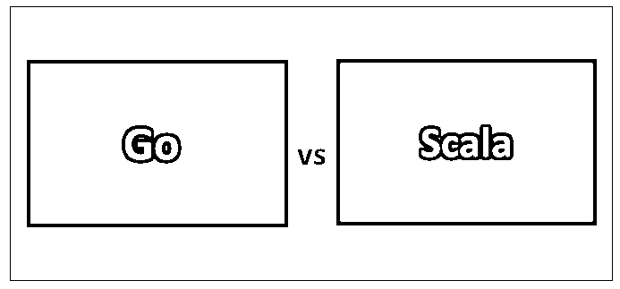

# Go vs Scala

> 原文：<https://www.educba.com/go-vs-scala/>

## Go 和 Scala 的区别

Go vs Scala 都有各自的优势和局限。这取决于项目的性质和客户的需求规格。GO——通常被称为 GOlang，是由 Google 开发的一种编程语言(PL)。它是一种静态类型的编译语言，继承了 c 语言的传统。工具、编译器和源代码都是免费和开源的。SCALA——它是一种通用编程语言，为函数式编程和强大的静态类型系统提供支持。(来源-维基)。

### Go 和 Scala 的正面比较(信息图)

下面是 Go 和 Scala 的 8 大区别

<small>网页开发、编程语言、软件测试&其他</small>

### Go 和 Scala 的主要区别

两者都是市场上的热门选择；让我们讨论一些主要的区别:

在选择编程语言的同时，每个公司都做一些计算，或者你可以说观察(从过去的经验)。下面讨论了其中的一些。

*   较少的代码工作更容易理解
*   经常使用或维护一组代码的人并不是(经常)创建它的人。

写代码更多的是交流，不仅仅是作者和编译器之间的交流，也是作者和未来读者(未知技能水平)之间的交流。这些因素对于在项目规划阶段确定以避免交付障碍和顺利运作至关重要。

**1。简单性—**与 Scala 相比，Go 更加简单。Scala 的语言规范页面超过 191 页，而 GO 只有 51 页。这种简单性对于团队决定快速进入项目至关重要。

**2。RISC 和 CISC–**一个 CPU 的架构可以是 RISC 和 CISC 模型。

精简指令集计算

CISC(复杂指令集计算)

RISC 模型仅使用更简单的命令，这些命令进一步细分为许多指令，以在单个 CLK 周期内实现低级操作，正如其名称所暗示的精简指令集计算一样。

**3。CISC—**在这里，一条指令可以像它发音时那样执行几个低级操作。这些低级操作可以是这些内存加载、自动操作等中的任何一种。

回到 Scala vs Go 基于这个模型，Go 提供了一组更简单、更小的正交原语，可以轻松地与 ease 和 expected 交互。开发人员可以通过学习少量的原语来轻松构建自己的需求，而 SCALA 拥有庞大的工具箱集和语法。人们必须详细学习并理解何时使用这些原语来编写几行代码。

**4。实用**

我们来看一个比较这两种做法的案例。考虑从 cookie 中获取一个用户 id。试着理解这个案例，并分析在这样做之前需要多少编码理解。

*   如果 cookie 不存在怎么办？
*   如果 cookie 值不是标准格式的数字？
*   另外，如果 cookie 赋值是负的呢？

**SCALA 代码:** 

`import play.api.mvc.RequestHeader
def getUserId()(implicit request: RequestHeader) = {
cookies.get("uid").map(_.value.toLong).filter(_ > 0)
}`

**围棋代码:** 

`import (
"fmt"
"http"
"strconv"
)
func getUserId(r *http.Request) (int64, error) {
c, err := r.Cookie("uid")
if err != nil {
return 0, err
}
i, err := strconv.ParseInt(c.Value, 10, 64)
if err != nil {
return 0, err
}
if i <= 0 {
return 0, fmt.Errorf("invalid user id")
}
return i, nil
}`

这里可以看到 SCALA 代码比 GO 小，但是 GO 是显式的，而 SCALA 需要上下文来理解。

显式代码对新手来说更容易理解

显式代码更容易编辑更改

显式代码的误差很容易理解

这些甚至更容易调试。

**5。可扩展并发解决方案** 

说到 Scala vs Go，值得注意的是这些 PL 能给你的公司带来什么。
SCALA 是一种持久的数据结构，使用一级和闭包的函数式编程，软件事务内存，而 GO 是一种轻量级的机器代码语言，基于 goroutines 和 UNIX 管道式通道的概念，高速编译和简单的抽象机制。

### Go 与 Scala 对比表

下面是最上面的比较

| **比较的基础** | **出发** | **SCALA** |
| **最初发布日期** | 2009 年 11 月 10 日 | 2004 年 1 月 20 日； |
| **稳定发布** | 2018 年 6 月 3 日至 5 日 | 2018 年 4 月 27 日 |
| **打字专业** | 强大、静态、推断和结构 | 静态的、强的、推断的和结构的 |
| **文件扩展名** | .走 | .斯卡拉和。南卡罗来纳州 |
| **设计开发** | 

*   Robert Grismer
*   rob pike
*   ken thompson
*   Developed by Google

 | 

*   Martin Oddsky
*   by
*   Method laboratory development

 |
| **实现语言** | Go，[汇编语言](https://www.educba.com/what-is-assembly-language/)，C++ | 斯卡拉 |
| **优势** | 

*   Static code analysis
*   Built-in testing and profiling framework
*   Learning curve

 | 

*   Object-oriented and functional coding paradigm
*   Java compatibility and interoperability
*   Functional and advanced features

 |
| **特性** | 

*   binary system
*   Language design
*   Powerful standard library
*   Package management
*   Static typing
*   Concurrency support
*   Test support

 | 

*   Type reasoning
*   Single instance object
*   inflexibility
*   Lazy calculation
*   Case class matches pattern.
*   concurrency control
*   String interpolation
*   higher-order function
*   speciality
*   Enriched set set

 |

### 结论

SCALA 是建立在 JVM 之上的。SCALA 通过各种内置类和 3 rd party 框架支持内置。GO 以 goroutines 和通道的形式提供并发性。PL 的特性和兼容性决定了它是否适合团队的可用资源。诸如代码可用性、理解行为、编写代码的复杂性以及被他人理解等因素。

### 推荐文章

这是 Go 和 Scala 之间最大区别的指南。在这里，我们还将讨论信息图和比较表的主要区别。你也可以看看下面的 Go vs Scala 文章来了解更多

1.  [C++ vs 围棋](https://www.educba.com/c-plus-plus-vs-go/)
2.  [Node.js vs Go](https://www.educba.com/node-js-vs-go/)
3.  [Python vs Scala](https://www.educba.com/python-vs-scala/)
4.  [Scala vs Java 性能](https://www.educba.com/scala-vs-java-performance/)

