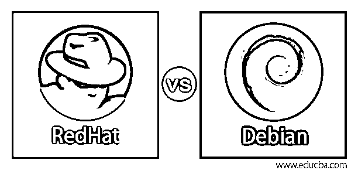
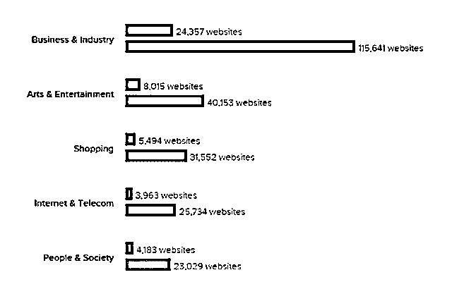
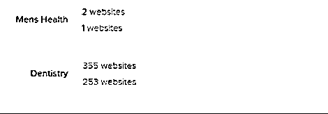
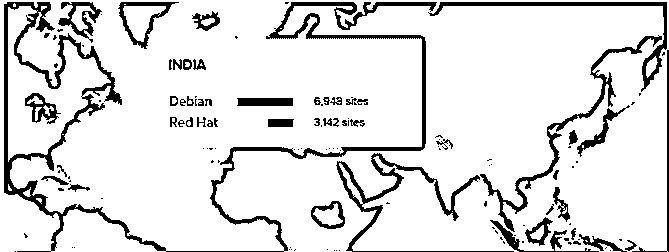

# RedHat vs Debian

> 原文：<https://www.educba.com/redhat-vs-debian/>

## RedHat 和 Debian 的区别

RedHat Inc .的 RedHat 提供开源产品供任何人购买和使用，其许可证在一定程度上是免费的。对于除此之外的功能，用户可以付费购买额外功能的许可证。Debian by Debian 项目为任何人提供免费的软件产品来访问许可的应用程序，对可访问的特性没有任何限制。当 RedHat 发布像 Linux 这样的产品作为商业发行版时，Debian 发布非商业产品。RedHat 最新的稳定版本是 7.5 版，2018 年 4 月 10 日发布，Debian 最近的稳定版本是 9.5 版，2018 年 7 月 14 日发布。

### RedHat 和 Debian 的正面比较(信息图)

下面是 RedHat 和 Debian 的 12 大区别

<small>网页开发、编程语言、软件测试&其他</small>

### RedHat 和 Debian 的主要区别

两者都是市场上的热门选择；让我们来讨论一些主要的区别。

1.  **市场份额:**双方的市场份额可以说是一方领先另一方的决定性关键因素。下面是一些市场份额分布(分析视图)。Debian 在顶级 10K 网站、前 10 万、前 100 万网站和整个网络类别中领先，而 RedHat 在市场份额类别中落后，它在所有细分市场中都输给了 Debian。

2.  **网站类别:**众所周知，全球有大量的网站。这些网站或多或少根据其服务的目标或目的分为不同的类别。谈到商业行业、艺术和娱乐、购物、电信和其他几个行业，Debian 是领导者，因为它在这些网络类别中有更好的使用覆盖面，而 RedHat 只对少数网络类别产生影响，如牙科和男性健康。

3.  从地理上来说，Debian 比 RedHat 被更多国家的人所接受。一方面， [Debian 在德、俄、法、美等 220 个国家有很强的影响力](https://www.educba.com/what-is-debian/)，而说到 RedHat，它成功地在日本、台湾、巴哈马、瑞士等国家建立了市场基础。从一个国家的角度来看，我们很容易看出 Debian 在印度网络市场的影响。

4.  RedHat 包含大约 3000 个软件包，而最新的 Debian 版本(有点喘)包含超过 38000 个软件包。对软件包的一般比较清楚地表明 Debian 提供的软件包比 RedHat 提供给用户的多 80%。比较 Debian 软件包，如 OpenOffice，Transmission BitTorrent client 和 mp3 编解码器等。，到 RedHat，需要手动安装或者从第 3 rd party 仓库安装。
5.  Bug/问题修复:RedHat 问题通常需要相当长的时间来解决，因为它是由一个较小的 red hat 员工社区控制和 QA 的，而 Debian 的 Bug 修复要快得多，因为 Debian 社区的人可以在不同的地理位置找到并致力于尽快解决它。
6.  **版本更新便利:** RedHat 更新版本一般需要六个月或更长时间。用户发现更新过程真的很麻烦，你需要重新安装所有的东西。另一方面，Debian 的更新非常频繁(每天一次),而且非常容易，只需点击几次。
7.  Debian 在区分配置文件和其他文件方面更加先进和智能。这导致容易安装。在 Debian 中，未修改的文件会自动更新，而需要用户许可的配置文件会根据用户的决定进行修改。这个特性是 RedHat 所没有的。

### RedHat 与 Debian 比较表

下面是最上面的比较

| **比较的基础** | **红帽** | Debian |
| **软件许可类型** | 开放源码 | 自由的 |
| **稳定发布(最新)** | 7.5、6.10、5.11/2018 年 4 月 10 日 | 9.5(拉伸)(2018 年 7 月 14 日) |
| **设计开发** | 红帽公司。 | Debian 项目(符合公众利益的软件)。 |
| **OS 家族** | Linux 操作系统 | 类 Unix |
| **初始发布** | 2000 年 2 月 22 日 | 1993 年 9 月 |
| **平台** | ARM64，电源架构；s/390；z/建筑， | Amd64、is64、i386、arm64、armel、armhf、mipsel、ppc64、z/Architecture、RISC-V |
| **内核类型** | 单片(Linux) | 单片(Linux、kFreeBSD、micro、GNU hurd) |
| **分配类型** | RedHat 是商业 Linux 发行版 | Debian 是非商业性的 Linux 发行版 |
| **包装类型** | RedHat 使用 rpm 包。RedHat 使用 RPM 包管理器。 | Debian 使用 deb 包。Debian 使用 dpkg 包管理器。 |
| **解析器类型** | RedHat 使用 yum 依赖解析器。 | Debian 使用 apt-get 依赖解析器 |
| **特性** | Virtualization possibilities(from Linux 5 onwards)内核和性能优化的多核处理器、可动态切换的预队列 I/O 调度程序。服务器和台式机打包、安全性、网络和互操作性、存储管理。 | X.org 7.3 集成，重新强调安全问题，Java 友好设置， |
| **使命/愿景** | RedHat 是一家跨国公司，其目的是基于每一包销售的利润。 | Debian 或 Debian 项目是由 SPI(公益软件)创建和开发的，SPI 是一个非盈利组织。 |

### 结论

服务器维护非常昂贵，这适用于任何公司，无论其规模大小。公司越大，挑战就越多。除了服务器维护之外，在最佳解决方案覆盖您的组织之前，其他挑战因素包括应用程序稳定性、企业版及其功能、安装成本。目的是 RedHat 是稳定和安全的，但老实说，RedHat 的企业版使您的公司花费数千美元，并在某种程度上获得过时的软件，这使它不太适合公司。Debian 在世界范围内的受欢迎程度，以及它因易于操作而被全球接受的程度，使它成为许多公司的首选。

这篇 Debian vs RedHat 的文章涵盖了一些非常关键的决定因素，在我看来，这些因素明显有利于 Debian。你可能不同意这篇 Debian vs RedHat 文章的讨论，但是你不能逃避事实。这篇 Debian vs RedHat 文章背后的唯一意图是揭示业务和用户方面的可用性和不足之处。各有利弊。目前所有可用的 Debian 发行版都是因为社区和用户组的支持。

### 推荐文章

这是 RedHat 和 Debian 之间最大区别的指南。在这里，我们也讨论了 RedHat 和 Debian 的主要区别，包括信息图表和比较表。您也可以看看以下文章，了解更多信息–

1.  [Redhat vs Ubuntu](https://www.educba.com/redhat-vs-ubuntu/)
2.  [CentOS vs Debian](https://www.educba.com/centos-vs-debian/)
3.  [Linux vs Mac](https://www.educba.com/linux-vs-mac/)
4.  [Linux vs Android](https://www.educba.com/linux-vs-android/)

