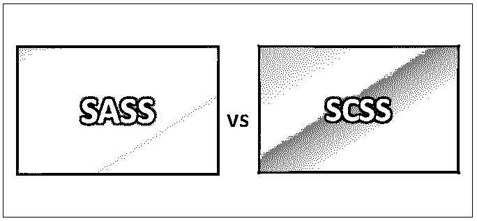

# 萨斯 vs SCSS

> 原文：<https://www.educba.com/sass-vs-scss/>

## 萨斯和 SCSS 的区别

SASS 是一种样式表语言，由 Hampton Catlin 设计，Chris Eppstein 和 Natalie Weizenbaum 开发。它是一种预处理器脚本语言，将被编译或解释为 CSS。SassScript 本身就是一种脚本语言。它的打字规则是动态的。SCSS 通常被称为 Sassy CSS，它是作为构建在现有 CSS 语法之上的 SASS(语法上令人敬畏的样式表)的主要语法而引入的。它像 CSS(层叠样式表)一样使用分号和括号。SCSS 是 CSS 的一个超集，也就是说，所有的 CSS 特性都将在 SCSS 可用，并且几乎不包含 SASS(语法上很棒的样式表)的特性。SCSS 认为任何 CSS 术语都是有效的。

### 萨斯和 SCSS 的面对面比较(信息图)

以下是萨斯和 SCSS 的 9 大区别:

<small>网页开发、编程语言、软件测试&其他</small>

### 萨斯和 SCSS 的主要区别

两者都是市场上的热门选择；让我们讨论一些主要的区别:

1.  SASS 是语法上令人敬畏的样式表，是 CSS 的扩展，它提供了嵌套规则、继承、混合的特性，而 SCSS 是 Sassy 级联样式表，它类似于 CSS，填补了 CSS 和 SASS 之间的空白和不兼容性。它是在麻省理工学院的许可下授权的。它最早出现在 2006 年。
2.  SASS 更容易使用，语法也不太复杂，它消除了分号、曲线、大括号等。，而 SCSS 是一个与 CSS 完全兼容的文件，并且具有. scss 类型的文件扩展名
3.  SASS 拥有最好的编码标准和良好的官方文档，而 SCSS 更容易学习开发代码。
4.  SASS 基于 javascript，支持不同的语言扩展，有自己的语法，开源 CSS 预处理器和高级功能，如控制和指令及其库，而 SCSS。
5.  通过重写代码，SASS 更难与现有的 CSS 项目集成，而 SCSS 通过添加新代码而不是重写现有的代码库，更容易与现有的代码库集成。
6.  SASS 更容易使用、阅读和编写，而 SCSS 在实现代码方面更具逻辑性和复杂性。
7.  [SASS 变量将以美元符号开始](https://www.educba.com/sass-variables/)，而 SCSS 具有模块化特性，通过使用某种注释以更模块化的方式组织代码。
8.  sass 有高级的语法特性，并且它的文件有一个. SASS 扩展名，而 SCSS 的特性就像每个有效的 CSS 文件都是一个 SCSS 文件。
9.  SASS 类似于 Ruby，需要 Ruby 进行安装，没有严格的代码缩进，而 SCSS 类似于 CSS，不需要额外的安装或配置就可以轻松使用。
10.  SASS 有局部和全局变量，用于 CSS 文件的不同位置，而 SCSS 有不同的变量，如颜色变量，这些变量可以在样式表中使用。
11.  SASS 有一个嵌套功能，可以嵌套 CSS 选择器以显示在 HTML 中，而且很难维护更长层次的嵌套 CSS，而 SCSS 可以处理多个类和不同的嵌套样式。
12.  SASS 有文档风格，比 CSS 更好，有颜色、属性和参数列表的操作特性，而 SCSS 语法有边距、列表风格、填充、显示等。
13.  SASS 有控制指令、功能指令、混合指令，并且具有可扩展的特性，而 SCSS 可以和 SASS 一起使用来表示 CSS 类似的特性。
14.  经过最初的开发，SASS 被扩展为 SassScript。它支持跨平台操作系统。它受到 CSS、LESS、YAML 等的影响。此 SASS 的文件扩展名类型有。scss 和。sass，它的正式实现也是一个使用 Ruby 开发的开源项目。

### 萨斯与 SCSS 对比表

下面是萨斯和 SCSS 之间最重要的比较

| **比较的基础** | **SASS** | **SCSS** |
| **定义** | 它被称为语法超棒的样式表。 | 它被称为时髦的级联样式表。 |
| **用途** | 当开发需要原始语法时使用它。 | 当对所使用的代码语法没有要求或标准时，使用它。 |
| **整合** | 它可以与任何类型的项目集成，因为它支持所有版本的 CSS。 | 它还可以与任何包或项目集成，因为它是 CSS 的超集，包含所有 CSS 功能。 |
| **平台** | 它支持任何操作系统或平台。 | 它支持跨平台操作系统。 |
| **语法** | 语法约束非常少，可以简单地编写。 | 它有更多的约束，如分号等。 |
| **社区** | 它有一个更大的设计师和开发人员社区。 | 它的社区更小，支持它的个人贡献者也更少。 |
| **执照** | 它在麻省理工学院的许可下被许可和修改。 | 它也被麻省理工学院许可。 |
| **规则** | 它在规则方面的约束更少。 | 它更具表现力，更面向语法。 |
| **文档** | 它使用 SassDoc 提供文档。 | 它允许在代码本身中有良好的内联文档。 |

### 结论

萨斯和 SCSS 都是 CSS 预处理器，它们对于包含在基于 CSS 的 UI(用户界面)或前端框架中以简化开发非常有用。这些 SASS vs SCSS 框架在以编程方式利用强大的 CSS 功能时，在高层次上提供了利用 CSS 功能的强大功能。SASS 是一种 CSS 扩展，其中大部分功能将被扩展，而 SCSS 是 CSS 的一种超集，其中 CSS 的所有功能都将在 SCSS 中。预处理器的选择取决于通过以有效的方式做出折衷选择来使应用高效工作所需的功能和特性。

与 SCSS 相比，SASS 更容易使用，需要更少的语法或配置，建议用于需要更快开发范围和更容易开发复杂组件的大型应用程序，而 SCSS 可用于优化 Mixin 功能和许多其他有效技术的情况。

### 推荐文章

这是萨斯和 SCSS 之间最大区别的指南。在这里，我们还讨论了萨斯和 SCSS 的关键差异，并提供了信息图表和比较表。你也可以看看下面的文章来了解更多。

1.  [密码术 vs 加密](https://www.educba.com/cryptography-vs-encryption/)
2.  [Groovy vs Java](https://www.educba.com/groovy-vs-java/)
3.  [Haskell vs Scala](https://www.educba.com/haskell-vs-scala/)
4.  [SASS vs CSS](https://www.educba.com/sass-vs-css/)

