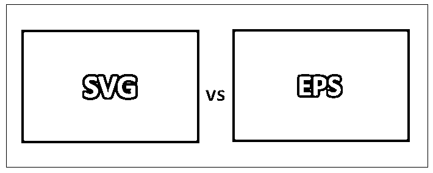

# SVG vs EPS 的应用

> 原文：<https://www.educba.com/svg-vs-eps/>

## SVG 和 EPS 的区别

SVG 代表可缩放矢量图形，一种基于 XML 的二维图形矢量图像格式。SVG 对交互性和动画有广泛的支持。使用 SVG 矢量可以在短时间内创建二维图像。但是，与 JPEG 和 PNG 不同，SVG 不使用像素。所有带有 SVG 的形状都是使用 XML 指定的，然后 SVG 查看器会呈现 XML。现代世界中的大多数 web 浏览器都能够呈现 SVG，就像它们可以呈现 PNG 和 JPG 格式一样。因为 SVG 是基于矢量图形格式的，所以它主要用于基于矢量的图表。一些基于 SVG 格式的应用程序是 X，Y 坐标系中的二维图形，本质上可扩展的图标和徽标可以成功地设计用于 web、移动应用程序和平板电脑。SVG 中呈现的形状基于矢量图形格式，存储为类似矢量的结构。简而言之，存储为数字而不是像素。作为矢量图形，基于 SVG 的图像也是可缩放的，这意味着开发人员可以放大和缩小图像的大小，而不用担心质量的损失。使之成为可能的一个特性是，这些图形是基于数字而不是像素的。换句话说，定义 SVG 图像的数字被修改，这可以通过乘法或除法来完成。XML 格式有多种好处；从 servlet、JSP 或 PHP 或任何其他 web 应用程序技术中创建是非常容易的。因此，SVG 被认为是计算机生成的图形和图表的理想选择。使用 SVG 创建的绘图本质上可以是交互式的或动态的。元素可以以基于时间的方式进行修改，并且可以用任何脚本语言(如 JavaScript)进行描述或编程。然而，web 标准推荐 SMIL 作为 SVG 的标准动画。

EPS 代表 Encapsulated PostScript，这是一种 PostScript 文档，可用作图形文件格式。Postscript 文档设计用于描述图像，并成功放置在另一个 Postscript 文档中。换句话说，可以说 EPS 文件是一个 Postscript 程序，其中包含一系列旨在创建图像的描述。此 Postscript 程序可以保存为单个文件，包括捕获或封装在其中的预览，允许其他程序在屏幕上显示预览。EPS 文件可以描述包含图像的矩形；这个矩形被称为边界框 DSC 注释。任何打算使用 EPS 文件的应用程序都可以利用这些信息来布局页面。EPS 属于 Adobe，与其他受支持的文件格式有本质区别。最初，EPS 文件旨在存储与打印机图像数据定位相关的信息，而不是计算机显示器。启用 Postscript 的打印机直接解释 EPS 数据，从 Postscript 文件生成高质量的输出。随着时间的推移，Postscript 数据变得更加可视化，其界面也变得更加强大。EPS 文件格式可用于 Adobe Illustrator 的矢量图像。EPS 文件通常包含图像的位图版本，以便于查看，而不是使用矢量指令来绘制图像。在第一次实现 EPS 时，苹果 Macintosh 机器广泛使用 Postscript。对于屏幕显示，EPS 文件通常包括内容的预览图片，因为它允许在可以绘制位图的应用程序中预览最终输出。如果没有这个预览，应用程序必须直接在 EPS 中呈现 Postscript 数据。

<small>网页开发、编程语言、软件测试&其他</small>

### SVG 和 EPS 之间的直接比较(信息图表)

下面是 SVG 与 EPS 之间的 8 大区别

### SVG 和 EPS 的主要区别

这两种性能都是业务中的推荐选项。让我们检查一些关键的区别:

*   SVG 代表标量矢量图形，而 EPS 是基于编程或脚本的，代表封装的 PostScript。
*   SVG 对于从事万维网工作流的团队来说是理想的，而 EPS 对于印刷工作流团队来说是很好的。
*   SVG 基于 XML 文件格式，可用于 web 相关技术，而 EPS 基于 Postscript 而非 XML 格式。
*   大多数现代 web 浏览器可以呈现基于 SVG 的图像，而 EPS 最初是为打印工作流设计的，带有 Postscript。
*   SVG 文件是网站设计的更好的选择，而 EPS 可以作为打印机的备份，只要有机会，他们可能会要求它。
*   SVG 文件格式适合网站上的图形和图标元素，而 EPS 文件格式更适合高质量的文档打印、徽标和营销材料。
*   SVG 文件格式是 web 平台上的一个新兴特性，而 EPS 格式正在消亡，并被保留给旧的矢量图形。
*   Adobe Illustrator 和 CorelDRAW 对读取、写入 SVG 有足够的支持，但并不是所有工具都有读写 EPS 格式的成熟功能，比如 Ghostview 可以很好地读取 EPS 格式，但不能编辑它。
*   SVG 是 W3C 的标准矢量图像，而 EPS 是印刷行业的标准交换格式。
*   如果想在 web 上使用矢量文件，SVG 是标准方法，因为这是唯一的选择，而 EPS 适用于印刷出版环境，因为 SVG 缺少许多印刷所需的功能。

### SVG 与 EPS 对比表

让我们来看看 SVG 与 EPS 之间的主要对比

| **比较的基础** | **【SVG】t1㎡型** | **EPS** |
| **定义** | www 出版的矢量图形标准 | 印刷工作流程的传统矢量图形标准 |
| **性质** | 文件类型可以改变颜色或动画 | 通常用于打印或保存设计的实际预览 |
| **基础** | 基于 XML 格式 | 后记的扩展 |
| **好处** | 基于 XML 的自然搜索、索引和压缩非常容易 | 关于如何显示图像的附加信息 |
| **开发** | 它是由 w3c 内部的公司开发的 | 不再开发 |
| **用途** | 对网络更有用 | 更适合矢量软件 |
| **到达** | 比 EPS 晚很多到达网络平台 | EPS 是一种传统的基于矢量的图形，比 SVG 早得多 |
| **功能** | 非常适合希望迁移到 www 工作流的团队 | 打印工作流程功能的理想选择 |

### 结论

EPS 和 SVG 文件格式各有优缺点。SVG 是 web 平台上矢量图形的事实上的标准，因为它是唯一的选择，而 XML 标准与基于 web 的技术兼容，如 servlet、JSP 或 PHP 等。另一方面，EPS 基于 Postscript，这与 XML 标准有很大不同。在今天的场景中，它已被弃用，并且比 SVG 更早出现在计算机技术中。EPS 更适合打印工作流程，这是初衷。最终，它出现在一个基于界面的环境中，并从那里开始加速发展。

选择是否使用 EPS vs SVG 格式的是用户。如果用户故事围绕基于 web 的场景，那么 SVG 文件格式是最好的选择，它支持多种浏览器。对于基于打印工作流的场景，EPS 将是一个理想的选择，因为 SVG 缺乏打印功能。

### 推荐文章

这是 SVG 和 EPS 之间最大区别的指南。在这里，我们还将讨论信息图和比较表的主要区别。你也可以看看下面的文章来了解更多。

1.  [Laravel vs Codeigniter](https://www.educba.com/laravel-vs-codeigniter/)
2.  [奥雷利亚 vs 安格尔](https://www.educba.com/aurelia-vs-angular/)
3.  [Java EE vs Spring](https://www.educba.com/java-ee-vs-spring/)
4.  [JavaScript vs JScript](https://www.educba.com/javascript-vs-jscript/)

