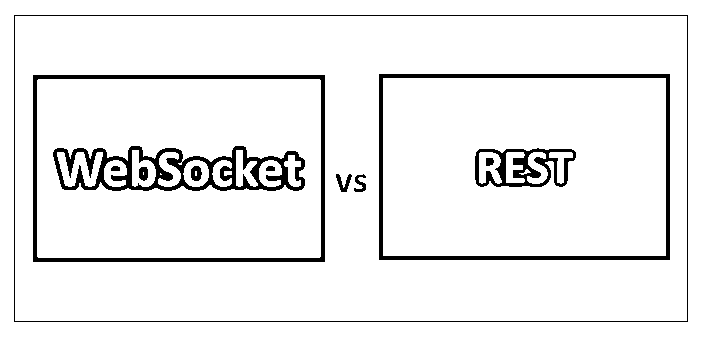

# WebSocket vs REST

> 原文：<https://www.educba.com/websocket-vs-rest/>

## WebSocket 和 REST 的区别

WebSocket 是一种通过 TCP 连接的通信协议，它提供了一个点对点通信系统。构建 WebSocket 的基本思想是 Socket，或者可以说 WebSocket 协议是 socket 的扩展。协议的标准化允许人们使用它，这对于从浏览器向服务器和从服务器传输数据是非常有效的。REST，即表示状态转移，定义了一组用于创建 web 服务的约束。在 web 应用程序中使用 HTTP 创建 REST 终结点是体系结构样式之一。RESTful 终结点正在被调用，这些终结点将调用本质上属于 RESTful 的 API 并给出 HTTP 响应。

### WebSocket

*   WebSocket 协议可以克服 HTTP 提出的障碍，就像它可以提供全双工通信一样。该协议于 2011 年标准化，W3C 正在标准化相关的 WebSocket API。同时，WebSocket 并没有向 web 的安全系统妥协。所有的 WebSocket 握手都可以由浏览器使用内嵌的开发工具来仔细检查。
*   WebSocket 代表了客户端和服务器之间双向通信的标准。使用这种方法，开发人员可以想出一个在所有平台上一致工作的函数。WebSocket 代表单个 TCP 套接字连接，因此消除了连接限制的问题。
*   跨域的通信可以在连接握手中有效地处理。类似 Pusher 的服务可以很容易地利用这种连接来支持实时平台，这在本质上是大规模可扩展的，并且可以在任何网站、web、桌面或移动应用程序上高效地使用。第一次是在 HTML5 规范中作为 TCP 连接引用的。所有浏览器都实现了 WebSocket 协议的安全版本，无论是 Firefox 还是 Google chrome 等等。

### 休息

1.  REST 的操作本质上是标准的、无状态的，这实际上使得任何 RESTful 的系统都是快速的、可靠的，同时也是可增长的。一个带有 HTTP 动词(即 Get、Post、Put、Delete)的请求将从客户端发出。它们对预期的操作集作出反应，接收数据，更新数据或者删除数据，这取决于动词。
2.  REST 可以作为为请求设计 API 的标准方法之一。如果用户在任何 web 应用程序上的交互不太频繁，HTTP 适合这种情况。在空闲时间，关闭的端口套接字可以节省资源。
3.  使用 REST 架构，客户端和服务器可以独立实现，彼此不了解。这种客户机/服务器模式有很多好处；客户端代码可以随时修改，而不会影响服务器。具有 REST 接口的不同客户端可以同时访问端点并接收相同的响应。
4.  此外，另一个特征是无国籍。服务器不需要知道客户端处于哪种状态，对于客户端来说也是如此。这种无状态属性可以通过使用资源而不是命令来获得。因此，接口的实现变得无关紧要，因为 REST 系统通过对资源的标准操作相互对话。

### WebSocket 与 REST 的面对面比较(信息图表)

以下是 WebSocket 与 REST 的 8 大区别:

<small>网页开发、编程语言、软件测试&其他</small>

### WebSocket 和 REST 的主要区别

两者都是市场上的热门选择；让我们讨论一些主要的区别:

1.  WebSocket 是一个基于套接字和端口概念的底层协议，它们是底层的传输机制，而 REST 是基于 CRUD 操作的。
2.  WebSocket 需要使用 IP 地址和端口细节，这是任何应用程序的底层细节，而 RESTful 应用程序需要设计基于动词和基于 HTTP 的操作。
3.  WebSocket 本质上是双向的，即从客户端到服务器的双向操作都是可能的，反之亦然，而 REST 遵循单向方法。
4.  WebSocket 方法是实时可伸缩应用程序的理想选择，而 REST 更适合有大量 get 请求的场景。
5.  WebSocket 是一个有状态协议，而 REST 是基于无状态协议的，也就是说，客户端不需要知道服务器，服务器也是如此。
6.  WebSocket 连接可以在单个服务器上垂直伸缩，而基于 HTTP 的 REST 可以水平伸缩。
7.  WebSocket 非常适合高负载是游戏的一部分的场景，即实时可伸缩的聊天应用程序，而 REST 更适合在典型的 GET 请求场景中调用 RESTful APIs 的偶尔通信。
8.  WebSocket 工作得更好，在 web socket 连接的生命周期中，客户端-服务器通过相同的 TCP 连接进行通信，而对于 HTTP 请求，则启动一个新的 TCP 连接。
9.  WebSocket 通信允许客户机和服务器相互独立地进行对话，而对于基于 REST 的方法，在任何给定的时间，要么客户机与客户机对话，要么服务器与客户机对话。
10.  WebSocket 通信成本较低，而基于 REST 的通信成本相对较高。

### WebSocket 与 REST 对照表

让我们来看看 WebSocket 与 REST 之间的顶部比较——

| **比较的基础** | **WebSocket** | **休息** |
| **HTTP** | HTTP 的使用发生在初始连接中。 | HTTP 是 RESTful web 服务中的一种常见协议。 |
| **通信** | 本质上是双向的。 | 本质上是单向的。 |
| **性质** | 基于套接字的概念。 | 基于资源的概念，而不是命令。 |
| **场景** | 实时聊天应用程序。 | 很多获取请求。 |
| **依赖关系** | 依靠 IP 地址和端口号。 | 基于 HTTP 协议并使用 HTTP 方法来中继数据。 |
| **成本** | 沟通成本更低。 | 通信成本相对高于 WebSocket。 |
| **性能** | 高负荷时更好。 | 非常适合偶尔交流。 |
| **状态** | WebSocket 是一个有状态的协议。 | REST 基于 HTTP，这是一种无状态协议。 |

### 结论

REST 是迄今为止为请求构建 web APIs 的最标准化的方式。大多数 web 应用程序倾向于使用 RESTful 方法。基于动词的操作，即创建、读取、更新或删除操作，通过 HTTP 协议成功执行。使用 HTTP 协议有一些好处；客户端和服务器不需要相互了解。在客户端完成的任何操作都不会妨碍服务器端的操作，服务器端的功能也是如此。

另一方面，WebSocket 是基于底层概念的，就像套接字和端口一样。在这种通信媒介中需要应用程序 IP 地址和端口。此外，客户机和服务器之间的 web 套接字通信可以共享一个 TCP 连接。此外，它是一个有状态的协议，不像 HTTP 那样本质上是无状态的。

因此，在 WebSocket 上使用 REST，或者相反，取决于应用程序和场景的类型。对于实时、可伸缩的应用程序，WebSocket 是理想的选择，与 REST 相比成本更低。任何有大量 CRUD 操作的应用程序都需要使用 RESTful 风格。最终，是需求和场景决定了 WebSocket 和 REST 的使用。

### 推荐文章

这是 WebSocket 和 REST 之间最大区别的指南。在这里，我们还将讨论信息图和比较表的主要区别。您也可以看看以下文章，了解更多信息–

1.  [拉勒维尔 vs 禅宗](https://www.educba.com/laravel-vs-zend/)
2.  [SVG vs Canvas](https://www.educba.com/svg-vs-canvas/)
3.  [密码术 vs 加密](https://www.educba.com/cryptography-vs-encryption/)
4.  [Haskell vs Scala](https://www.educba.com/haskell-vs-scala/)
5.  [web socket vs . socket . io:差异](https://www.educba.com/websocket-vs-socket-io/)
6.  [web socket 和 vs Socket.io 的主要区别](https://www.educba.com/websocket-vs-socket-io/)

