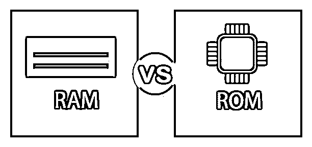

# RAM 与 ROM

> 原文：<https://www.educba.com/ram-vs-rom/>

## RAM 和 ROM 的区别

RAM，也称为随机存取存储器，只在使用时保存数据。它以临时形式存储信息，并需要存储数据的能力。与 ROM 相比，它的尺寸更大，成本也更高。我们可以使用 RAM 进行读写操作。ROM(只读存储器)存储内容，即使系统不用于永久存储信息。只能用于读操作，成本很少。体积小，容量也少。RAM 用于 CPU 缓存，而 ROM 用于微控制器。

### 随机存取存储

*   每台计算机都有某种形式的存储器，用来存储当前正在执行的数据和机器代码。RAM，即随机存取存储器设备，提供相同的目的，其允许在相同的时间量内读取和写入数据。RAM 设备有许多数据线来满足这种存储要求。众所周知，现代 RAM 设备具有易失性类型的存储器；即使非易失性 RAM 也在开发中，但如果断电，信息也会丢失。RAM 也可以以集成电路的形式提供。市场上还有其他非易失性存储器，它们有某些限制，如允许随机访问读类型操作，但不允许写操作。
*   有两种类型的 RAM 在现代计算机世界中广泛使用，SRAM，即静态 RAM 和 DRAM，即动态 RAM。SRAM 的生产成本很高，它使用晶体管存储单元状态来存储每一位数据。SRAM 比 DRAM 速度更快，需要的能量更少，因此被现代计算机主要用作高速缓冲存储器。另一方面，DRAM 使用具有晶体管和电容器的对来存储一位数据。因为与 SRAM 相比，它的生产成本更低，所以它们被广泛应用于世界各地的计算机中。SRAM 和 DRAM 本质上都是易失性的，因为当系统断电时它们会失去状态。更具体地说，它们负责提供计算机系统中的主内存。

### 只读存储器

*   只读存储器不容易修改，所以它们适合存储数据，在较长的一段时间内不需要修改。人们可以说这种类型的存储器是硬连线的，在制造之后不能被改变。最新版本 ROM 已经问世，它包含一个用于正常操作的只读存储器，尽管它可以被编程。EPROM，即可擦除可编程只读存储器和 EEPROM，即电可擦除可编程只读存储器，可以被移除和重新编程。但是，这个过程需要时间，速度相对较慢，可以通过一定的尝试来实现。
*   计算机开机时，需要一定的内存来运行初始程序，初始程序是用 ROM 存储的。这个过程也称为引导或自举。在现代计算机中，主处理器的引导存储在 ROM 中；其他设备如图形卡、硬盘、CD-DVD 驱动器也在系统中使用 ROM。掩模编程 ROM 是 ROM 的经典例子，它对需要存储的数据进行物理编码。它们是集成电路，不可能改变其内容。然而，可以修改另一类 ROM，包括 PROM、EPROM、EEPROM。电修改的 ROM，它们的读取速度比写入速度快。在申请写保护后，一些可重编程只读存储器成为只读存储器。

### RAM 和 ROM 之间的直接比较(信息图表)

下面是 RAM 与 ROM 之间的 6 大区别

<small>网页开发、编程语言、软件测试&其他</small>

### RAM 和 ROM 的主要区别

两者都是市场上的热门选择；让我们讨论一些主要的区别:

1.  RAM 是随机存取存储器，没有电源不能保存数据，而 ROM 是只读存储器，即使没有电源也能保存数据。
2.  RAM 是存储信息的易失性存储介质，而 ROM 是存储数据的非易失性存储介质。
3.  使用 RAM，写数据是一个更快更轻松的过程，而 ROM，写数据的速度比 RAM 慢得多。
4.  RAM 有两种类型，即静态 RAM 和动态 RAM，而 ROM 有三种类型:屏蔽 ROM、PROM、EPROM 和 EEPROM。
5.  RAM 上的数据被多次访问、读取和擦除，而在 ROM 上，写入数据是一个相对非常慢的过程。
6.  RAM 用于主存储器 DRAM 和 CPU 高速缓冲存储器 SRAM，而 ROM 用于 BIOS、[微控制器](https://www.educba.com/what-is-microcontroller/)和其他电子设备。
7.  RAM 很贵，也不便宜，而 ROM 比 RAM 便宜得多。
8.  RAM 的容量很大，甚至更高，而 ROM 的容量较小，甚至更低。
9.  RAM 是一种具有读写操作的高速存储器，读写操作速度很快，而 ROM 是速度较慢的存储器，不容易修改，可以通过外部程序完成。
10.  RAM 上的数据可以多次更改，这解释了它的扩展性，而 ROM 上的数据是永久的，尽管可以更改，但速度非常慢，而且次数有限。

### RAM 与 ROM 对照表

下面是 RAM 和 ROM 之间最重要的比较

| **比较的基础** | **RAM** | 【T0 罗马】T1 |
| **数据** | 没有电源，RAM 无法保存数据 | ROM 可以在没有电源的情况下保存数据 |
| **存储** | 临时存储介质 | 一种永久的存储介质 |
| **功率** | RAM 芯片易失，断电时会丢失信息 | ROM 是非易失性的，不需要恒定的电源 |
| **操作** | RAM 芯片用于计算机的正常运行 | ROM 主要用于计算机的启动过程或引导 |
| **速度** | 将数据写入 RAM 更快 | 与 RAM 相比，写入 ROM 要慢得多 |
| **例子** | RAM 芯片可以存储信息，运行程序，并在任务之间快速切换 | 与 BIOS 一起使用的 PROM 芯片存储开始初始计算机启动过程所需的程序 |

### 结论

在这篇关于 RAM 和 ROM 的文章中，我们看到了 RAM 和 ROM 各有优缺点。但是这两种类型的存储设备对于计算机设备的有效运行都是必需的。ROM 很便宜，可以永久保存数据，但它有自己的一套限制，比如很难修改数据，而且时间也是固定的。RAM 很贵，但同时，数据可以在上面多次修改。

然而，随着现代电子景观，ROM 也不逊色。可移动存储介质，如 USB 驱动器、存储数据卡等。是 EEPROM(一种只读存储器)的复杂实现。因此，无论是 RAM 还是 ROM 都可以满足应用程序的技术和性能要求，处理大量的数据。

### 推荐文章

这是 RAM 与 ROM 之间最大差异的指南。在这里，我们还将讨论信息图和比较表的主要区别。你也可以看看下面的文章来了解更多。

1.  [Oracle vs SQL Server](https://www.educba.com/oracle-vs-sql-server/)
2.  [PL SQL vs SQL](https://www.educba.com/pl-sql-vs-sql/)
3.  [JSP vs Servlet](https://www.educba.com/jsp-vs-servlet/)
4.  [JSP vs ASP](https://www.educba.com/jsp-vs-asp/)

