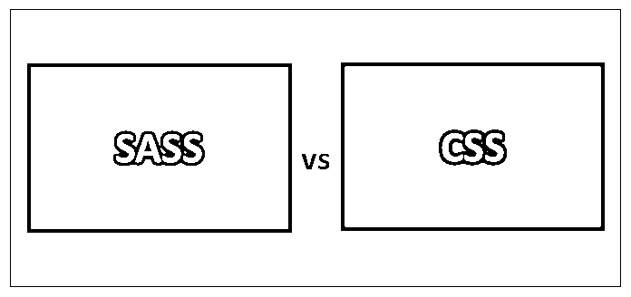

# SASS vs CSS

> 原文：<https://www.educba.com/sass-vs-css/>

## SASS 和 CSS 的区别

Sass for Systematically Awesome 样式表是 CSS 的预处理器。它是 CSS 的一个扩展，用于为基础语言增加功能和风格。它鼓励你包含因素、既定原则、内联导入、混合、遗留，这只是冰山一角，所有这些都有一个完全 CSS-良好的语言结构。CSS 或级联样式表是一种样式表语言。它用于描述以诸如 HTML 的语言编写的报告的介绍。CSS 是万维网、HTML 和 JavaScript 的基础创新。

**让我们更详细地研究一下 SASS 和 CSS:**

<small>网页开发、编程语言、软件测试&其他</small>

*   Sass 是一种更加稳定和突破性的 CSS 增强方言，它从根本上清晰地描述了记录的风格。保持大模板的效率并快速运行小模板对处理大模板非常有帮助。
*   萨斯最初是由汉普顿·卡特林设计的，由娜塔莉·韦岑鲍姆在 2006 年发明的。在基础改进之后，Natalie Weizenbaum 和 Chris Eppstein 继续进行其基础变体，并使用 SassScript 扩展 Sass，Sass script 是一种在 Sass 文件中使用的简单脚本语言。
*   CSS 的目的是授权介绍和内容的划分，包括设计、色调和字体。这种划分可以增强内容的可访问性，在介绍属性的细节方面提供更大的适应性和控制，通过在不同的 CSS 文档中指示相关的 CSS 来使不同的页面能够共享格式，并且减少辅助内容中的多面性和冗余。
*   与其他 CSS 增强方言相比，Sass 拥有更多的亮点和功能。萨斯核心团队一直在不停地工作，以保持领先。
*   在 CSS 之前，HTML 记录的每一个表示特征都包含在 HTML 标记中。所有的文本风格色调、基础风格、组件排列、边缘和大小都必须在 HTML 中清楚地描述出来，通常不止一次。CSS 让创建者有机会将大量数据转移到另一个文档，即模板，从而大大降低 HTML 的难度。

### SASS 和 CSS 的直接比较(信息图表)

以下是 SASS 和 CSS 的 7 大区别:

### SASS 和 CSS 的主要区别

两者都是市场上的热门选择；让我们来讨论一些显著的区别:

1.  SASS 是一个 CSS 预处理器，这使得它基本上是一个和 CSS 没有区别的东西。
2.  作为一个预处理程序，一段代码在 Sass 中完成，后来这段代码被组装成 CSS。
3.  SASS 的基本目标是增强实用性，因为你的模板越来越大，越来越难以置信。
4.  本质上都是 CSS 然而，粗配置中的 SASS 应该被收集(加热)到最后的浏览器可读 CSS 中。
5.  SASS 对于小项目来说可能是多余的，但是对于大项目来说，SASS 将在底层形式和未来支持中为您节省大量时间。它使您能够利用各种因素来快速改变色调、文本尺寸、缓冲等，在这一点上，准备好或填充整个使用该变量的 CSS。
6.  萨斯/SCSS 是 CSS 的扩充，增加了它的超大容量，使它更有价值，更有利可图，并组成稳定的代码。它们也被称为 CSS 预处理器。
7.  SASS 的语法非常类似于 ruby。
8.  我们在 CSS 中使用大括号。
9.  在 SASS 中没有使用大括号。
10.  SASS 是 CSS 的预处理方言。当你编写 SASS 时，你必须把它合并到标准的 CSS 中，这样程序才能呈现它。您可以使用 Codekit 之类的应用程序或订单行工具，例如 Grunt。
11.  利用 Sass 编写预先准备好的 CSS 使您能够利用 Sass 的特性，如 mixins 和标准 CSS 附近的缩进 CSS。这真的很酷，会非常快地加速你的前端改进。
12.  在使用 CSS 的情况下，你不一定要编写 HTML 标签属性。只需了解一个标签的 CSS 规则，并将其应用于该标签的每一个事件。因此，代码越少意味着下载时间越快。
13.  CSS 本身可能很有趣，但是模板变得越来越大，越来越复杂，越来越难跟上。这就是预处理器可以发挥作用的地方。SASS 提供了一个利用 CSS 中还不存在的亮点的机会，如 factors、settling、mixins、legacy 和其他巧妙的处理方式，使编写 CSS 再次变得有趣。

### SASS 与 CSS 比较表

让我们来看看 SASS 和 CSS 之间的主要比较——

| **比较的基础** | **SASS** | **CSS** |
| **架构** | 面向全面 | 复杂的 |
| **语言** | 基于 SaasScript。 | 与 HTML 结合使用。 |
| **表达式语法** | 它消除了块，并使用特殊的缩进，使用新的一行，而不是使用分号。 | 它由一个声明性和选择性块组成，其中每个声明由一个分号组成。 |
| **变量** | 它扩展了 CSS 的用途，因为它允许重用受益于字体堆栈等功能的变量。 | 它不允许变量的重用，这有时会导致重写代码。 |
| **可共享性** | SAAS 允许我们在所有代码中共享 CSS 属性。 | 可以在代码块中确定一个属性。 |
| **嵌套** | SAAS 启动具有特定层次结构的 CSS 选择器的嵌套。 | CSS 选择器的嵌套可能会导致冲突，并危及程序员的一段代码。 |
| **依赖性** | SAAS 是一种用 CSS 编译的预处理语言。 | CSS 可以和 HTML 一起使用来设计网页的样式并增强它们。 |

### 结论

SASS 是一个 CSS 预处理器，它让你有机会利用因子、科学活动、混合、循环、容量、导入和其他有趣的功能，使编写 CSS 变得更好。在某些方面，您可以考虑将 SASS 作为一种模板扩展方言，因为它通过展示基本编程语言的优势扩展了标准 CSS 属性。因此，SASS 将汇编你的代码，并产生一个程序可以得到的 CSS 产量。SAA 伴随着两种不同的语言结构:萨斯本身和 SCSS，最常用的一种。SCSS 语言结构是完美的 CSS，所以你只需要重命名你的。你可以编写一次 css，然后在许多 HTML 页面中重用同一个表单。您可以为每个 HTML 组件定义一种样式，并根据需要将其应用于相同数量的网页。CSS 拥有比 HTML 更广泛的属性群，因此与 HTML 特性相比，你可以给你的 HTML 页面一个明显更好的外观。

### 推荐文章

这是 SASS 和 CSS 之间最大区别的指南。在这里，我们还将讨论信息图和比较表的主要区别。您也可以看看以下文章，了解更多信息–

1.  [CSS vs CSS3](https://www.educba.com/css-vs-css3/)
2.  [HTML vs CSS](https://www.educba.com/html-vs-css/)
3.  [萨斯 vs SCSS](https://www.educba.com/sass-vs-scss/)
4.  [HTML vs JavaScript](https://www.educba.com/html-vs-javascript/)

