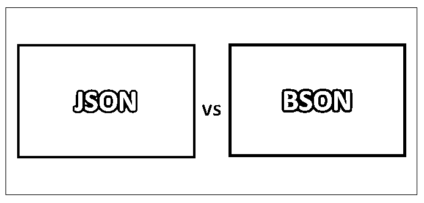

# JSON vs BSON

> 原文：<https://www.educba.com/json-vs-bson/>

## JSON 和 BSON 的区别

JavaScript Object Notation (JSON)是一种标准的文件格式，它使用人类可读的文本来传输具有属性-值对和数组数据类型的数据。这是最常见的数据格式之一，主要用于异步浏览器-服务器通信。JSON 是一种独立于语言的格式。另一方面，BSON 是一种计算机交换格式，主要用于数据存储和作为 MongoDB 数据库中的网络传输格式。它是一种简单的二进制形式，用于表示数据结构和关联数组(在 MongoDB 中通常称为文档或对象)。

**让我们更详细地研究一下 JSON 和 BSON:**

<small>网页开发、编程语言、软件测试&其他</small>

*   BSON 代表二进制 JSON，它由包含字段名、类型和值的有序元素列表组成。字段名类型通常是字符串。它的基础包括 JavaScript，现在有很多编程语言，利用这些代码来生成和解析 JSON 格式的相关数据。
*   BSON 类型支持日期和二进制数据，由于其性质，这不是可读的形式，而普通的 JSON 文件由一个键值对组成。BSON 文件并不一定总是比 JSON 文件小，但是它肯定会跳过不相关的记录，而对于 JSON，您需要解析每个字节。这是在 MongoDB 内部使用它的主要原因。
*   BSON 类型的格式本质上是轻量级的、高度可穿越的和快速的。BSON 实现用于支持在其他对象中嵌入对象和数组。在 BSON 对象内部，可以构建索引，并且将对象与顶级和 BSON 键上的查询表达式进行匹配。BSON 是一个二进制编码的 JSON 文档，用于在集合中存储文档。BSON 增加了对 JSON 中不支持的二进制和日期等数据类型的支持。
*   实际上，不需要太多关于 BSON 的信息。只需要使用语言的本机类型和提供的类型(如驱动程序的 ObjectID ),到 BSON 类型的映射将独立完成。

### JSON 和 BSON 的正面比较(信息图)

以下是 JSON 与 BSON 的 10 大区别:

### JSON 和 BSON 的主要区别

两者都是市场上的热门选择；让我们讨论一些主要的区别:

BSON 是 JSON 的序列化格式编码格式，主要用于存储和访问文档，而 JSON 是人类可读的标准文件格式，主要用于以键-值属性对的形式传输数据。

BSON 被设计成占用更少的空间，但是它没有 JSON 那么高效。事实上，在某些情况下，BSON 比 JSON 占用更多的空间。这样做的原因是可遍历性，这意味着 BSON 向文档添加了一些附加信息，如字符串长度和子对象，从而使遍历更快。

BSON 还被设计成具有相对较快的编码和解码技术。例如，所有这些整数都存储为 32 位整数，这样它们就不会在文本中来回解析。因此，对于较小的整数，它比 JSON 占用更多的空间，但无论如何，BSON 解析起来要快得多。

除了上面提到的几点，BSON 还使用了 JSON 中没有的其他数据类型，比如 BinData 和 Date 数据类型。BSON 扩展了 JSON 类型模型，以便为不同语言中更有效的编码和解码提供额外的数据类型，而在 JSON 中，没有提供这样的规定。它和 XML 一起促进了数据交换，XML 是主要的格式。JSON 支持你能想到的所有基本数据类型，比如数字、字符串和其他布尔值。它还支持散列和数组等数据类型。BSON 利用 JSON 类型格式以文档的形式存储数据，就像数据以行和列的形式存储在关系数据库中一样。

### JSON 与 BSON 对比表

下面是 JSON 和 BSON 之间最重要的比较:

| **比较的基础** | **JSON** | **BSON** |
| **类型** | 标准文件格式 | 二进制文件格式 |
| **速度** | 相对较慢 | 更快的 |
| **空间** | 消耗相对较少的空间。 | 消耗更多的空间。 |
| **用途** | 数据传输。 | 数据的存储。 |
| **编码和解码技术** | 没有这种技术。 | 快速编码和解码技术。 |
| **特性** | 键-值对仅用于数据传输。 | 重量轻，速度快，可穿越。 |
| **结构** | 用于异步服务器浏览器通信的独立于语言的格式。 | 二进制 JSON，由包含字段名、类型和值的有序元素列表组成。字段名类型通常是字符串。 |
| **遍历** | JSON 没有跳过而是浏览了所有内容。 | 另一方面，BSON 只索引相关内容，跳过所有不需要的内容。 |
| **解析** | JSON 格式不需要解析，因为它们已经是人类可读的格式了。 | 另一方面，BSON 需要被解析，因为它们很容易被机器解析和生成。 |
| **创作类型** | 广义上讲，JSON 由一个对象和一个数组组成，其中对象是键值对的集合，数组是值的有序列表。 | 二进制编码技术由附加信息组成，如字符串长度和对象子类型。此外，BinData 和 Date 数据类型是 JSON 不支持的数据类型。 |

### 结论

BSON 并不用于每个应用程序，它主要扩展到 NoSQL 数据库，如 MongoDB。它越来越受欢迎，在接下来的几个月里可以在许多其他应用程序中找到它的用途。另一方面，许多组织广泛使用 JSON，它是当今大多数文件中使用的最流行的格式之一。JSON 有自己的局限性和优势，BSON 也是如此。选择适合您组织的产品。请继续关注我们的博客，获取更多类似的文章。

### 推荐文章

这是 JSON 和 BSON 之间最大差异的指南。在这里，我们也讨论了 BSON 和 JSON 的关键区别，包括信息图和比较表。你也可以看看下面的文章来了解更多。

1.  [围棋 vs Java](https://www.educba.com/go-vs-java/)
2.  [MongoDB vs SQL server](https://www.educba.com/mongodb-vs-sql-server/)
3.  [Python vs Groovy](https://www.educba.com/python-vs-groovy/)
4.  [JavaScript vs JScript](https://www.educba.com/javascript-vs-jscript/)

