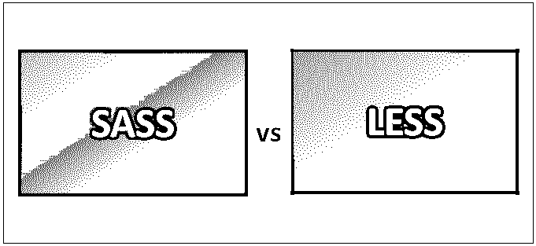

# 萨斯 vs 少

> 原文：<https://www.educba.com/sass-vs-less/>

## SASS 和 LESS 之间的区别

SASS vs LESS 应该是 CSS 或预处理器的扩展。预处理器是一种脚本语言，它扩展 CSS，然后将其编译回常规 CSS。可以说它们是为更好的维护、主题和可扩展性而设计的编程语言。SASS 代表[语法牛逼的样式表(SASS)](https://www.educba.com/what-is-sass/) ，LESS 代表更精简的 CSS (LESS)。SASS 基于 Ruby，LESS 使用 JavaScript。此外，LESS 让用户有机会在某些情况发生时激活 mixins。另一方面，SASS 提供了大多数编程语言都知道的循环和大小写区别。让我们更详细地看一下 SAS 和 LESS 之间的区别。

### SASS 和 LESS 之间的直接差异(信息图)

以下是 SASS 和 LESS 之间的 6 大区别

<small>网页开发、编程语言、软件测试&其他</small>

### SASS 和 LESS 之间的主要区别

两者都是市场上的热门选择；让我们讨论一些主要差异:

*   **帮助 CSS3**

萨斯提供指南针。指南针有助于提前处理情况。LESS 提供了一些库，这些库提供了市场营销支持图表，与 SASS 相比非常健壮。LESS 使得构建健壮的库成为可能，并且可以在任何需要的时候重用。这有助于 CSS3 更加用户友好。预处理器软件与这些库保持同步。

*   **语言能力**

LESS 提供了创建受保护混合的能力，该混合只有在满足某些条件时才起作用。例如，如果文本的颜色较浅，而用户想要较深的背景。为此，如果一个 mixin 分为两部分，那么这些守卫将会看到只有一部分是有效的。另一方面，SASS 认为自然概念和健壮性更重要，因此使用 Compass 可以实现这一点。例如，Compass 有一个叫做 background 的 mixin，它可以让你传递任何你想得到的东西，它会在需要的时候输出。

*   **变量处理**

声明变量和处理变量有两种不同的定义方式。LESS uses @和 SASS 使用$。在 SASS 中，$没有任何继承意义，而@ of LESS 表示应该发生继承。在 SASS 中，如果全局变量被覆盖并且全局变量取局部值。

*   **处理媒体查询**

媒体查询可用于将块添加到主样式表的底部。当使用 SASS 或更低版本时，用户可以通过使用嵌套将样式组合在一起。在这方面，SASS 比 LESS 有更好的效果。

### SASS 与 LESS 比较表

下面是顶部对比

| **比较的基础** | **SASS** | **小于** |
| **基本差异** | SASS 是一个 CSS 预处理器，帮助减少 CSS 中的重复，最终节省时间。它是 CSS 的扩展，有助于节省时间。它提供了一些可以用来创建样式表和帮助维护代码的特性。它被认为是 CSS 的超集，用 Ruby 编写。 | LESS 也是一个 CSS 预处理器，可以让用户定制、维护、管理和重用网站的样式表。LESS 是一种动态语言，可以在不同的浏览器上使用。用 JavaScript 写的更少，编译数据非常快。这也有助于保持代码的模块化，使其可读和易于更改。 |
| **特性** | **以下是 SASS 的特点:**

*   **It is stable, powerful and compatible with other versions of CSS.**
*   **It is a superset of CSS, written in JavaScript.**
*   **It has its own syntax, which is compiled into readable CSS.**
*   **It is open source.**

 | 以下是 LESS 的特点:

*   **A piece of code can be written cleaner and more organized.**
*   **You can define new styles according to your needs and reuse them at any time.**
*   **It is developed on JavaScript and is a superset of CSS.**
*   **This is an agile tool that helps to reduce redundancy**

 |
| **错误** | SASS 能够报告语法错误。 | LESS 在所有测试中都有更准确的错误信息，它还解释了错误发生的正确位置。 |
| **功能** | **SASS enables you to create your own function and use them with the context user wants. Functions can be called by using the function name and with any parameters.**

Like mixin 函数也可以全局访问，并且接受不同的参数。可以使用@return 返回值。

 | LESS 使用 JavaScript 对值进行操作。它还使用预定义的函数来操作 HTML 元素，并对样式表的不同方面进行更改。它还具有改变颜色的功能，如圆形功能、地板功能、天花板功能和百分比功能。 |
| **Mixins** | Mixins help in creating styles that can be used and reused anywhere in your stylesheet without recreating non-semantic classes. In SASS, mixins can store different values or parameters and call that function. Mixin also enables the uses of underscores and hyphens.定义混音:@mixin 指令用于定义 mixin包括 Mixin:@include 用于在文档中包含 mixin参数:

SASS 脚本值被作为参数，并在其中可用。

通过一个街区:

样式块可以传递给 mixin

 | Mixins are also used in LESS. In LESS, mixins can be nested. It can also accept parameters and returns different values as well. The scope of a mixin is as per the caller’s scope and are visible.Mixin 返回值:mixin 也可以像函数一样定义变量和返回值。另一个 mixin 中的 mixin:一个 Mixin 可以在另一个 Mixin 中使用，也可以用于返回值。 |
| **文档** | SASS 的文档更侧重于知识库和设置。它没有提供更多的视觉效果。 | 较少的文档具有吸引人的视觉效果。它也有容易跟随的步骤。 |

### 结论

这两种预处理程序在网页设计师中很受欢迎。SASS 用户可以很容易地选择他们的语法，开发人员可以决定何时脱离 CSS 规则。另一方面，LESS 的优势在于用户可以在特定条件发生时激活 mixins 的功能。SASS 还提供程序员知道的循环和案例。因此，这完全取决于开发人员和项目需求，他们更喜欢哪种语言。这两种语言各有优缺点。最后，被选中的一个提供了它们所开发的最佳特性。

### 推荐文章

这是 SASS 和 LESS 之间最大差异的指南。在这里，我们还将讨论信息图和比较表的主要区别。你也可以看看下面的文章来了解更多。

1.  [萨斯 vs SCSS](https://www.educba.com/sass-vs-scss/)
2.  [SASS vs CSS](https://www.educba.com/sass-vs-css/)
3.  [SVG vs EPS](https://www.educba.com/svg-vs-eps/)
4.  [SOA 诉案件](https://www.educba.com/soa-vs-cas/)

