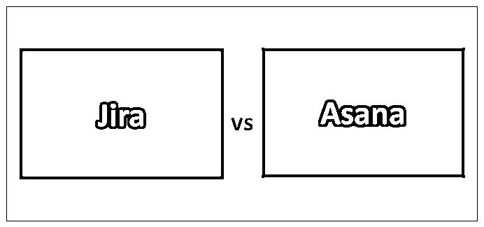

# 吉拉对阿萨纳

> 原文：<https://www.educba.com/jira-vs-asana/>

## 吉拉和体式的区别

吉拉是 Atlassian Corporation Plc 开发的问题跟踪产品和专有软件产品。它完全是用 Java 编程语言编写的。它支持跨平台操作系统。它被授予了专有许可证。吉拉下有不同的软件包，如吉拉核心，一个通用的软件包，吉拉软件包含敏捷项目管理功能和吉拉服务台，运行 IT 服务或业务服务台。Asana 是由 Asana 商业组织开发的移动和 web 应用程序，我们使用它来管理和组织软件项目，并跟踪分配给团队每个成员的任务的工作流。它作为[软件即服务](https://www.educba.com/what-is-software-as-a-service-saas/)提供。它有助于组织、管理和跟踪团队合作。它具有不同的管理特性、团队管理和一些其他安全特性，可以有效地管理团队。

### 吉拉和体式的面对面比较(信息图)

以下是吉拉和体式的 9 大区别:

<small>网页开发、编程语言、软件测试&其他</small>

### 吉拉和体式的主要区别

两者都是市场上的热门选择；让我们讨论一些主要差异:

1.  与吉拉相比，吉拉的客户体验指数和一次性付费订阅或年度或月度订阅更多，而 Asana 的客户体验指数或评级更少，并提供免费或月度或年度订阅付费。
2.  吉拉拥有思科、易贝、Adobe、NASA、LinkedIn 和 Salesforce 等受欢迎的客户用户，而 Asana 拥有 CBS Interactive、Synthetic Genomics、Airbnb 和 Pinterest 等受欢迎的用户。
3.  吉拉有不同的功能，如可定制的工作流、缺陷和错误管理、问题和源集成、定制的仪表板、安全和管理功能、与 REST APIs 的集成，而 Asana 有不同的功能，如活动提要、文件附件和自动更新、定制日历和会议邀请、焦点模式和工作流的不同任务。
4.  吉拉可在 Windows、Linux、Mac OS、Android、基于网络、iPhone 或 iPad 等设备上使用，而 Asana 支持不同的设备，如 Linux、Mac OS、Android、基于网络、iPhone 或 iPad 和 Windows。
5.  吉拉支持与不同的 API 或平台集成，如销售云、EasyBI、Zendesk、Tempo、Atlassian、Balsamiq、Service Desk、Confluence、nFeed、吉拉甘特图，而 Asana 支持不同的工具，如 Google Drive、Dropbox、InstaGantt、Jotana、Zapier、Github、Sprintboards、Cloud work、Phabricator、Alfred、FlowBS 和 Usersnap。
6.  吉拉支持英语和其他国际语言，而 Asana 的产品只支持英语。
7.  吉拉有小型企业、中型企业和大型企业，而 Asana 有不同类型的客户，如小型企业、中型企业、大型企业和自由职业者。
8.  吉拉有门票、电话和训练支持功能，而 Asana 有门票和训练支持功能。
9.  吉拉有 Scrum board 工具的不同特性和几个报告工具，如 sprint 报告、速度图表和 burns down 图表，而 Asana 有不同的特性，具有上传特性的循环表和类似于仪表板特性的可视板。
10.  吉拉具有与云服务集成的特性，而 Asana 具有更快的内部部署，这是基于云的解决方案。

### 吉拉 vs 阿萨纳对比表

以下是吉拉和 Asana 的顶级对比

| **比较的基础** | **吉拉** | **体式** |
| **定义** | 它是业内顶级的项目管理软件，允许管理组织中的大型团队。 | 这是一个项目管理软件，用于组织和管理团队和不同的工作流程。 |
| **用途** | 它用于以高效的方式创造高质量的产品。 | 它简单易用，通过 play store 中的 android 应用程序提供了简化的 UI 以及移动和网络应用程序。 |
| **价格** | 它根据公司的用户数量来定价。 | 它有两个计划，即一个是免费的，另一个是每人每月有限的金额。 |
| **平台** | 它支持任何类型的产品或软件应用程序开发。 | 它支持任何类型的项目，主要是中小型项目。 |
| **项目规模** | 它适合大型团队和大型项目。 | 它特别适合于中型项目。 |
| **变化** | 它允许对项目的所有阶段进行更新和更改。 | 它允许对任务和工作流进行快速更改，但不适合更小的项目，这会影响仪表板。 |
| **人气** | 它更受欢迎，被行业中的大多数组织所使用。 | 它不是更受欢迎，而是被一些中小型公司使用。 |
| **管理** | 这取决于项目和产品配置。 | 它更易于管理，并包含一个易于跟踪的仪表板。 |
| **灵活性** | 这取决于项目中使用的方法。 | 可以灵活地与第三方工具集成。 |

### 结论

吉拉是一个被许多公司使用的跟踪和项目管理产品，适合大型项目，而 Asana 适合小型项目。选择产品的选择取决于项目的需求和规模，同样的方法可以扩展到开始项目之前选择的项目或产品。

吉拉的名字来源于 Gojira，在日语中被称为哥斯拉。它是作为 Bugzilla 的竞争对手推出的。它用于项目管理的敏捷方法中。它最初发布于 2002 年。它是根据商业软件许可证授权的。它支持不同的语言，如英语、日语、德语、法语和西班牙语。而 Asana 是在 2012 年商业化推出的。它成立于 2008 年。它提供了不同的第三方工具和 API 与它的软件包集成。

与 Asana 相比，使用吉拉的优势更大，因为它在敏捷项目方法论方面具有编写故事点的高级功能，在 bug 或问题跟踪方面具有跟踪流程的高级功能，在 scrum 或看板中配置多个任务或工作流时具有定制功能。对于大型项目，吉拉在定制和更多功能方面更为可取。Asana 的定制选项更少，dashboard 更容易使用，适合小型或中型项目。

### 推荐文章

这是吉拉和体式之间最大差异的指南。在这里，我们还将讨论信息图和比较表的主要区别。你也可以看看下面的文章来了解更多。

1.  [SDLC 与敏捷](https://www.educba.com/sdlc-vs-agile/)
2.  [JSON vs BSON](https://www.educba.com/json-vs-bson/)
3.  [JSON vs CSV](https://www.educba.com/json-vs-csv/)
4.  [JSON vs AJAX](https://www.educba.com/json-vs-ajax/)

