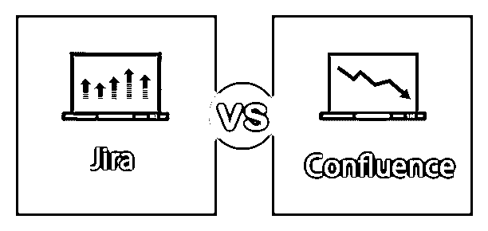
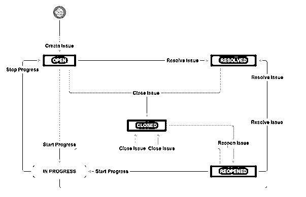

# 吉拉 vs 合流

> 原文：<https://www.educba.com/jira-vs-confluence/>

## 吉拉和合流的区别

在这次讨论中，我们将涵盖吉拉与合流。因此，在讨论两者之间的区别之前，让我们先了解一下吉拉和合流的一些基础知识。

### 什么是 JIRA？

JIRA 是由澳大利亚公司 Atlassian 开发的工具。吉拉的主要目的是跟踪与问题相关的 bug，它用于项目管理。

<small>网页开发、编程语言、软件测试&其他</small>

吉拉是为敏捷的项目管理而设计的，这也是为什么大多数官方文档都是用它来写的。但是在实际场景中，人们甚至在各种非敏捷项目中使用吉拉，这说明了它的重要性和多功能性。

它提供了一个很好的仪表板来查看分配给某人并需要解决的问题。此工具的主要用途是跟踪与您的软件和手机应用程序相关的问题和错误。它也用于项目管理。JIRA 提供了一个紧凑的仪表板外观，包括许多有用的特点和功能，使处理问题非常容易。

现在我们来看一下 JIRA 工作流程，在创建问题时，它包括以下几个阶段:

1.  **开放问题**–一旦创建了问题，该问题就是一个开放阶段，可以分配给某个人(受让人)进行处理。
2.  **进行中的问题**–在问题打开并分配给受分配人后，受分配人可以将其标记为“进行中”，这表明受分配人已接受该问题并已积极开始处理该问题。
3.  **已解决的问题**–在受让人成功解决问题后，可将其标记为已解决，并可将其分配给创建问题的同一个人或其他相关人员。验证已解决的问题后，如果成功，则可以关闭该问题；否则，如果需要任何进一步的更改，它将被重新打开。
4.  **重新打开的问题**–可以重新打开之前创建并解决的问题，但如果它需要更多的更改或解决方法不正确或发现更多的错误。同一问题可以分配给之前分配给它的同一受分配人，也可以分配给其他人。
5.  **关闭问题**–成功验证解决方案后，可以关闭问题。通常，这是由报告问题的同一个人完成的。

#### JIRA 工作流程

以下是 JIRA 的工作流程:

图片取自 JIRA 官方文件。

### 什么是合流？

汇流是一种协作工具。它用于帮助团队高效地协作和共享知识。使用 Confluence，用户可以创建可供所有团队成员评论和编辑的博客和页面。例如，我们将能够轻松地创建路线图。我们还可以创建包含清单的笔记，创建知识库并集中管理一切。我们还可以附加文件，比如我们的 excel 规划，并为了方便起见将它们显示在页面上。

Confluence 还设计为与吉拉集成，他们有许多集成点，让 Confluence 用户能够从维基页面查看、交互和参考吉拉问题。

### 吉拉和汇流的直接对比(信息图)

以下是吉拉和合流的 20 大区别:

### Axure 和 sketch 的主要区别

来自同一家公司 Atlassian 的两种独立产品。让我们讨论一些主要差异:

*   JIRA 是一个完全可定制的平台，用于围绕任务、项目和计划组织团队。任务的依赖性、访问资源、权限、层次结构等。，都可以成立。项目经理和敏捷领导者可以观察软件的状态，比如积压计划、发布计划和整体进度。JIRA 框架也可以用于商业团体，而不仅仅局限于软件开发。
*   Confluence 是一个知识库或 wiki，它围绕我们在 JIRA 正在进行的项目(如产品需求)组织和存储您的所有信息资产，或会议纪要、营销资产、设计文档等一般信息。Confluence 很容易与 JIRA 整合，所以这些资产成为一个整体。因此，团队可以以健壮的方式毫不费力地创建、协作和更新这些资产。

### 吉拉与汇流对比表

以下是吉拉和合流之间的一些比较

| **比较的基础** | **汇流** | **JIRA** |
| **描述** | Confluence 是一个协作工具，它围绕您在 JIRA 所做的项目存储和组织您的所有信息资产。 | JIRA 是一个问题管理平台，允许团队在整个生命周期中轻松管理他们的问题。它是高度可定制的，可以适应我们需要的任何工作流程。它主要用于软件开发中，作为管理和跟踪开发工作的一种方式。 |
| **支持的平台** | 网络，iPhone，安卓 | 网络，iPhone，安卓 |
| **Typical Customers** | 小型、中型和企业客户 | 小型、中型和企业客户 |
| **定价** | 每月 10 美元起 | 每月 10 美元起 |
| **访问控制** | 支持 | 不支持 |
| **行动管理** | 不支持 | 支持 |
| **活动目录集成** | 集成不可用 | 集成可用 |
| **活动仪表板和跟踪** | 有空的 | 有空的 |
| **应用集成** | 不支持 | 支持 |
| **任务管理** | 不支持 | 支持 |
| **日历管理** | 支持 | 不支持 |
| **内容管理** | 支持 | 不支持 |
| **文件管理** | 支持 | 不支持 |
| **动态工作流** | 不支持 | 支持 |
| **项目规划** | 支持 | 不支持 |
| **项目管理** | 支持 | 不支持 |
| **项目时间跟踪** | 不支持 | 支持 |
| **第三方整合** | 支持 | 支持 |
| **报告和统计** | 不支持 | 支持 |
| **项目工作流程** | 无法使用 | 有空的 |

### 结论

两者完全不同。所以理解了这种差异，我们就可以通过结合两者来加以利用。以下是我们应该在吉拉集成 confluence 的一些原因:

*   我们将把您所有的项目文档放在一个中心位置，这样我们的团队成员就不需要搜索他们的电子邮件、计算机文件夹或 Google drive 来找到他们需要的东西。我们还可以直接在 Confluence 中保存和组织发布说明、需求规范和代码评审。
*   通过结合吉拉和融合，我们可以实现跨团队的沟通。因此，打破了工程部门和其他业务团队之间的壁垒。业务涉众将能够看到发布的状态，并获得团队进展的完全可见性。
*   当我们的团队在吉拉软件和其他资源之间转换时，我们可以通过减少浪费的时间和在上下文之间切换来更快地交付。此外，执行软件开发的团队成员可以在吉拉访问正确的文档。我们可以通过添加小工具，让开发者轻松查看与他们当前工作相关的文档，从而将 Confluence pages 引入吉拉。我们甚至可以建立可信的连接，访问用户受限的 Confluence 和吉拉页面。
*   它还可以帮助业务团队从报告中受益。吉拉不断生成关于项目和问题的数据，但是业务团队可能没有时间或技能来详细检查这些报告。因此，通过将吉拉信息链接到 Confluence 报告，我们可以在一个简单的用户界面上以可理解的图表呈现状态报告，以便您的业务团队从吉拉可用的大量数据中受益。

### 推荐文章

这是一个吉拉和合流之间的主要区别的指南。在这里，我们还将通过信息图和比较表来讨论吉拉与融合的主要区别。您也可以看看以下文章，了解更多信息–

1.  [吉拉 vs 阿萨纳](https://www.educba.com/jira-vs-asana/)
2.  [吉拉 vs 特雷罗](https://www.educba.com/jira-vs-trello/)
3.  [Itil vs 敏捷](https://www.educba.com/itil-vs-agile/)
4.  [吉拉 vs ServiceNow](https://www.educba.com/jira-vs-servicenow/)

