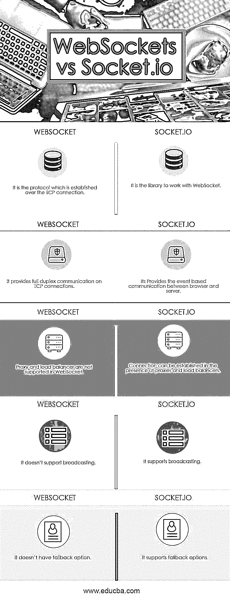

# WebSocket vs Socket.io

> 原文：<https://www.educba.com/websocket-vs-socket-io/>

## WebSocket 和 Socket.io 的区别

WebSocket 是通过 TCP 连接在客户端和服务器之间提供双向通信的通信协议；WebSocket 一直保持开放，所以它们允许实时数据传输。当客户端触发对服务器的请求时，它不会在收到响应时关闭连接；而是持续等待客户端或服务器终止请求。

**插座。IO** 是一个支持客户端和 Web 服务器之间实时和全双工通信的库。它使用 WebSocket 协议来提供接口。一般分为两部分；WebSocket 和 Socket.io 都是事件驱动的库。

<small>网页开发、编程语言、软件测试&其他</small>

*   客户端:它是运行在浏览器内部的库
*   服务器端:它是 Node.js 的库

### WebSocket

以下是这些功能:

**web socket 的主要特性**

*   WebSocket 有助于客户端和 web 服务器之间的实时通信。
*   该协议有助于在服务器和客户端之间的实时世界中实现跨平台转换。
*   这也使得全球范围内的企业对于实时 web 应用的需求增强并增加了可行性。
*   与 HTTP 连接相比，它的主要优势是提供全双工通信。

**WebSocket 协议模式**

我们为什么需要 WebSocket？

*   它提供全双工通信，这有助于保持客户端和 Web 服务器之间建立的连接。
*   它还符合标准，并以可忽略的延迟提供往来于事件流的准确性和效率。
*   WebSocket 消除了开销并降低了复杂性。
*   它让实时交流变得轻松而高效。

### Socket.IO

以下是这些功能

#### 插座的主要特点。超正析象管(Image Orthicon)

*   它有助于同时向多个套接字广播，并透明地处理连接。
*   它适用于所有平台、服务器或设备，确保平等、可靠和快速。
*   如果需要，它会自动将需求升级到 WebSocket。
*   它是在其他协议之上的自定义实时传输协议实现。
*   它要求客户端使用两个库，服务器端也使用一个库。
*   IO 致力于基于工作的事件。使用服务器端的套接字可以访问一些保留的事件，如连接、消息、断开、Ping 和重新连接。
*   有一些基于客户端的保留事件，如连接、连接错误、连接超时和重新连接等。

#### 为什么我们需要插座。IO:

*   我处理你的技术替代品的所有退化，以获得实时的全双工通信。
*   它还处理各种支持级别和浏览器的不一致性。
*   它还为基本的发布基础设施提供了额外的功能空间支持，并考虑了自动重新连接。
*   目前，AFAIK 是使用最多的一个，并且更容易帮助普通的 web 套接字。

### WebSocket 和 Socket.io 的面对面比较(信息图表)

以下是 WebSocket 与 Socket.io 的前 5 名对比:

### WebSocket 和 socket.io 的主要区别

WebSocket vs Socket.io 都是市场上的热门选择；让我们讨论一下 WebSocket 和 Socket.io 之间的一些主要区别:

*   它通过 TCP 提供连接，而 Socket.io 是一个抽象 WebSocket 连接的库。
*   WebSocket 没有回退选项，而 Socket.io 支持回退。
*   WebSocket 是技术，Socket.io 是 WebSockets 的库。

### WebSocket 与 Socket.io 对照表

下面是 WebSocket 和 Socket.io 最顶层的对比:

| **序列号** | **WebSocket** | **Socket.io** |
| One | 它是在 TCP 连接上建立的协议 | 这是使用 WebSocket 的库 |
| Two | 它在 TCP 连接上提供全双工通信。 | 提供浏览器和服务器之间基于事件的通信。 |
| Three | WebSocket 中不支持代理和负载平衡器。 | 可以在代理和负载平衡器存在的情况下建立连接。 |
| 4. | 它不支持广播。 | 它支持广播。 |
| 5. | 它没有后备选项。 | 它支持回退选项。 |

### 结论

这都是关于 web socket vs . socket . io 的，这些话题理论上没什么可学的。你必须实际一点。基本上，WebSocket 是浏览器继承的技术；你编码的越多，你学到的就越多。

### 推荐文章

这是一个 web socket vs . socket . io 的指南。在这里，我们还将讨论 web socket vs . socket . io 的主要区别，包括信息图表和比较表。你也可以看看下面的文章来了解更多-

1.  [WebSocket vs REST](https://www.educba.com/websocket-vs-rest/)
2.  [肥皂 vs 休息](https://www.educba.com/soap-vs-rest/)
3.  [哈斯克尔 vs 二郎](https://www.educba.com/haskell-vs-erlang/)
4.  [SOAP vs HTTP](https://www.educba.com/soap-vs-http/)

