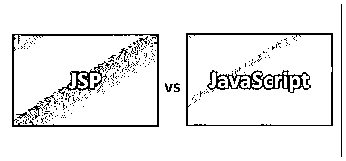

# JSP 与 JavaScript

> 原文：<https://www.educba.com/jsp-vs-javascript/>

## JSP 和 JavaScript 的区别

JSP 是 Java 服务器页面，是一种动态网页技术，用于生成动态网页内容。JSP 技术基于不同的内容格式，如 XML 或 HTML 或任何其他类型的文档内容。Sun Microsystems 在 1999 年发布了 JSP。它类似于 PHP 和 ASP(微软动态服务器页面技术)。它完全使用 Java 编程语言。它是基于 JSR (Java 规范请求)245 规范开发和发布的。Java Server Pages 的最新发布版本是 2.3。Java 服务器页面与 servlet 容器兼容，servlet 容器符合 Java EE 规范标准，需要应用程序或 web 服务器，如 Tomcat 或 Jetty。Java 服务器页面将在应用程序运行时被转换成 Servlets。Java 内部的 HTML 内容称为 Servlet，而 HTML 之间的 Java 内容称为 Java 服务器页面技术。

JavaScript 通常被称为 JS，是一种解释型的高级动态编程语言。它有弱类型和动态类型编程原则。它首次出现在 1995 年 9 月。JavaScript 使用的标准是 ES，即 ECMAScript。ECMAScript 是一个维护 JavaScript 编程语言标准的标准团体。ECMA 标准的开发者包括 Netscape、Ecma International 和 Mozilla Foundation。它是由来自美国的 Brendan Eich 开发和设计的。JavaScript 是与 HTML 和 CSS 齐名的网络技术标准之一。

<small>网页开发、编程语言、软件测试&其他</small>

### JSP 和 JavaScript 的直接比较(信息图表)

以下是 JSP 与 JavaScript 之间的 9 大区别:

### JSP 和 JavaScript 之间的主要区别

两者都是市场上的热门选择；让我们讨论一些主要的区别:

1.  Java Server Pages 是一种动态网页技术，而 JavaScript 是一种脚本语言，可以将静态的 HTML 内容变成动态的。
2.  Java Server Pages 有 scriptlets 在 HTML 之间添加 Java 代码，而 JavaScript 有许多内置函数，可用于使用 JavaScript 对象修改数据，这些对象基于面向对象编程模型中基于原型模式的继承。
3.  Java Server Pages 有 JSTL 支持来处理一些复杂的特性，而 JavaScript 有不同的数据类型，如 Boolean、Number、String、Date、Math、HTML DOM 和 RegExp 等。,
4.  Java Server Pages 支持几乎所有的 web 浏览器，而 JavaScript 不支持跨浏览器功能，这导致在浏览器发生变化时无法执行一些功能，从而导致不利。
5.  Java 服务器页面将通过 web 服务器从后端呈现和提供。相比之下，JavaScript 是一种脚本语言，可以在客户端和服务器端使用，既可以在浏览器端使用，也可以在客户端使用，其中代码将由 JavaScript 内置编译器 JIT 编译器进行内部编译。它将在浏览器中被解释，并且模块的执行稍后在客户端环境中发生，即在浏览器上。
6.  Java Server Pages 有 JSR 规范，这是 Oracle 的[标准，而 JavaScript 有最新的标准，称为 ES 9 (ECMAScript 标准),在其编程模型中支持高级功能方面和几个高阶函数。](https://www.educba.com/oracle-database-interview-questions/)
7.  Java Server Pages 在开发复杂特性方面有局限性，而 JavaScript 有一个标准规范，可以使用 JS 强大的函数式编程来操作复杂的模块。
8.  Java Server Pages 在 web 容器中具有 JSP 隐式对象特性，而 JavaScript 具有提升特性，通过使用 let 关键字可以在 ES 6 标准中使用该特性。
9.  Java 服务器页面支持表达式语言(EL ),它提供对函数和 Java 对象中数据的访问，而 JavaScript 具有隐式原型引用来引用 JS 对象中的数据。
10.  Java Server Pages 有一个 JSP 编译器，它将 JSP 翻译成 Servlet 来解释网页内容和显示，而 Javascript 有一个 Javascript 解释器来解析代码，它被称为 JavaScript 引擎。

### JSP 与 JavaScript 对照表

下面是 JSP 和 JavaScript 之间最重要的比较:

| **比较的基础** | **JSP** | **JavaScript** |
| **定义** | JSP 是基于 Oracle(当时是 Sun Microsystems)的 servlet 容器和 Java EE 规范的技术。 | JavaScript 是一种脚本语言。 |
| **执照** | 它还向网页添加动态网页内容，但功能有限。 | 为静态网页添加动态功能，提供丰富的用户体验。 |
| **整合**
**与** | 可以使用 Scriptlets 将 HTML 嵌入到 Java 代码中。 | HTML 不能嵌入 JavaScript 内部。 |
| **配套**
**特色** | 需要基于 servlet 容器的 web 或应用服务器来部署 JSP 网页。 | 需要 JavaScript 引擎来运行代码。 |
| **通用性** | 将使用 servlet 技术从服务器端呈现。 | 适用于客户端和服务器端环境中的主流浏览器。 |
| **维护** | 由 Java 规范组维护。 | 由 ECMA TC-39 委员会维护。 |
| **HTTP/ FTP** | Weblogic 也支持 HTTP 和 FTP。 | Tomcat 只支持 HTTP。 |
| **浏览器**
**支持** | 它很容易支持所有的浏览器，因为它是由一个 web 服务器渲染生成的内容。 | 根据功能不同，支持少数浏览器中的内容。 |
| **灵活性** | 维护较大的项目是困难的。 | 开发大型复杂的项目更加容易和灵活。 |

### 结论

Java 服务器页面在网页上提供动态网页内容，并为视图层的表示提供相关的文档样式格式，而 JavaScript 只能用作脚本语言，它需要 HTML 来显示内容。在视图层有几种显示视图内容的框架，如 Angular JS、React JS、Vue JS 等。JavaScript 有不同类型的库:ReactJS、AngularJS、Vue JS 和 ExtJS 等。，以提供超快速和丰富的 web 应用程序。

jsP 只能在 servlet 容器兼容的服务器中使用，而 JavaScript 可以在 Node.js 服务器中使用任何 JS 相关的框架来开发网页，并且可以与任何类型的 JS 框架集成。JSP 要求 Java 编程语言与 HTML 一起使用，以在 scriptlets 中编写 Java 代码来显示带有实时动态数据的 HTML 内容，而 Javascript 不需要任何 Servlet 容器来部署网页。JavaScript 提供了不同的选项来开发网页。

### 推荐文章

这是 JSP 和 JavaScript 之间最大区别的指南。在这里，我们还讨论了 JSP 和 JavaScript 在信息图和比较表方面的主要区别。你也可以看看下面的文章来了解更多。

1.  [JSP vs PHP](https://www.educba.com/jsp-vs-php/)
2.  [PHP vs JavaScript](https://www.educba.com/php-vs-javascript/)
3.  [Java vs JavaScript](https://www.educba.com/java-vs-javascript/)
4.  [JavaScript vs 节点 JS](https://www.educba.com/javascript-vs-node-js/)

