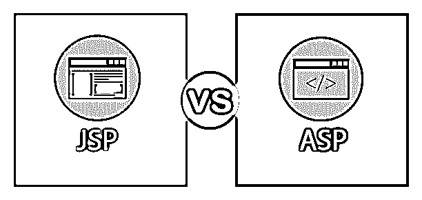

# JSP 与 ASP

> 原文：<https://www.educba.com/jsp-vs-asp/>

## **JSP 和 ASP 的区别**

JSP (Java Server Page)基本上是一种帮助软件开发人员实现和开发基于 XML、HTML 或其他适用文档类型的动态网页的技术。它最初由太阳微系统公司于 1999 年发布。它基本上是一种 Java 服务组件，从用户界面的角度来看，它对基于 Java 的应用程序非常有用。它可以完全访问 Java APIs 和企业的数据库。ASP(动态服务器页面)基本上是微软第一个用于动态生成网页的服务器端脚本引擎。它最初发布于 1996 年。ASP 主要实现用于内容生成目的的服务器端脚本，然后这些脚本被发送到客户端的 web 浏览器。这些生成的内容脚本主要是用 JScript、VBScript 或者 PerlScript 开发的。

### JSP 和 ASP 的重要性

在下面找到 JSP 的重要性:

<small>网页开发、编程语言、软件测试&其他</small>

1.  在 JSP 的情况下，由于 HTML 页面中直接存在嵌入的动态元素，而不是使用单独的 CGI 文件，性能图随之增加。
2.  因为 JSP 主要是在 servlets API 上实现的，所以它可以访问企业 Java APIs。
3.  在处理业务逻辑时，它也有直接的影响，servlets 和 works 也支持它与 API 和模板的结合。

在下面找到 ASP 的重要性:

1.  作为一个模块化框架，添加和删除功能可以很容易地管理。
2.  它支持跨平台功能。
3.  从基本设置的角度来看，它更容易实现。
4.  它内置了对 web 服务标准的支持。

### JSP 和 ASP 的直接比较(信息图表)

以下是 JSP 与 ASP 的 7 大对比:

### JSP 和 ASP 的主要区别

两者都是市场上的热门选择；让我们讨论一些主要的区别:

1.  JSP (Java 服务器页面)基本上是一种帮助软件开发人员实现和开发基于 XML、HTML 或其他适用文档类型的动态网页的技术，而 ASP(动态服务器页面)基本上是微软第一个用于动态生成网页的服务器端脚本引擎。
2.  Sun Microsystems 最初开发 JSP(最近被 Oracle 收购)，而微软开发 ASP。
3.  从性能的角度来看，JSP 代码可以比 ASP 执行得更快。
4.  就 JSP 而言，它主要由 Apache Tomcat web 服务器使用，并且主要在基于 Linux 的 web 服务器上实现。但是它也可以在 JBoss 和 IBM 应用服务器上运行。因此，如果执行是在基于 Linux 的服务器上进行的，那么 JSP 比 ASP 更可取。就 ASP 而言，它主要基于微软 IIS 服务器，并在基于 windows 的系统上实现。
5.  JSP 是免费的，而 ASP 不是免费的，并且需要一个合适的许可(费用)才能使用。
6.  使用适用的驱动程序库文件，JSP 可以很容易地与任何数据库服务器链接，而在 ASP 的情况下，数据库服务器可以很容易地连接，但是需要安装和使用适用的附加组件。此外，由于它是基于 VB 的，所以 MS SQL 连接也可以使用。
7.  在 ASP.Net 框架的情况下，局部变量可以自动初始化，而在 JSP 的情况下，特定过程下的变量不能以这种方式初始化。
8.  JSP 主要针对 Java 安全模型工作，而 ASP 主要基于 Windows NT 安全架构模型并在其上实现。
9.  JSP 主要基于 Java，因此它变得独立于平台。因此，它可以在任何平台上工作，不管是基于 MS Windows 还是 Linux 的平台。但 ASP 不是这样，它只能在微软视窗平台上工作。
10.  定制标记库不能在 ASP 上实现，而大量的库支持 JSP。

### JSP 与 ASP 对照表

下面是 JSP 和 ASP 之间最重要的比较:

| **比较基准** | **JSP** | **ASP** |
| **定义** | JSP (Java Server Page)基本上是一种帮助软件开发人员实现和开发基于 XML、HTML 或其他适用文档类型的动态网页的技术。 | ASP(动态服务器页面)基本上是微软第一个用于动态生成网页的服务器端脚本引擎。 |
| **架构** | 在 JSP 中，它基本上是一种 Java servlet 组件，从用户界面的角度来看，它对于基于 Java 的应用程序非常有用。 | 在 ASP 的情况下，它主要实现用于内容生成目的的服务器端脚本，然后这些脚本被发送到客户端的 web 浏览器。 |
| **成本效益** | JSP 是免费的。 | ASP 不是免费的，使用它需要一个合适的许可(费用)。 |
| **操作模式** | 以 JSP 为例，它主要运行在 Java 编程语言上，可以在运行时直接编译。 | 在 ASP 的情况下，它主要用 Visual Basic 语言实现，因此需要解释代码，然后才能执行。 |
| **简约** | 就 JSP 而言，编码是编写复杂查询的第一步，比编程更容易。 | 在 ASP 的情况下，它处理不同的复杂情况和查询，以产生适当的机器级输出。所以，它基本上是编码和其他不同方法的高级版本。因此，它比 JSP 复杂得多。 |
| **数据库** | 使用适当的驱动程序库文件，JSP 可以很容易地与任何数据库服务器连接。 | 在 ASP 的情况下，可以很容易地连接数据库服务器，但是需要安装和使用适用的附加组件。此外，由于它是基于 VB 的，所以 MS SQL 连接也可以使用。 |
| **支持** | 对于 JSP 及其用户也有很多社区支持。 | 虽然费用昂贵，但他们提供了更大范围的社区和付费支持。通常所有的 ASP 版本都用来提供长期的客户支持。 |

### 结论

在对 JSP 和 ASP 进行了一系列因素的比较之后，可以得出这样的结论:JSP 和 ASP 是应用程序开发的两种重要的服务器端脚本语言，但是在同一时间点上，每种语言都有自己的优缺点。因此，在选择任何一种语言之前，开发人员应该学习和分析 JSP 和 ASP 语言的不同方面。因此，基于项目需求的类型、工作时间和其他讨论的方面，应该选择这两者中的任何一个来达到期望的目标。

### 推荐文章

这是 JSP 和 ASP 之间最大区别的指南。在这里，我们还考虑了信息图和比较表的关键区别。您也可以阅读以下文章，了解更多信息——

1.  [JSP vs JavaScript](https://www.educba.com/jsp-vs-javascript/)
2.  [Java vs PHP](https://www.educba.com/java-vs-php/)
3.  [node . js vs Asp.net](https://www.educba.com/node-js-vs-asp-net/)
4.  [JSP vs JSF](https://www.educba.com/jsp-vs-jsf/)

