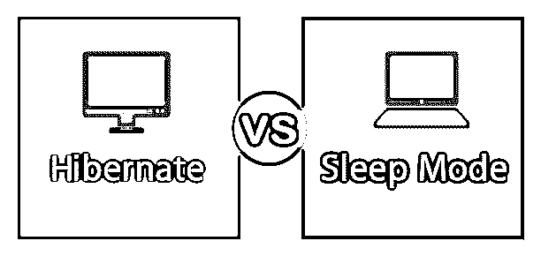
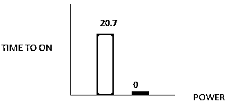
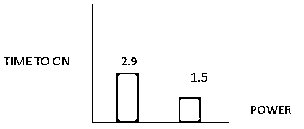

# 休眠与睡眠模式

> 原文：<https://www.educba.com/hibernate-vs-sleep-mode/>

## 休眠模式和睡眠模式的区别

休眠模式和睡眠模式是其他几种混合模式中的两种，混合睡眠和关机。从名字本身就可以很容易地看出这些模式的确切意图。 [Windows 为用户提供了](https://www.educba.com/windows-interview-questions/)选项，以便在您不使用电脑时节省电量。Hibernate 有几个同义词，比如 Suspend to Disk (Linux)。在休眠模式下，在计算机关闭之前，工作功能数据保存在计算机的磁盘中。一旦电脑开机，一切都变得井井有条，并恢复到以前的状态。睡眠也有一些同义词(袖手旁观)。整个机器状态保存在 RAM 存储器中。在这种模式下，计算机使用最小功率。

### 休眠模式和睡眠模式的直接比较(信息图表)

下面是 7 大区别。

<small>网页开发、编程语言、软件测试&其他</small>

### 休眠模式和睡眠模式的主要区别

这两种模式都是市场上的流行选择；让我们来讨论一些主要的区别。

*   在休眠模式下，计算机工作保存在硬盘中，而在睡眠模式下，工作保存在 RAM 中。
*   [保持休眠模式](https://www.educba.com/hibernate-vs-jdbc/)不需要电源，但保持睡眠模式需要少量电源(因为工作保存在 RAM 中)。
*   如果您不想长时间使用笔记本电脑，休眠模式很有用，而睡眠模式在笔记本电脑暂停较短时间时很有用。
*   休眠模式的功耗低于 300nA，而睡眠模式的功耗约低于 2nA。
*   休眠模式和睡眠模式的唤醒时间分别小于 100 uS 和 15 uS。

### 休眠与睡眠模式对照表

以下是 7 个最热门的对比:

| **休眠与睡眠模式的比较基础** | **冬眠** | **睡眠** |
| **用电量** | 零功率 | 低功耗 |
| **恢复** | 慢的 | 瞬间 |
| **适用性** | 通常，当系统空闲较长时间时，关机后重新启动将是一个耗时的过程。 | 当系统空闲时间较短时首选 |
| **同义字** | 暂停到磁盘(在 Linux 中)，安全渗漏(在 Mac 中)，S4(在 ACPI) | 待机(在 Windows 旧版本中)，暂停到内存(在 Linux 中)，S3 在 ACPI |
| **过程功能** | 该过程被保存到硬盘上 | 该过程被停止，并且工作被保存在 RAM 存储器中。 |
| **模式演示** | 当系统处于休眠模式时，用户将无法使用系统。 | 一台休眠的电脑还在工作；它运行着基本的功能并使用电能。为了避免系统问题，必须不时地关闭系统。 |
| **能效–窗户** | **

**  | 

 |

### 结论

这些休眠和睡眠模式之间的一个共同联系是它们都是为了省电。理解这些术语的一般方法如下

冬眠，一般来说，意味着长时间的睡眠，就像熊(灰熊)在冬天做的那样。冬眠后，这些动物需要一段时间来适应冬眠前的阶段。睡眠就像一个快速的午睡；记住，在办公场所小睡一会儿可以恢复精神。

### 推荐文章

这是休眠模式和睡眠模式之间最大区别的指南。在这里，我们还将通过信息图和比较表来讨论休眠和睡眠模式的主要区别。你也可以看看下面的文章来了解更多。

1.  [Oracle vs SQL Server](https://www.educba.com/oracle-vs-sql-server/)
2.  [Hibernate vs JPA](https://www.educba.com/hibernate-vs-jpa/)
3.  [IPv4 和 IPv6](https://www.educba.com/ipv4-vs-ipv6/)
4.  [春天 vs 冬眠](https://www.educba.com/spring-vs-hibernate/)

