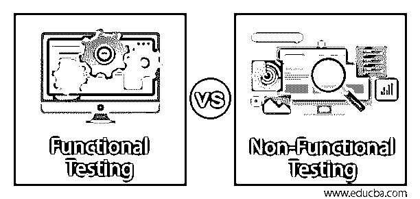

# 功能测试与非功能测试

> 原文：<https://www.educba.com/functional-testing-vs-non-functional-testing/>

## 功能测试和非功能测试的区别

下面的文章提供了功能测试和非功能测试的概要。无论是软件、应用程序还是网站开发，软件测试的作用对于实现产品的无缺陷和平稳运行都是至关重要的。它是一个检查产品质量的过程，以发现开发的软件或应用程序是否满足指定的要求。除了质量之外，测试还可以消除软件中的大多数 bug 和错误。软件测试主要分为功能测试和非功能测试，这两种测试各有其独特的优势、好处和特点。

#### 功能测试:

*   [功能测试验证](https://www.educba.com/what-is-functional-testing/)被测软件或应用的“功能”。它确保产品的每个功能都符合需求规格。在这种类型的测试中，软件是针对真实环境进行测试的，它与软件或应用程序的源代码无关。进行功能测试是为了描述软件系统的行为和执行。
*   在执行非功能测试之前，进行功能测试以有效地理解系统如何执行其功能是很重要的。软件或应用程序的“功能”是通过给出适当的输入并将实际结果与预期结果进行比较来测试的。自动化或手动包括测试 API、数据库、用户界面和产品的功能。

#### 非功能测试:

*   非功能测试验证软件或应用程序的可用性、可靠性、性能等非功能方面。它集中在功能测试中没有涉及的所有方面。当一个产品按照消费者的期望运行，并且在任何情况下都是高效的，那么它就被认为是一个可靠的产品。非功能性测试是在这些客户体验参数下进行的。这是满足客户期望的关键因素。因为手动进行非功能性测试是不可行的，所以在这种类型的测试中使用了一些特殊的自动化工具。

### 功能测试和非功能测试的直接比较(信息图)

下面是功能测试和非功能测试之间的 10 大区别

<small>网页开发、编程语言、软件测试&其他</small>

### 功能测试和非功能测试的主要区别

让我们讨论一下功能测试和非功能测试之间的一些主要区别:

*   **动机:**使用这些工具的目的各不相同。功能测试用于验证系统应该满足的需求和要求是否得到正确满足。它用于检查软件应用程序没有任何错误，并有助于发布和推广软件应用程序的决策。相反，非功能性测试的目的是通过检查用户体验来看应用程序是否如客户所期望的那样运行。在这种情况下，还会评估执行任务或响应客户请求的响应时间。
*   测试技术/子测试:通过执行各种测试来检查软件的功能和非功能方面。在功能测试下，执行的子测试[包括单元测试](https://www.educba.com/unit-testing/)，用于从开发应用的初始阶段检查错误和缺陷，冒烟和健全测试，用于确保软件按照给定的规范工作，[白盒测试](https://www.educba.com/white-box-testing/)，用于检查代码，[黑盒测试](https://www.educba.com/black-box-testing/)，通过在系统上运行测试用例，[集成测试](https://www.educba.com/integration-testing/)，用于检查所有组件是否按照预期相互作用，等等。而对于非功能性测试，通过执行质量性能测试、正常和极端条件下的行为负载测试、兼容性测试、配置测试、检查其限制的压力测试、安全性测试、[可扩展性测试](https://www.educba.com/scalability-testing/)、检查故障或崩溃情况下的恢复持续时间的恢复测试等来进行检查。这些是通常进行的子测试，但可能因系统而异。
*   测试的标准:功能和非功能测试的评估有几个标准。对于泛函，有正参数也有负参数。使用手动和自动工具执行功能测试。测试人员向应用程序提供有效和无效的输入，并查看生成的输出是否符合预期。无效输入有助于了解系统在意外情况下的性能。在检查系统是否给出期望的输出后，功能测试被认为通过或失败。这与执行非功能测试时要考虑的参数非常不同。
*   **bug、错误和缺陷:**功能测试包括对功能和特性的评估。如果错误或缺陷渗透到系统中，这将受到严重影响。在软件开发生命周期中，在功能测试的每一步，都要对软件进行检查。但是，在测试系统的非功能性需求时，不需要测试 bug、故障或错误。在非功能测试中，分析了系统在几种不同条件下的行为、响应时间和用户体验。

### 功能测试与非功能测试对照表

让我们讨论一下功能测试和非功能测试之间最重要的区别。

| **参数** | **功能测试** | **非功能性测试** |
| 目标 | 验证软件操作。 | 验证性能。 |
| 使用 | 验证应用程序的行为。 | 验证应用程序的性能。 |
| 执行 | 在非功能测试之前进行。 | 在非功能性测试后进行。 |
| 要求 | 易于定义功能需求。 | 难以定义非功能性测试的需求。 |
| 焦点区域 | 客户的要求。 | 客户的期望。 |
| 人工测试 | 易于执行。 | 难以执行。 |
| 要求 | 功能规格。 | 性能规格。 |
| 示例测试案例 | 检查登录功能。 | 检查有多少人可以同时登录软件。 |
| 功能 | 描述软件的功能。 | 描述产品的工作原理。 |
| 测试类型 | 功能测试类型的例子:

*   [Interoperability](https://www.educba.com/interoperability-testing/)

*   globalization
*   User acceptance
*   unit testing
*   regression testing
*   integration testing
*   localization

 | 非功能性测试类型的例子:

*   performance test
*   portability testing
*   Compliance test
*   Scalability test
*   [Usability test](https://www.educba.com/what-is-usability-testing/)
*   Load test
*   [Pressure test](https://www.educba.com/what-is-stress-testing/)
*   [Capacity test](https://www.educba.com/volume-testing/)
*   Disaster recovery test

 |

### 结论

通过这篇文章，我们已经探索并理解了什么是功能性和非功能性测试。看看功能性测试和非功能性测试之间的比较和差异，可以理解，这些是显著不同的，但同样重要。有不同的方法和策略来实现这两者。提前提供系统的需求和规范以及客户的期望是很重要的，这样测试人员可以很容易地进行这些测试。在启动软件之前，有必要适当地检查它是否满足功能性和非功能性需求。

### 推荐文章

这是功能测试和非功能测试的指南。在这里，我们还将讨论信息图和比较表的主要区别。您也可以浏览我们推荐的其他文章，了解更多信息——

1.  [邮递员 vs 大摇大摆](https://www.educba.com/postman-vs-swagger/)
2.  [SDLC vs STLC](https://www.educba.com/sdlc-vs-stlc/)
3.  [Wireshark vs Fiddler](https://www.educba.com/wireshark-vs-fiddler/)
4.  [敏捷 vs 瀑布项目管理](https://www.educba.com/agile-vs-waterfall-project-management/)

