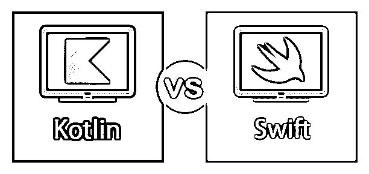
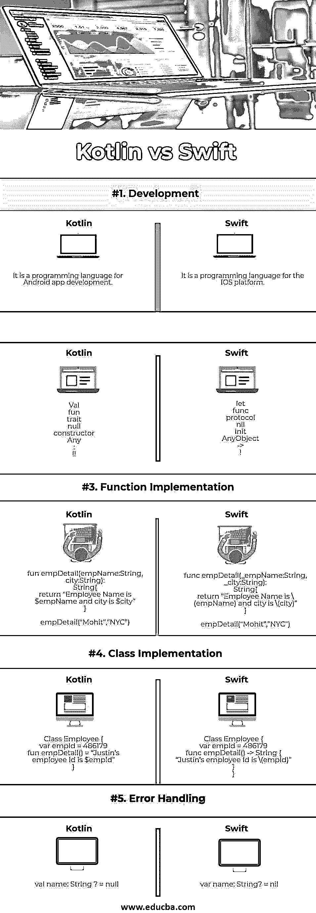

# 锅炉 vs Swift

> 原文：<https://www.educba.com/kotlin-vs-swift/>

## 科特林和斯威夫特的区别

本主题将通过简介、主要差异和下表中的直接比较来了解 Kotlin 与 Swift 之间的差异。

### 我的锅

它是由 JetBrains 和谷歌在 2016 年推出的。第一个稳定的版本是 Kotlin 1.0，它得到了开发者社区的广泛使用和赞赏。它是另一种运行在 JVM 上的编程语言，与 Java 有很强的互操作性。它是编译的静态类型语言，可以在不同的平台上编译。

<small>网页开发、编程语言、软件测试&其他</small>

Kotlin 由谷歌正式推出，用于 Android 开发。与 Java 不同，Kotlin 有一个像 python 一样更具表现力的语法。从 Kotlin 开始，对 Java 的良好理解是必须的。

Kotlin 克服了 Java 的一些限制，比如分号；在 Kotlin 中分号是可选的，换行符足以标记该语句的结束。在 Kotlin 中，使用关键字 var，变量可以是不可变的。静态变量和方法不需要存在于类体内，可以在包的顶层定义。

### 迅速发生的

它是 iOS 应用程序、watchOS 应用程序、电视应用程序和 macOS 应用程序最受欢迎的编程语言。它是一种面向对象的、功能性的、块结构的通用语言。克里斯·拉特纳制定该计划的目的是克服目标 c 中的问题和困难

Swift 允许编写与手机、台式机、服务器或任何执行代码的设备兼容的代码。它建立在结合了安全性和设计模式的现代编程方法之上，使程序员能够高效、轻松地进行编码。

Swift 库有大量预定义的方法，可用于构建逻辑。因此，不仅编写代码更容易，而且代码的维护也没有麻烦。Swift 避免使用容易出错的大型类，并采用现代编程模式，例如

*   它倾向于在程序开始被调用之前初始化变量。
*   检查数组和列表是否有超出范围的索引错误。
*   程序员不需要为内存管理编写额外的代码行；它利用自动引用计数进行内存管理。
*   简单的错误处理允许程序员在运行时以高效和用户友好的方式处理意外错误。

### Kotlin 和 Swift 之间的正面比较(信息图)

以下是 Kotlin 与 Swift 之间的 5 大差异:

### Kotlin 和 Swift 的主要区别

Kotlin vs swift 都是开发 IOS 和 Android 开发的强大语言。让我们来看看这两种语言的主要区别:

1.  斯威夫特的枚举被认为比科特林的更强大。
2.  Swift 中没有数据类。
3.  Swift 中缺少委托类和属性。
4.  Swift 中不允许注释。
5.  默认情况下，Kotlin 中的所有类都是 final。
6.  Kotlin 没有 strut 或通过值传递数据。
7.  Kotlin 不提供 Tuple。
8.  Kotlin 没有类型别名。
9.  科特林没有守卫声明。

#### 内存管理

Kotlin 和 Swift 实现了一种不同的内存管理方法。Swift 使用 ARC 或自动引用计数进行内存管理，而 Kotlin 使用垃圾收集。

#### 释文

注释是向代码添加元数据的最简单的方法。Kotlin 支持在代码中包含大量注释，而 Swift 不提供任何注释。

#### 数据类

相对于传统 Java 编程的数据类或 POJO 是保存数据变量的类；在 Kotlin 中，有这些数据类是可能的，而在 Swift 中是不可能的。

#### 结构

虽然 Kotlin 是一种类似 Java 的语言，但它不支持开发人员的任何结构；另一方面，Swift 提供了使用大量库的结构。

#### 委托的类和属性

Kotlin 支持委托类和属性，而 Swift 不提供任何支持。委托属性允许开发人员使用其他类的方法引用。

### 科特林与斯威夫特对比表

以下是 Kotlin 和 Swift 之间最重要的比较:

| **概念** | **锅炉** | 雨燕 |
| 发展 | 它是一种用于 Android 应用开发的编程语言。 | 它是一种用于 IOS 平台的编程语言。 |
| 语法差异 | 英国压力单位 | 让 |
| 乐趣 | 功能 |
| 特点 | 草案 |
| 空 | 无 |
| 构造器 | 初始化 |
| 任何的 | 父对象 |
| : | -> |
| !! | ! |
| 功能实现 | fun empDetail(empName:String, city:String):字符串{返回“雇员姓名是$empName，城市是$city”}

empDetail("Mohit "，" NYC ")

 | func empDetail(_empName:String, _city:String):字符串{返回“雇员姓名是\(雇员姓名)，城市是\(城市)”}empDetail("Mohit "，" NYC ") |
| 类实现 | Class Employee {var empId = 486179

fun empDetail() = "Justin 的员工 Id 是$empId "

}

 | Class Employee {var empId = 486179func EMP detail()-> String { " Justin 的员工 Id 是\(empId)" }} |
| 错误处理 | Val name: String? = null | var name: String? = Nil |

如您所见，在函数实现方面有一些细微的差别；如果您注意到 swift 的函数实现的参数，该变量有下划线(_)作为前缀，而在 Kotlin 中没有。

类似地，在 Kotlin to return 中，参数值$以变量名为前缀，标记要返回的绝对值。然而，要在 swift 中返回参数，变量要用简单的大括号括起来，并以正斜杠(\)为前缀。

对于字符串变量的错误处理，在 Kotlin 中使用 null，在 Swift 中使用 nil。然而，不管使用什么关键字，它都以完全相同的方式工作。

### 结论

既然已经到了文章的结尾，那就来总结一下到目前为止我们所学到的东西吧。Kotlin 是用于 Android 应用开发的编程语言，Swift 是用于 IOS 应用开发的。kotlin 和 swift 语言都是建立在现代编程方法和软件设计模式之上的。这两种语言都提供了几个内置的函数，这些函数都是在大量的库中定义的。在本文中，我们看到了这两种语言的一些相似之处和不同之处。这两种语言之间存在一些概念上的差异和微小的语法差异。

这两种语言都不局限于[移动应用开发](https://www.educba.com/mobile-app-development-software/)，可以扩展到服务器端开发和使用不同可用框架的跨平台应用。这些语言在不断发展，以提高性能、编程效率和安全性。

### 推荐文章

这是 Kotlin 和 Swift 之间差异的指南。在这里，我们还将讨论信息图和比较表的主要区别。你也可以看看下面的文章来了解更多-

1.  [Java vs Kotlin](https://www.educba.com/java-vs-kotlin/)
2.  [Groovy vs Kotlin](https://www.educba.com/groovy-vs-kotlin/)
3.  [春天 vs 冬眠](https://www.educba.com/spring-vs-hibernate/)
4.  [科特林 vs 斯卡拉](https://www.educba.com/kotlin-vs-scala/)

