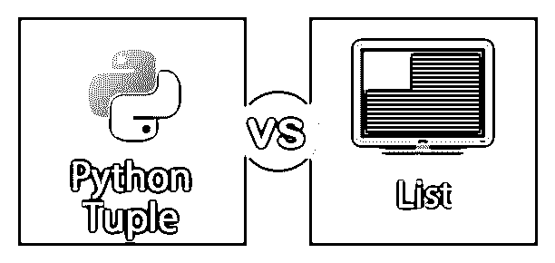

# Python 元组与列表

> 原文：<https://www.educba.com/python-tuple-vs-list/>

## Python 元组和列表的区别

Python Tuple 用于通过使用()来定义和存储一组值，这是一个花括号。另一方面，List 用于通过使用表示为[]的方括号来定义和存储一组值。当比较 Python Tuple 和 list 的内置函数时，Python Tuple 的预定义内置函数比 list 的少。列表相对于 Python Tuple 的一些优点是，列表可以定义为可变长度，并且可以从一个目的地复制到另一个目的地，但是 Python Tuple 只能有固定长度，不能被复制。

让我们看看这个元组的例子:

<small>网页开发、编程语言、软件测试&其他</small>

def test()
返回 1，2
a，b = test()
打印(a，b)

这里，我们使用了一个元组从函数中返回值，因此在打印值时，我们不能修改它。

Python 元组可以没有括号，也可以有“()”这样的括号，这有助于 Python 理解元组中的列表。方括号定义了 Python 列表。它的功能类似于数组在其他语言中的工作方式。示例:

x = [1，3，5，6，2，1，6] print(x):打印完整的列表
print(x[0]，x[1]):打印从索引 0 开始的列表

由于相似性，这两种结构经常被混淆，它们有很大的不同。

### Python 元组和列表之间的直接比较(信息图表)

下面是 6 大对比 Python 元组 vs 列表

### Python 元组和列表的主要区别

以下是积分列表；描述 Python 元组与列表的主要区别:

#### 操作的功能

与元组相比，列表具有补充的内置功能。列表和元组有共同的 index()和 count()方法，但除此之外，列表还有许多专门应用于列表的函数，如 append()、remove()、clear()、sort()、reverse()等。

我们可以使用内置函数 dir([object])来找出与列表和元组相关的所有函数。此类命令的输出如下所示:

**列表对象:**

[‘__add__’,
‘__class__’,
‘__contains__’,
‘__delattr__’,
‘__delitem__’,
‘__dir__’,
‘__doc__’,
‘__eq__’,
‘__format__’,
‘__ge__’,
‘__getattribute__’,
‘__getitem__’,
‘__gt__’,
‘__hash__’,
‘__iadd__’,
‘__imul__’,
‘__init__’,
‘__init_subclass__’,
‘__iter__’,
‘__le__’,
‘__len__’,
‘__lt__’,
‘__mul__’,
‘__ne__’,
‘__new__’,
‘__reduce__’,
‘__reduce_ex__’,
‘__repr__’,
‘__reversed__’,
‘__rmul__’,
‘__setattr__’,
‘__setitem__’,
‘__sizeof__’,
‘__str__’,
‘__subclasshook__’,
‘append’,
‘clear’,
‘copy’,
‘count’,
‘extend’,
‘index’,
‘insert’,
‘pop’,
‘remove’,
‘reverse’,
‘sort’]

**元组对象:**

[‘__add__’,
‘__class__’,
‘__contains__’,
‘__delattr__’,
‘__dir__’,
‘__doc__’,
‘__eq__’,
‘__format__’,
‘__ge__’,
‘__getattribute__’,
‘__getitem__’,
‘__getnewargs__’,
‘__gt__’,
‘__hash__’,
‘__init__’,
‘__init_subclass__’,
‘__iter__’,
‘__le__’,
‘__len__’,
‘__lt__’,
‘__mul__’,
‘__ne__’,
‘__new__’,
‘__reduce__’,
‘__reduce_ex__’,
‘__repr__’,
‘__rmul__’,
‘__setattr__’,
‘__sizeof__’,
‘__str__’,
‘__subclasshook__’,
‘count’,
‘index’]

我们可以看到，除了元组之外，还有其他功能与列表相关联。

#### 尺寸评估

元组操作比列表操作小。当有大量元素时，这使得操作更快。让我们看一个例子来计算列表和元组元素的大小。

x= (1，2，3，4，5，6，7，8，9，0)
y= [1，2，3，4，5，6，7，8，9，0]*T3】print(' x = '，x.__sizeof__())
print('y= '，y.__sizeof__())*

 ***输出:**

x= 104
y= 120

在这个例子中，我们有一个元组 x 和一个包含相同数量条目的列表 y，但是元组的大小小于列表的大小。

#### 多样化的使用案例

最初，列表似乎总是能够替换元组，但事实并非如此。我们可以理解这是由于以下原因:

*   当使用元组而不是列表时，它给查看者一个想法，即当前数据可以改变，也不应该改变。
*   元组经常用于存储数据，相当于没有键的字典。

**举例:**

[(‘Employee1’, 1000), (‘Employee2’, 1001), (‘Employee3’, 1002)]

元组也可以用作字典中的键，因为它们的哈希表和不可变的特性。列表不适合这种情况，因为它们不能处理函数 __hash__()并且本质上是可变的。

key_value = {('a '，' b '):1 } #有效
key_value = {['a '，' b ']:1 } #无效

*   可读性增加了，即当元组存储在列表中时比当列表存储在列表中时读取信息更容易。示例:

[(2,4), (5,7), (3,8), (5,9)] is easier to read than [[2,4], [5,7], [3,8], [5,9]]

#### 元组和列表的使用

当我们知道要给出什么信息时，我们使用元组，并且我们需要保存值以防被修改，就像当我们需要存储网站的凭证时。元组也用作字典的键，因为只有不可变的值可以被散列。因此，在这种情况下，我们不能使用列表。如果我们仍然想使用一个列表作为一个键，我们首先需要把列表转换成一个元组。

另一方面，当我们想要修改集合中给定的值，并且不知道集合大小是否固定时，我们可以使用列表。

### Python 元组与列表比较表

下面是 Python 元组和列表之间最顶层的比较

| **特性** | **列表** | **元组** |
| 句法 | 列表由方括号[]定义。 | 元组由括号()定义，或者根本没有括号。 |
| 可变与不可变 | 该列表本质上是可变的，即它可以在创建后被更改或改变。 | A tuple is immutable in nature, i.e. it cannot be altered or changed after its creation. |
| 可用操作 | list 中的内置函数比 tuple 中的更多，比如 pop()、insert()等。 | Tuple 内置函数较少。 |
| 尺寸比较 | 与元组操作相比，列表操作的规模更大。 | Tuple operations are smaller in size, which makes it faster with many elements. |
| 长度 | Lists have a variable length. | 元组具有固定的长度。我们不能更改现有元组的大小。 |
| 欺骗 | 列表可以复制 | 无法复制元组。 |

### 结论

这都是关于 Python 元组和列表的。既然我们已经理解了 python 元组和列表之间的区别，我们就更容易决定应该使用这两者中的哪一个。因此，我们可以得出结论，尽管列表和元组在 Python 中都是[重要的数据结构](https://www.educba.com/data-structure-interview-questions/)，但是它们之间有显著的差异，主要的差异是列表是可变的，而元组不是。

### 推荐文章

这是 python Tuple 和 List 之间区别的指南。在这里，我们还将讨论信息图和比较表的主要区别。你也可以看看下面的文章来了解更多-

1.  [冒烟测试与健全性测试](https://www.educba.com/smoke-testing-vs-sanity-testing/)
2.  [Python 编译器](https://www.educba.com/python-compilers/)
3.  [Python 列表理解](https://www.educba.com/list-comprehensions-python/)
4.  [Python getattr](https://www.educba.com/python-getattr/)

*