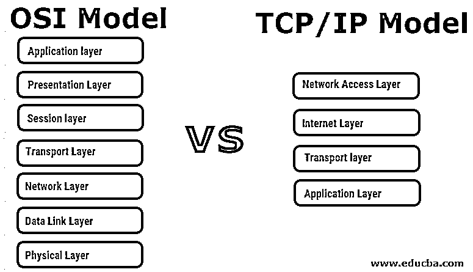

# OSI 模型与 TCP/IP 模型

> 原文：<https://www.educba.com/osi-model-vs-tcp-ip-model/>

## OSI 模型和 TCP/IP 模型介绍

最常用的两种通信网络模型是 TCP / IP 和 OSI。他们之间的很多异同都在这里。主要区别在于，概念模型是 OSI，不实用于通信，而 TCP / IP 用于连接建立和网络通信。TCP / IP 遵循水平方法，而 OSI 模型支持垂直方法。对于每个网络，包括互联网，TCP / IP 是标准协议，而 OSI 不是协议，而是理解和设计的基准模型。

### OSI 模型

OSI 模型是由国际标准化组织开发的一种概念模型，允许各种通信系统通过标准协议进行通信。

<small>网页开发、编程语言、软件测试&其他</small>

1.  **应用层:**这是唯一一个直接与用户数据交互的层。但需要注意的是，软件应用不是应用层的组件；应用层负责协议和信息操作，软件用户依靠它们来获得重要的信息。
2.  **表示层:**这一层的首要任务是准备信息，以便应用层可以使用；也就是说，第六层将信息提供给消费应用。两个通信者可以使用[不同的加密方法](https://www.educba.com/what-is-encryption/)进行通信，以便将输入的数据转换成接收设备应用层可以理解的语法。
3.  **会话层:**这是用来开启和关闭两台机器之间通信的层。信函开始和结束之间的时间称为会话。
4.  **传输层:**流量控制和差错控制负责这一层。传输层检查接收端的错误，以确保接收数据的完整性，如果不完整，则请求重传。
5.  **网络层:**网络层允许在两个不同的网络之间传输信息。网络层还确定信息到达目的地的最佳物理路由。
6.  **数据链路层:**[数据链路层从该层收集](https://www.educba.com/data-link-layer/)数据包，并将它们分成更小的部分。像网络层一样，互联通信中的流量控制和差错控制由数据链路层负责。
7.  **物理层:**这一层包含信息传递中涉及的物理设备，如电线、开关等。这也是 1 和 0 的字符串，其中的信息变成了比特流。

### TCP/IP 模型

互联网协议是为网络通信建立的规则集。TCP/IP 被认为是一种健壮的网络协议模型。

它是 OSI 模型的精简版本。

1.  **网络接入层:**网络接入层是 OSI 模型中可用的数据链路层和物理层的组合。物理寻址在这一层完成，即源和目的地的 MAC 地址被分配给数据包。因此，这一层负责数据的物理传输。
2.  **互联网层:**互联网层用于将一个独立的数据包发送到网络的目的地。所有连接到 TCP/IP 网络的机器、Web 服务器和节点都被分配到这一层。
3.  **传输层**:允许信息以信息图表的格式从源主机无缺陷地传递到目的主机。
4.  **应用层:**应用层分三层执行 OSI 模型的任务:应用层、表示层和会话层。它是节点和节点之间的交互所必需的，并处理用户界面的需求。应用层协议有 TFTP、HTTP、Telnet、SSH、NTP、DNS、NFS、FTP、SNMP、DHCP、SMTP。

### OSI 模型和 TCP/IP 模型的面对面比较(信息图表)

以下是 OSI 模型与 TCP/IP 模型之间的 7 大区别。

### OSI 模型和 TCP/Ip 模型的主要区别

让我们讨论一下 OSI 模型和 TCP/IP 模型之间的一些主要区别。

*   OSI 知道水平方法，垂直方法称为 TCP/IP 方法。
*   OSI 是独立于协议和通用的，而 TCP/IP 有支持互联网发展的正常法律。
*   与 OSI 模型相比，TCP/IP 模型更可靠。
*   包被提供给 OSI 传输层，而在 TCP/IP 的情况下，这是不确定的。
*   在 OSI 模型中，表示层和会话层是可用的，[而 TCP/IP 模型](https://www.educba.com/tcp-ip-model/)不包含这样的层。
*   TCP/IP 实现操作系统的功能，OSI 帮助指导网络并充当参考工具
*   TCP/IP 提供网络级连接设施，而 OSI 网络层提供连接和无连接服务。
*   没有其他模型是 TCP/IP，而 OSI 试图匹配其他模型设计，因为它是一个参考。
*   协议可以很容易地终止；虽然最初的规则是在 TCP/IP 模型中，但是新的规则可以引入 OSI 模型。

### **OSI 模型和 TCP/IP** 对照表

让我们讨论 OSI 模型和 TCP/IP 模型之间的最大区别。

| **OSI 模型** | **TCP/IP 模型** |
| 它代表开放系统互联。 | 它代表传输控制和互联网协议。 |
| 它是计算机环境的理论框架。 | 它是一种用于数据信息传输的客户服务模式。 |
| 在 OSI 模型中，有 7 层 | TCP/IP 模型中有 4 层 |
| 使用率低 | TCP/IP 模型是最常用的 |
| 这种模式是一种垂直的方法 | 这种模式是一种横向的方法 |
| 在这个模型中，包裹的交付是一个保证 | 在这种模式下，不保证包的交付 |
| 该协议隐藏在 OSI 中，在技术上很容易被替换和改变。 | 在这种模式下，更换工具不像 OSI 那样容易 |

### 结论

在这篇文章中，我们看到了两者之间的差异。TCP/IP 被广泛用于通过互联网自始至终传递信息。因此，我们可以得出这样的结论:TCP/IP 比 OSI 模型更健壮、更灵活，并且指明了信息应该如何在互联网上传输。

### 推荐文章

这是 OSI 模型与 TCP/IP 模型的对比指南。在这里，我们还将讨论信息图和比较表的主要区别。您也可以浏览我们推荐的其他文章，了解更多信息——

1.  [WCF vs 网络服务](https://www.educba.com/wcf-vs-web-services/)
2.  [数据库管理系统架构](https://www.educba.com/dbms-architecture/)
3.  [网络的基本原理](https://www.educba.com/basic-fundamental-of-networking/)
4.  [数据库管理系统与关系数据库管理系统](https://www.educba.com/dbms-vs-rdbms/)

