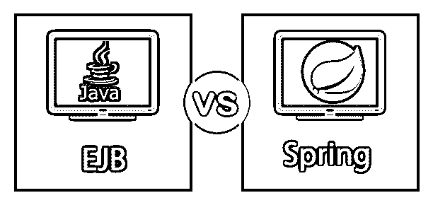
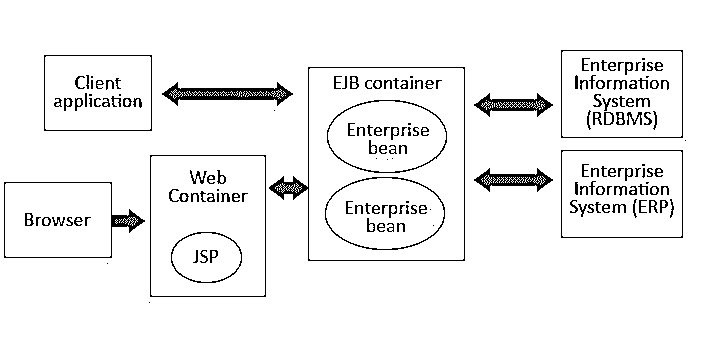
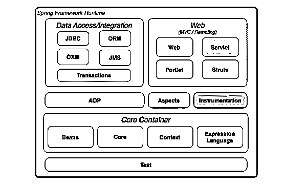

# EJB vs 春天

> 原文：<https://www.educba.com/ejb-vs-spring/>

## EJB 和春天的区别

下面的文章提供了 EJB 和春天的区别。让我们先看看什么是 EJB 和春天。

**EJB** 是企业 Java Beans 的缩写。EJB 是一个用于服务器端架构的 Java API，用于基于组件的事务性分布式编程。EJB 指定了 bean 格式，并定义了一组必须由运行 bean 的容器提供的服务。因此，开发人员不需要关心服务细节，如安全性、事务支持或任何远程对象访问。要运行 EJB 应用程序，您需要一个应用服务器，即 JBoss、WebLogic、WebSphere 等 EJB 容器。 **Java Spring** 是一个轻量级开源框架，支持 Hibernate、EJB、JSF、Tapestry 等多种框架。Spring framework 有一个分层结构，它允许您在开发的开始就选择所需的组件。Spring 框架提供了许多特性，如控制反转(IOC)、面向方面(AOP)、事务管理、 [JDBC 异常处理](https://www.educba.com/what-is-jdbc/)等。这使得开发人员可以专注于业务需求，而不是应用程序的架构细节。

<small>网页开发、编程语言、软件测试&其他</small>

### 《EJB》与《春天》的比较

以下是 EJB 和春天的十大区别。

### EJB 和春天的主要区别。

让我们讨论一下 EJB 和春天的一些主要区别。

*   EJB 与 Spring 的主要区别在于，EJB 是 Java EE 的规范，而 Spring 是框架或实现。
*   EJB 是一种基于组件的事务性编程架构。对于 Java 开发人员来说，这使得服务器端开发变得更加容易。Spring framework 是一个 Java 平台，为开发 Java 应用程序提供支持。该框架处理基础设施配置，并让开发人员专注于业务需求。

### EJB 建筑

*   EJB 框架将业务逻辑从底层细节中分离出来，这样开发人员就可以专注于业务需求。与使用许多 SQL 查询的遗留系统不同，EJB 架构不直接使用 SQL 查询；相反，它使用模型-视图-控制器设计模式，其中查询被包装在 EJB 容器中，数据可以通过 EJB 进行评估。
*   在应用程序的中心，一个 EJB 容器管理一组企业 beans。这个 bean 负责管理与后端数据库系统(通常是关系数据库)的连接。如您所知，在 Spring 框架中，这由数据访问或集成模块负责。
*   在 EJB，web 容器使用 JSP 来访问 EJB bean；它将 JSP 转换成 HTML，然后将 [HTML 提供给浏览器](https://www.educba.com/introduction-to-html/)。在 Spring 中，这是由 Web 模块处理的。
*   在 EJB，中间层，即企业 beans，充当各种系统(如关系数据库)的包装器。有两种类型的企业 bean，即实体 bean 和会话 bean。在高层次上，会话 bean 代表活动，实体 bean 代表应用程序的实体。实体 bean 是存储在存储系统(如数据库)中的持久性对象。相反，框架 Spring 使用 web 容器进行会话管理。

### 春天建筑

### 

*   Spring framework 有大约 20 个模块，并提供各种功能。这些模块在逻辑上分为数据访问/集成、Web、AOP、方面、工具、核心容器和测试。
*   核心容器由核心、beans、上下文和表达式语言模块组成。核心和 Bean 模块提供了 IoC 和依赖注入等特性。
*   数据访问/集成层提供交易模块，如 JDBC、JMS、ORM、OXM 等。JDBC 模块提供了一个 JDBC 抽象层，它消除了编写与数据库建立连接所需的配置代码的需要。
*   ORM 模块支持一些流行的对象关系映射 API，如 JPA、Hibernate。不像 EJB 只支持 JPA。
*   web 层由 Web-Struts、Web-Servlet 和 Web-Portlet 模块组成。web-servlet 模块包含 Spring 的 web 应用程序 MVC 实现。它在 web 表单和业务逻辑层之间提供了清晰的分离。
*   Spring AOP 模块提供了一种符合 AOP 联盟的面向方面的编程，允许你定义方法拦截器来清晰地分离功能。
*   测试模块提供了对 JUnit 或 TestNG 的[支持。](https://www.educba.com/junit-annotations/)

### EJB vs 春天对比表

让我们讨论一下 EJB 和春天的最大区别。

| **比较的基础** | **EJB** | **春天** |
| **交易管理** | EJB 只支持 JTA 事务管理器。 | 通过其 PlatformTransactionManager 接口，spring 支持多种事务，如 JTA、Hibernate、JDO 和 JDBC。
使用 JTA 事务管理器支持分布式事务 |
| **依赖注入** | 它可以将 EJB 的数据、JMS 资源、JPA 资源注入到容器中。 | 可以注入列表、属性、地图和 JNDI 资源。 |
| **坚持** | 它支持可编程的 bean 管理的持久性，并与 JPA 紧密耦合。 | 它提供了一个框架，支持各种持久性技术的集成，如 JDBC、Hibernate、JDO 和 iBATIS。 |
| **状态管理** | 支持有状态会话 beans 和扩展的持久性上下文。 | 支持 Web 容器会话管理 |
| **网络服务** | 支持有状态会话 beans 和扩展的持久性上下文。 | 它不支持任何直接的 web 服务集成。 |
| **安全** | 它通过 JAAS 支持声明性和编程性安全支持。
通过用户和角色支持声明式安全。声明性安全在部署描述符文件中配置。 | 没有现成的安全实现。然而，它通过 spring 配置文件或类元数据提供了声明性的安全性。
Acegi 是构建在 Spring 之上的开源安全框架。 |
| **分布式计算** | 提供容器管理的远程方法调用。 | 它通过 RMI、JAX-RPC 和 web 服务提供对远程调用的支持。 |
| **消息传递** | 它支持即时消息传递。
通过消息驱动 Beans 的能力。 | 对于消息，需要添加侦听器的配置。 |
| **调度** | 通过 EJB 定时服务提供简单的调度 | 对于调度，需要添加和配置 Quartz。 |
| **AOP** | 它通过拦截器提供有限的支持。 | 支持 AspectJ 和 Spring AOP 联盟 |

### 结论

每种技术都有一些优点和缺点，在选择任何规范或框架之前，预先了解优点和缺点是非常重要的。在本文中，我们已经看到 EJB 是 J2EE 的一个规范，而 Spring 是一个易于实现的框架，尽管有一些重叠的地方。我们已经看到了架构上的差异，并讨论了 EJB 和 spring 为开发人员提供的一些服务。

通过差异矩阵，我们可以得出这样的结论:如果你想使用 AOP 这样的高级特性，并希望对应用程序有更多的控制，那么就选择 Spring 框架。如果您不想深入了解数据库的配置细节，并且应用程序是非常有状态的，那么使用 EJB。

### 推荐文章

这是 EJB vs 春天的指南。在这里，我们还将讨论信息图和比较表的主要区别。您也可以浏览我们推荐的其他文章，了解更多信息——

1.  [春天 vs 冬眠](https://www.educba.com/spring-vs-hibernate/)
2.  [精益六部适马 vs 六部适马](https://www.educba.com/lean-six-sigma-vs-six-sigma/)
3.  [Hibernate vs JPA](https://www.educba.com/hibernate-vs-jpa/)
4.  [春季框架面试试题](https://www.educba.com/spring-framework-interview-questions/)

