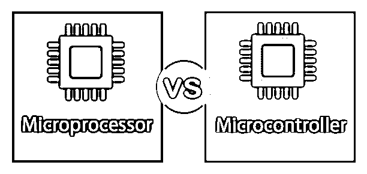

# 微处理器与微控制器

> 原文：<https://www.educba.com/microprocessor-vs-microcontroller/>

## 微处理器和微控制器的区别

微处理器和微控制器被定义为用于执行计算和控制功能的小芯片的集成电路；微处理器集成了 CPU 的功能，是微控制器的大脑，而微控制器是一台具有各种形状和大小的计算机，除此之外还有其他差异，如设备类型、执行的任务、体系结构、效率、计算、内存存储、成本、速度等。微处理器的例子可以是个人计算机，而微处理器可以是嵌入式系统(如电视、移动电话、洗衣机等)。)

### 微处理器与微控制器的正面比较(信息图表)

以下是微处理器和微控制器之间的 15 大区别

<small>网页开发、编程语言、软件测试&其他</small>

### 微处理器和微控制器的主要区别

让我们讨论一下微处理器和微控制器之间的一些主要区别。

*   微处理器和微控制器是一些非常基本和关键的电子元件，基于它们的架构，它们彼此有很多不同。不可否认的是，两者都有其特定的目的和用途，这使得它们在许多人通常不知道的广泛方面有所不同。
*   正如我们所见，微处理器和微控制器的主要区别在于外部和内部组件的存在。微控制器将外设嵌入到单个芯片中，这使得它们比微处理器更加紧凑。
*   用于制造微控制器的互补金属氧化物半导体技术比用于制造微处理器的材料便宜得多。微控制器应用所需的外部元件数量较少，因此成本最低。
*   相反，与微控制器相比，用微处理器制作的应用程序的总成本太高，因为系统所需的外围组件的数量比微控制器所需的数量多得多。

### 微处理器与微控制器对照表

让我们讨论一下微处理器和微控制器之间的最大区别。

| **微处理器** | **微控制器** |
| 微处理器在单个集成电路上集成了中央处理器(CPU)的功能。它基本上是微控制器的大脑。微处理器是单个芯片中的计算引擎。没有微处理器，进行任何计算都是不可能的。 | 用最简单的术语来说，微控制器基本上是一台有各种封装和尺寸的计算机。考虑一个个人计算机的例子，它可以同时执行许多任务或运行各种程序，这样你就可以一边听音乐，一边在文字处理器中打字。 |
| 微处理器是一种可编程设备，它接受一些输入，对其执行一些逻辑和算术运算，并产生一些期望的输出。 | 微控制器是通常专用于单一任务的计算机。就像任何其他计算机一样，微控制器有一个中央处理器，允许它在后台执行所有的计算和逻辑操作。 |
| 微处理器将接受机器语言的指令，执行它们，然后命令处理器去做什么。微处理器在这样做的同时执行给定的三件事情:
它在算术和逻辑单元(ALU)的帮助下进行诸如加、减、乘、除和逻辑运算的操作。
其中的数据能够从一个位置移动到另一个位置。
程序计数器寄存器存储下一条指令的引用。微处理器将从一个位置跳到另一个位置，从而在每次跳跃后做出决定。 | 它有一个由微控制器使用的存储器，用来存储专用于一个单一任务的程序。微控制器中最重要的组件是时钟，因为它决定了微控制器的运行速度，从而影响应用的某些方面，如分辨率、响应、功耗等。 |
| 它使用冯诺依曼架构，数据和程序存在于同一个内存模块中。 | 微控制器采用哈佛架构，数据和程序存储在一个单独的存储模块中。 |
| 它是一个集成了处理器/CPU 的芯片。需要外部存储器和 I/O 组件。 | 微控制器带有内部存储器和外围设备或 I/O 组件以及外部处理器。 |
| 由于外部连接了外部 i/o 元件，它的电路很大。 | 由于内部存储器和 i/o 组件，微控制器具有小尺寸的电路。 |
| 微处理器在小型系统中的使用效率很低。 | 然而，微控制器是一种有效的技术，因为它们可以用于紧凑的系统中。 |
| 系统成本高 | 系统成本低 |
| 外部组件消耗大量功率，这增加了功率消耗率，导致高功率消耗。这使得它不太适合使用电池的设备，因为电池的电量很容易耗尽。 | 外部组件的数量越少，总功耗就越小，因此更适合消耗存储功率(如电池中的功率)的设备。 |
| 当涉及到功率效率时，大多数微处理器自身的效率不足以节省功率，因为它们没有任何这样的特征。 | 当谈到电源效率时，大多数微控制器足以有效地节省电源，因为它们具有许多节能功能或模式，如空闲模式或节能模式。其结果是比平时消耗更多的能量。 |
| 由于外部存储器和 i/o 组件，微处理器中的每条指令都需要外部操作。这使得它比微处理器相对较慢。 | 由于内部存储器和 i/o 组件，微控制器中的每个指令都需要内部操作。这使得它相对更快。 |
| 微处理器中的大多数操作都是基于内存的，因为微处理器中的寄存器数量较少。 | 微控制器中的大多数程序更容易编写和编码，因为微控制器中的寄存器数量比微处理器中的多得多。 |
| 微处理器保存许多指令，这些指令由几个步骤组成，如解码、提取、执行、存储等。 | 微控制器有一个固定大小的 ROM 和 RAM 的 CPU 和所有其他必要的嵌入式外围组件，因此它也被称为小型机。 |
| 许多硬件制造公司生产微处理器，如微芯片、摩托罗拉、飞利浦等。 | 微处理器，如英特尔奔腾系列处理器、酷睿 2 双核、双核、英特尔 i3、i5、i7 等 |
| 使用的例子可以是个人电脑。 | 使用的例子可以是在嵌入式系统中，例如在洗衣机、电视等中。 |

### 结论

计算机的基础部分由微处理器构成，而微控制器构成嵌入式系统的关键[组件。与终生致力于执行相同任务的微控制器相比，微处理器能够执行各种任务的操作。了解了这些差异之后，我们意识到微处理器永远不能被微控制器所取代。](https://www.educba.com/what-is-embedded-systems/)

### 推荐文章

这是微处理器与微控制器的对比指南。在这里，我们还将讨论信息图和比较表的主要区别。您也可以浏览我们推荐的其他文章，了解更多信息——

1.  [云计算 vs 网格计算](https://www.educba.com/cloud-computing-vs-grid-computing/)
2.  [什么是云计算中的虚拟化？](https://www.educba.com/what-is-virtualization-in-cloud-computing/)
3.  [嵌入式系统面试问题](https://www.educba.com/embedded-system-interview-questions/)
4.  [单片内核 vs 微内核](https://www.educba.com/monolithic-kernel-vs-microkernel/)

