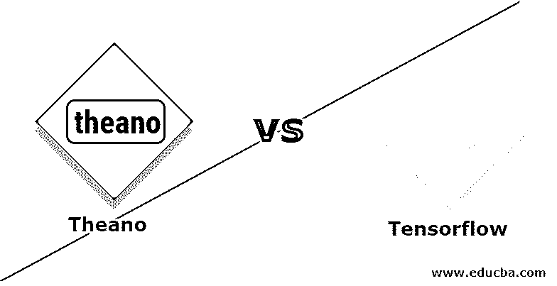
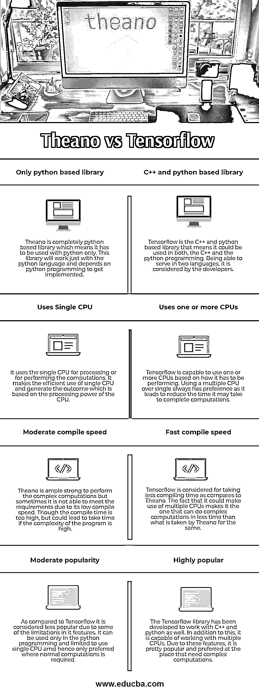

# theano vs tensorflow

> 原文：<https://www.educba.com/theano-vs-tensorflow/>

## 张量流和张量流的区别

Theano 可以定义为属于 python 的库，它通过优化编译器来评估数学表达式及其操作，从而简化了应用程序开发。通过利用 python，它习惯于作为人工智能的[特征。NumPy-Esque 语法已经用于在 python 中实现这个库。它使用 CPU 的架构，一旦代码是用这个编译的。](https://www.educba.com/what-is-artificial-intelligence/)

Tensorflow 是另一个免费的开源库，可以用来实现程序中的数据流。像 Theano 一样，它也可以被认为是[通过其提供的计算为机器学习](https://www.educba.com/what-is-machine-learning/)做出贡献的数学库。开发这个库的原因是将它用于研究目的。随着这个库的发展，人们认为它在生产环境中使用已经足够可靠了。它让用户创建一个大规模工作的神经网络，并且可以是多层的。它通过引入数据流图的使用为人工智能做出了贡献。这两个库都为开发人员实现属于人工智能的特性铺平了道路。根据需求，开发人员可以选择这两个库中的任何一个。

<small>Hadoop、数据科学、统计学&其他</small>

### Theano 和 Tensorflow 的面对面比较(信息图)

以下是 Theano 和 Tensorflow 的 4 大对比:

### **Theano 和 Tensorflow 的主要区别**

Theano 和 Tensorflow 是服务于几乎相同目的的库。以下是下面提到的一些主要区别:

*   Theano 由 LISA group 开发，LISA group 是蒙特利尔大学的一部分，而 Google Brain 团队则开发了 Tensorflow 供内部使用。虽然它是为内部使用而开发的，但后来却被公之于众。
*   当应用程序需要的资源较少，并且计算不太复杂时，最好使用 ano。在开发需要中等系统配置的算法时，可以毫无疑问地使用 ano。 [Tensorflow](https://www.educba.com/install-tensorflow/) 在需要大量计算且资源充足的情况下是首选。此外，Tensorflow 的一个优点是它允许复杂的算法在系统中运行。
*   Theano 库提供了一个平台，只有基于 Python 的应用程序才能利用它。由于其局限性，研究人员并不倾向于那些[喜欢用 C++](https://www.educba.com/what-is-c-plus-plus/) 工作的人。Tensorflow 让我们将它与 C++和 python 一起使用，最终为研究提供一个扩展的环境。
*   它们都是为了相同的目的而开发的，但是由于组织的作用，它们都带有可靠性的标签。Tensorflow 是由谷歌开发的，谷歌有一个专门的团队，名为 brain team，他们一直在开发这个，tensor flow 比 Theano 受欢迎得多。Theano 是由 LISA 小组开发的，运行得非常好，但由于它的一些限制，它没有 Tensorflow 那么受欢迎。

### 泰诺和张量流对照表

下面是 Theanoa 和 Tensorflow 的区别。

| **theno** | **Tensorflow** |
| **仅基于 python 的库**–the ano 是一个完全基于 python 的库，这意味着它只能与 python 一起使用。这个库将只与 python 语言一起工作，并依赖 python 编程来实现。 | **基于 C++和 python 的库**–tensor flow 是基于 C++和 python 的库，这意味着它可以在 C++和 Python 编程中使用。能够以两种语言服务，这是开发者所考虑的。 |
| **使用单个 CPU**–它使用单个 CPU 进行处理或执行计算。它有效地利用了单个 CPU，并根据 CPU 的处理能力生成结果。 | **使用一个或多个 CPU**–tensor flow 能够根据其性能使用一个或多个 CPU。使用多个 CPU 比使用单个 CPU 更有优势，因为这样可以减少完成计算所需的时间。 |
| **中等编译速度**–ano 足以执行复杂的计算，但有时由于其编译速度较低，无法满足要求。虽然编译时间太长，但如果程序的复杂性很高，可能会导致花费时间。 | **编译速度快**–tensor flow 被认为比 Theano 花费更少的编译时间。它可以利用多个 CPU 的事实使它能够在比 ano 更短的时间内完成复杂的计算。 |
| **中等受欢迎程度**–与 Tensorflow 相比，由于其功能的一些限制，它被认为不太受欢迎。它只能在 python 编程中使用，并且仅限于使用单 CPU AMD 因此仅在需要正常计算的情况下才首选。 | **非常受欢迎的**–tensor flow 库已经开发出来，可以与 C++和 python 一起使用。除此之外，它能够与多个 CPU 一起工作。由于这些特性，它在需要复杂计算的地方非常受欢迎和首选。 |

### **结论**

Theano 与 Tensorflow 各有其重要性，它们的偏好基于必须使用它们的应用程序的要求。两个图书馆存在的主要动机是研究和发展。除此之外，它在生产中也经常使用。理解他们可以根据开发人员的需要选择其中一个库是非常重要的。此外，开发应用程序的技术也很重要。所有推动人工智能实现的图形化流程的研究都利用了这些库。人们可以简单地选择这些库来在短时间内构建具有机器学习特性的应用程序。

### 推荐文章

这是一个关于 Theano vs Tensorflow 的指南。我们还讨论了 Theano 与 Tensorflow 的直接差异、关键差异、信息图和比较表。你也可以看看下面的文章来了解更多。

1.  [tensor flow vs Caffe–主要差异](https://www.educba.com/tensorflow-vs-caffe/)
2.  py torch[vs tensor flow——哪个更好？](https://www.educba.com/tensorflow-vs-pytorch/)
3.  [tensorlow 替代品](https://www.educba.com/tensorflow-alternatives/)
4.  [如何安装 Tensorflow](https://www.educba.com/install-tensorflow/)
5.  [张量流与火花|差异](https://www.educba.com/tensorflow-vs-spark/)
6.  [Mxnet 与 TensorFlow 的主要差异](https://www.educba.com/mxnet-vs-tensorflow/)

