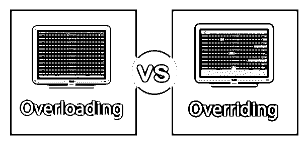

# 过载与覆盖

> 原文：<https://www.educba.com/overloading-vs-overriding/>

## 重载和重写的区别

在深入研究重载和重写之间的区别之前，我们需要理解它们实际上是什么，以及它们具体应用的场景？Java 新手经常会混淆两者，但两者完全不同，用在自己特定的场景中。[方法重载](https://www.educba.com/method-overloading-in-c-sharp/)是指我们有多个同名但不同签名的方法。签名包括方法参数的数量、参数的数据类型。签名中不包含方法的返回类型。这样做是为了提供重用相同方法名的功能，并增加程序的可读性。方法覆盖发生在继承的[案例中，其中派生类从基类继承属性。它涉及用相同的参数和返回类型在派生类中定义相同的基类方法，以在派生类中定义该方法的任何特定功能/实现。](https://www.educba.com/what-is-inheritance-in-programming/)

考虑一个场景，程序员需要找到一个几何图形的面积。每个图形的面积各不相同。例如，为了求正方形的面积，只需要一个参数“边”;对于矩形，需要两个参数，“长度和宽度”，而对于圆形，需要“半径”，可以是小数。为了解决这个问题，需要进行方法重载，其中方法区域对于不同图形的区域具有不同的参数和数据类型。想想银行系统的情况，尽管所有员工的多种方法和程序都是相同的，除了正常人和老年人的利率不同。在这种情况下，使用方法覆盖，在继承基类“银行利率”的普通和高级公民类中有不同的方法利率实现。

<small>网页开发、编程语言、软件测试&其他</small>

### 重载和重写之间的直接比较(信息图表)

下面是过载和覆盖的 7 大对比 **:**

### 重载和重写之间的主要区别

让我们讨论一下重载和重写之间的一些主要区别:

1.  在方法重载中，方法名中可以有相同或不同的访问说明符 /修饰符，而在方法重载中，基类的方法(被重载的方法)必须有一个比父类的方法更受限制的访问说明符。例如，如果基类的方法是受保护的，那么子方法 private 是不允许的。
2.  就性能而言，重载比重写具有更好的性能，因为方法重载是在编译时完成的。
3.  方法的返回类型从来不是方法重载的一部分；因此，不同的重载方法具有相同或不同的返回类型并不重要，然而，在方法重写父方法和基方法的返回类型时，一个类需要完全相同。
4.  说到绑定，[重载有静态](https://www.educba.com/overloading-in-java/)绑定，而重载有[动态绑定](https://www.educba.com/dynamic-binding-in-java/)。
5.  如果一个方法抛出异常，则由方法抛出的异常在重载方法中无关紧要。其他重载方法可以/不可以抛出相同或不同的异常，但是在重写的情况下，重写方法(派生类中的方法)不能抛出比被重写方法(基类中的方法)更高层次的异常。
6.  所有像 private、final 和 static 这样的说明符都不能在方法重写中使用，而所有的访问说明符都允许在方法重载中使用。

### 重载与重载对照表

下表总结了重载与重写之间的比较:

| **序列号** | **过载** | **超驰** |
| One | 方法重载是为了根据各种情况增强方法的定义。 | 方法重写是为了提供父类中定义的方法的特定实现。 |
| Two | 方法重载是在单个类中完成的，其中一个类对一个方法有不同的定义。 | 方法重写是在两个具有 IS-A(继承)关系的类之间完成的。 |
| Three | 方法重载是在编译时完成的，因此它被称为编译时多态性。 | 方法重写是在运行时完成的，因此它被称为运行时多态性。 |
| Four | 对于方法重载，参数排序、数据类型和参数计数需要不同。 | 对于方法重写，参数排序、数据类型和计数需要相同。 |
| Five | 在方法重载的情况下，方法的返回类型可以相同，也可以不同。这一点也不重要。 | 在方法重写的情况下，父类和子类中方法的返回类型需要相同。 |
| Six | 静态方法可以被重载，也就是说，我们可以在同一个类中重载不同的静态方法。 | 静态方法永远不能被覆盖，也就是说，父类和基类中的[静态方法](https://www.educba.com/static-method-in-php/)在它们之间没有关系。 |
| Seven | 私有和最终方法可以在一个类中重载，即一个类可以重载不止一个私有和最终方法。 | 私有和最终方法永远不能在子类中重写。 |

### 方法重载的例子

下面是方法重载的一个示例:

**代码:**

`public class Figures{
public int area(int side)
{
return side*side;
}
public int area(int length, int breadth) //method overloading
{
return length*breadth;
}
public static void main(String[] args)
{
Figures f = new Figures ();
System.out.println("Area of Square "+ f.area(10));
System.out.println("Area of Rectangle "+ f.area(12,10));
}
}`

**输出:**

在上面的示例中，方法“area()”被重载，并且在两个重载的方法中具有不同的参数，因为 area 需要找出正方形和矩形，但是具有不同的参数。

### 方法重写的示例

下面是方法重写的一个示例:

**代码:**

`public class BankRates{     // parent(base) class
void rates()
{
System.out.println(“Rates for normal citizen is 3.5%”);
}
}
class SeniorCitizen extends BankRates{     //child class inheriting parent class
void rates()    // method overriding
{
System.out.println(“Rates for senior citizens is 4.5%”);
}
}
class Bank{
public static void main(String[] args)
{
SeniorCitizen sc = new BankRates();
sc.rates();
}
}`

**输出:**

在上面的例子中，方法“rates()”在派生类“SeniorCitizen”中被重写，因为我们希望方法 rates 也在类 SeniorCitizen 中，但具有不同的实现。

### 结论

上面的解释清楚地显示了重载和重写之间的区别，以及使用这两者的具体场景。在编程之前，人们需要理解 Java 的这些核心概念，因为它们是许多事情的基础，并理解更高级的概念。

### 推荐文章

这是重载和重写之间最大区别的指南。在这里，我们还讨论了重载和重载的关键区别，包括信息图和比较表。您也可以看看以下文章，了解更多信息–

1.  [PHP 中的重载](https://www.educba.com/overloading-in-php/)
2.  [c#中的重载](https://www.educba.com/overloading-in-c-sharp/)
3.  [在 Java 中覆盖](https://www.educba.com/overriding-in-java/)
4.  [c#中的重载和重写](https://www.educba.com/overloading-and-overriding-in-c/)

