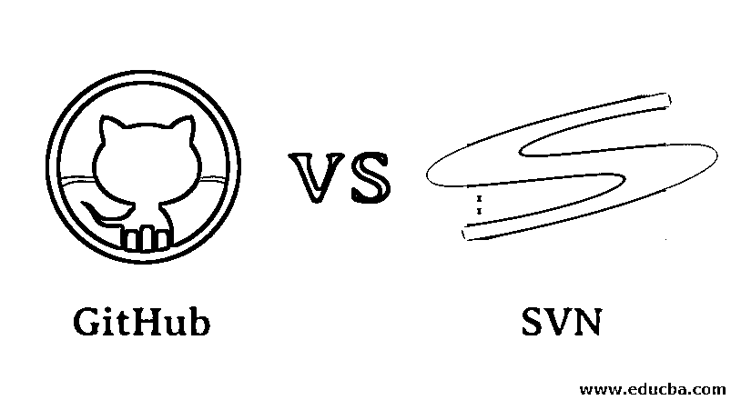

# GitHub vs SVN

> 原文：<https://www.educba.com/github-vs-svn/>

**

** 

## GitHub 和 SVN 的区别

GitHub 是一个为软件开发版本控制提供托管的平台。它提供了访问控制和各种功能，如错误跟踪、任务管理等。，针对每个项目。GitHub 上的项目可以通过使用 GitHub 命令行界面来访问和修改，所有的[标准 GitHub 命令](https://www.educba.com/github-commands/)都可以使用它。GitHub 允许注册和非注册用户浏览网站上的公共存储库并访问代码。用户必须创建一个帐户才能向网站提供内容，但非注册用户可以访问公共存储库，并被允许浏览和下载内容。 [Subversion (SVN)是一个集中式版本控制系统](https://www.educba.com/what-is-svn/)，曾经是使用最多的系统之一。虽然 SVN 的受欢迎程度正在减弱，但仍有数百万行存储在其中。它甚至继续被积极地维护着，尽管是由一个小型的开源社区来维护。SVN 是开源的，这意味着它是免费的，也是划算的。SVN 已经存在很多年了，采用并开始使用它的组织拥有数百万行代码。

### GitHub 和 SVN 的面对面比较(信息图)

下面是 GitHub 和 SVN 的 11 大对比 **:**

<small>网页开发、编程语言、软件测试&其他</small>

### GitHub 和 SVN 的主要区别

让我们来讨论一下 GitHub 和 SVN 的一些主要区别

#### 1.GitHub

当处理一个项目时，您将克隆主存储库或主存储库；这意味着您正在制作代码的副本。这个过程会在您的本地机器上创建一个本地 GitHub 存储库，以便开始或继续使用这个新特性。当新功能完成并且您准备好将更改放回主资料库时，您需要将所有更改从本地资料库推送到主资料库。选择 GitHub 也是因为它的灵活性和快速性；可以离线使用。所以在 GitHub 工作的时候，除了把修改推回中央服务器，你不用一直连接互联网。

#### 2.SVN

SVN 很受欢迎，因为它很容易理解，而且使用起来很简单。它的工作原理是拥有一个中央服务器作为开发者存储代码的仓库；该存储库分为 3 个关键区域，即分支、标签和主干。这些领域中的每一个都有重要的作用。

让我们了解一下这些组件是关于什么的:

*   **行李箱**

在这个区域，开发者保留原始代码；任何人都不应该将任何不完整的代码提交到主干中，因为这是每个人都可以查看原始代码的中心区域。当你想修改或改变特性和功能时，你应该从主干中分支出你的代码；当你完成编码后，你应该将所有的分支合并到主干中。

*   **分支机构**

正如我们已经讨论过的，当您想要添加/修改一个新的特性时，会使用分支，所以您从那个项目的主干中分支出代码。这意味着您将主干代码的副本带到分支中，并开始处理分支代码，直到编码部分完成。当您完成编码时，您可以将您的更改合并回主干中。这样做的好处是，当您开发新功能时，您可以尽可能多次地提交到分支中，并且您知道您不会破坏任何人的主干代码，从而保持主干代码的安全和稳定。

*   **标签**

标签用于在几个时间点上标记你的代码；它类似于分支你的代码，除了它永远不会被使用。他们要做的是复制主干代码，并把它和标签目录一起放在一个新的文件夹中。标记和分支的区别在于它不用于开发代码；相反，它用于恢复您的代码。当您从主干部署代码时，会用到标记，您将在主干上制作一个标记，并将其标记为一个新特性。当您意识到新标签有一个损坏的代码时，您可以很容易地将其恢复并修复问题。

### GitHub 与 SVN 对比表

下表总结了 GitHub 与 SVN 的对比 **:**

| **GitHub** | **SVN** |
| GitHub 是一个分布式版本控制平台。 | SVN 是一个集中的版本控制平台。 |
| 它使用多个存储库来访问和维护代码。 | SVN 没有任何集中的代码维护库。 |
| 它可以脱机使用，这意味着即使失去连接，您也可以继续工作。 | 在 SVN，代码承诺的连接必须存在。 |
| GitHub 中更快的提交，因为您在本地存储库上工作。 | 当您将代码提交到中央存储库时，比 GitHub 慢。 |
| 在 GitHub 中，即使发生单点故障，我们仍然可以在开发人员在本地存储库中使用它时提交更改，直到它得到修复。 | 在 SVN，如果节点发生故障，一些代码会中断构建流程，开发人员无法提交工作。 |
| 在这种情况下，您有一个称为分支的存储库，您在其中保存原始/修改的代码。 | 在 SVN，有一个称为 trunk 的附加存储库，以及一个存储最终开发代码的分支。 |
| GitHub 中的内容存储为元数据。 | SVN 存储内容文件。 |
| GitHub 上提供了克隆功能。 | 克隆功能在 SVN 不可用。 |
| GitHub 中提供了分支和合并支持。 | 合并支持在 SVN 不可用。 |
| GitHub 要求您将存储库作为一个单元来签出。 | SVN 允许你检查分支和他们的子树。 |
| 存储大型二进制文件会降低 GitHub 的性能。 | 在 SVN，最新的修改只被检查出来，所以比 GitHub 花的时间少。 |

### 结论

无论你使用 SVN 还是 GitHub，最终，它们都有各自的优缺点。它只是一个版本控制平台，将您的代码存储在服务器中，供多个用户以分布式或集中式的方式使用或访问。

### 推荐文章

这是 GitHub 和 SVN 之间最大区别的指南。在这里，我们还将讨论信息图和比较表的主要区别。您也可以看看以下文章，了解更多信息–

1.  [超载与超驰–最大差异](https://www.educba.com/overloading-vs-overriding/)
2.  [微处理器与微控制器–比较](https://www.educba.com/microprocessor-vs-microcontroller/)
3.  [最大差异——吉拉 vs Github](https://www.educba.com/jira-vs-github/)
4.  [GIT 版本控制系统](https://www.educba.com/git-version-control-system/)
5.  [去推](https://www.educba.com/git-push/)
6.  [什么是枢纽？](https://www.educba.com/what-is-hub/)

