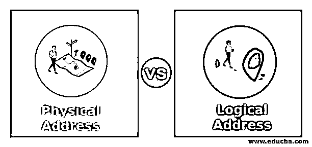

# 物理地址与逻辑地址

> 原文：<https://www.educba.com/physical-address-vs-logical-address/>

## 物理地址和逻辑地址介绍

逻辑地址是用户可以访问的虚拟地址。客户不能直接访问物理地址。对于物理访问，逻辑地址用作参考。逻辑地址和物理地址的基本区别在于，在程序执行期间，[逻辑地址是由 CPU 创建的](https://www.educba.com/logical-address/)，而物理地址指的是内存位置。该地址被用作物理存储器位置访问参考。从程序中产生的逻辑地址的逻辑地址空间集合。实际地址永远不是收件人。相反，用户的相应逻辑地址访问物理地址。

### 物理地址和逻辑地址之间的直接比较(信息图表)

下面是物理地址与逻辑地址的 9 大对比 **:**

<small>网页开发、编程语言、软件测试&其他</small>

### 物理地址和逻辑地址的主要区别

让我们讨论一下物理地址和逻辑地址之间的一些主要区别:

*   物理地址是显示存储器位置的地址，而逻辑地址显示 CPU 的地址，即中央处理器单元产生地址。
*   一个设备只能有一个物理地址。它们是不变的，所以不能改变。一个设备可以有多种逻辑地址。尽管逻辑地址是动态的，但它们是可以改变的。
*   内存管理单元生成物理地址，而 CPU 生成逻辑地址。
*   物理地址到逻辑地址的映射被认为是物理地址。对于程序，CPU 生成一组逻辑地址，称为逻辑地址空间。
*   物理地址不能直接访问，而我们可以直接访问逻辑地址。
*   用户无法查看物理地址，但他们可以轻松查看逻辑地址。
*   物理地址空间是程序中产生的所有物理地址的集合。此外，逻辑地址空间是程序中生成的所有逻辑地址的集合。
*   物理地址和逻辑地址需要相同的编译时间和加载时间地址绑定方案。另一方面，物理地址和逻辑地址需要不同的执行时间。
*   物理地址用于标识存储器的位置，而另一方面，逻辑地址用于访问物理地址。

### 对照表

下表总结了物理地址与逻辑地址之间的比较:

| **比较基础** | **物理地址** | **逻辑地址** |
| 定义 | 物理地址是内存/存储器的位置。 | 逻辑地址由 CPU 生成。 |
| 由...产生 | 物理地址由 MUM(内存管理单元)生成 | 逻辑地址由 CPU(中央处理器)生成。 |
| 访问人 | 用户不能直接访问物理地址。它使用逻辑地址来访问物理地址。 | 用户可以直接访问逻辑地址。它用于访问物理地址。 |
| 地址空间 | 一组物理地址被映射到逻辑地址，并被认为是物理地址。 | CPU 生成的一组对应于程序的逻辑地址被认为是逻辑地址空间。 |
| 能见度 | 用户看不到它。用户无法查看物理地址[。](https://www.educba.com/what-is-a-physical-address/) | 它对用户是可见的。用户可以很容易地查看逻辑地址。 |
| 变化 | 一个设备只有一个物理地址。物理地址是不变的。 | 逻辑地址可以变化。逻辑地址有多种变化。 |
| 获得变革的机会 | 物理地址不能改变。 | 逻辑地址可以改变。 |
| 使用 | 它用于查找内存的物理位置。 | 它用于查看物理地址。 |
| 编译时间和加载时间地址绑定方案 | 与逻辑地址相同。 | 与物理地址相同。 |

### 推荐文章

这是物理地址和逻辑地址之间区别的指南。在这里，我们还将讨论信息图和比较表的主要区别。您也可以看看以下文章，了解更多信息–

1.  [超载 vs 越权](https://www.educba.com/overloading-vs-overriding/)
2.  [。Net Core vs .Net Framework](https://www.educba.com/dot-net-core-vs-dot-net-framework/)
3.  [虚拟主机 vs 云主机](https://www.educba.com/web-hosting-vs-cloud-hosting/)
4.  [MySQL vs SQLite](https://www.educba.com/mysql-vs-sqlite/)

