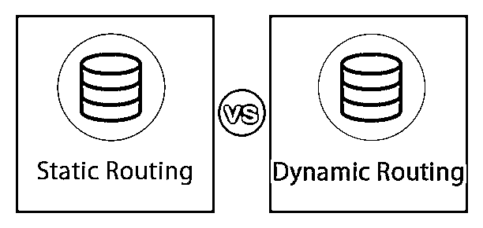

# 静态路由与动态路由

> 原文：<https://www.educba.com/static-routing-vs-dynamic-routing/>

## 静态路由和动态路由的区别

路由器用于将数据从一个位置传输到另一个位置，从而将数据从一个路由器转发到另一个路由器；它们使用手动输入的表中信息或根据路由信息计算的表中信息。在本文中，我们将详细讨论静态路由和动态路由。

### 什么是静态路由？

在静态路由中，路由显示两台路由器之间无法自动更新的路径。路径是手动更新的。如果变化发生在网络端，我们需要更新路由表的变化路径。路由表是包含路由信息的表。[静态路由很容易](https://www.educba.com/what-is-static-routing/)设计和实施，因为没有复杂的路径。当路由器数量较少时，静态路由是最佳选择，因为它需要手动更新。静态路由也称为非自适应路由，因为它不会自动采用路由路径。

<small>网页开发、编程语言、软件测试&其他</small>

### 什么是动态路由？

在动态路由中，路由器显示两台路由器之间可以自动更新的路径。路径会自动更新。如果变化发生在网络侧，则不需要手动更新路由路径；路由路径将自动更新。路由器之间的路径称为路由路径。当网络发生变化时，它会向路由器发送消息通知变化。路由器更新这些变化并使用路由算法路由，即在表中计算并更新路由路径。动态路由也称为自适应路由，因为它自动采用路由路径。
进行[动态路由](https://www.educba.com/dynamic-routing/)的路由或路径称为动态路径或动态路由，在该路由中；该信息响应于网络变化，以动态地更新这些变化。响应意味着它根据网络的变化而变化。它会根据网络变化进行自我调整。

### 静态路由和动态路由的直接比较(信息图)

以下是静态路由与动态路由的 10 大区别

### 静态路由和动态路由的主要区别

让我们讨论一些主要的关键差异:

1.  在静态路由中，路由表是手动更新的，而在动态路由中，路由表是自动更新的。
2.  静态路由最适合小型网络实施和星型拓扑。它不适合任何其他拓扑。而动态路由最适合大型网络实施。它适用于由冗余链路组成的网络拓扑。
3.  静态路由比动态路由需要更少的带宽，动态路由需要更大的带宽。
4.  在静态路由中，路径由用户或管理员更新，而在动态路由中，路径会自动更新。
5.  静态路由不使用任何路由协议和算法，而动态路由使用路由协议和复杂的算法来计算路由操作。
6.  静态路由因非自适应路由而闻名，而动态路由因自适应路由而闻名。
7.  静态路由比动态路由需要更短的管理距离。
8.  在静态路由中，路由不会对网络变化做出反应，而在动态路由中，路由会对网络变化做出反应。
9.  静态路由不需要许可证，而动态路由需要许可证。此外，在静态路由中，链路故障会干扰正在进行的路由。而在动态路由中，链路故障不会干扰正在进行的路由。
10.  在静态路由中，目的地的路由与定义的相同。而在动态路由中，路由取决于[当前的网络拓扑](https://www.educba.com/what-is-network-topology/)。
11.  重新路由流量在静态路由中不存在，但在动态路由中存在。
12.  静态路由不需要额外的资源，而动态路由需要额外的资源。
13.  在静态路由中，网络基础设施很小，而在动态路由中，网络基础设施很大。

### 静态路由与动态路由对照表

我们来讨论一下静态路由和动态路由的最大区别。

| **比较的基础** | **静态路由** | **动态路由** |
| **配置技术** | 在静态路由中，路由表是手动更新的。 | 在动态路由中，路由表会动态更新。 |
| **带宽** | 它比动态路由需要更少的带宽。 | 它比静态路由需要更多的带宽。 |
| **路径/路线** | 路径由管理定义。 | 路径会根据网络中的变化进行更新。 |
| **应用领域** | 静态路由在小型网络中实施。 | 动态路由在大型网络中实施。 |
| **路由协议** | 它不使用任何协议。 | 它使用 eigrp、arp 等协议。，以计算工艺流程工序。 |
| **路由算法** | 它不使用任何复杂的路由算法。 | 它使用复杂的路由算法。 |
| **安全** | 比动态路由更安全 | 不如静态路由安全。 |
| **链接影响** | 如果路由器之间的任何一条链路出现故障，都会干扰其它路由路径。 | 路由器之间任何链路的故障都不会影响其它路由路径。 |
| **网络基础设施** | 网络基础设施很小。 | 网络基础设施很大。 |
| **链路故障** | 链路故障干扰了正在进行的路由。 | 链路故障不会干扰正在进行的路由。 |

### 推荐文章

这是静态路由与动态路由的对比指南。这里我们讨论信息图和比较表的主要区别。您也可以浏览我们推荐的其他文章，了解更多信息——

1.  姜戈 vs 拉腊维尔
2.  [路由算法](https://www.educba.com/routing-algorithms/)
3.  [角度与反作用](https://www.educba.com/angular-vs-react/)
4.  [什么是路由器？](https://www.educba.com/what-is-router/)

