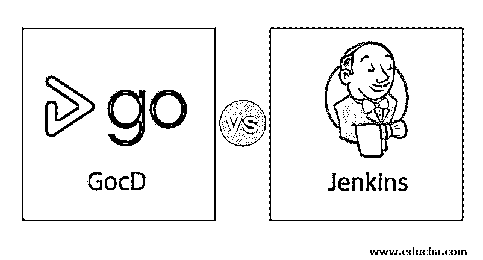

# GoCD vs Jenkins

> 原文：<https://www.educba.com/gocd-vs-jenkins/>

## GoCD 和 Jenkins 的区别

持续集成和持续交付是[软件开发过程](https://www.educba.com/what-is-software-development/)中最重要的部分。Jenkins 和 GoCD 都是开源工具。如果您想要对软件有完全的可见性和控制，GoCD 是持续交付的最佳选择。对于[持续集成](https://www.educba.com/continuous-integration-tools/)，可以使用 Jenkins，因为它是一个开源的 CI 服务器，可以使用各种插件进行扩展。将近 1000 多个插件是 Jenkins 的基础。Jenkins 是一个通用的自动化工具。对于单一目的和激光聚焦的连续输送，GoCD 是最好的。GoCD 和 Jenkins 对于构建和维护复杂的管道都很有用。下面我们详细讨论 GoCD vs Jenkins。

### GoCD 和 Jenkins 的面对面比较(信息图)

以下是 GoCD 和 Jenkins 的 11 大对比 **:**

<small>Hadoop、数据科学、统计学&其他</small>

### GoCD 和 Jenkins 之间的主要区别

让我们讨论一下 GoCD 与 Jenkins 之间的一些主要区别:

#### GoCD 的主要特点

*   端到端管道和工作流程完全透明。整个过程的可见性。
*   GoCD 是一个高度可定制的开源工具，支持 Windows 和 Linux。
*   它遵循软件开发中管道部署的简单设置过程。您可以通过并行执行任务以及依赖关系管理来处理复杂的工作流。
*   它支持测试。
*   GoCD 支持项目生命周期的自动化，从代码检入到服务器上的部署，遵循一步一步的方法，从构建代码，然后再次测试测试用例，最后部署到专用服务器。
*   它是一个建模、可视化和执行持续交付管道的服务器。

#### 詹金斯的主要特征

*   Jenkins 也是开源的，对全世界的用户都是免费的。
*   能够在软件开发中执行连续交付和连续集成操作。
*   Jenkins 在安装和配置方面要简单得多。升级插件和作业也很容易。
*   它支持大量的操作和方法，如身份验证、通知管理、实现版本控制系统、调度作业和并行部署管道。
*   它还支持最重要的软件开发过程，如源代码管理(SCM)、构建管理、UI 和管理。
*   詹金斯是自主经营的。多个构建可以并行运行。它也遵循主服务器和代理的概念。
*   Jenkins 支持其远程 API，这提供了另一种将 Jenkins 集成到您的内部产品和首选工具中的方法。
*   支持与基于通信协议的 Slack、GitHub 和 email 等工具集成，因为 Jenkins 的生态系统中有 1000 多个插件。

### GoCD 与 Jenkins 对比表

下表总结了 GoCD 与 Jenkins 之间的比较:

| **类型** | **GoCD** | 詹金斯 |
| **通用** | 用于连续交付目的的工具。如果您不熟悉 CD 工具，请不要担心；你可以在 15 分钟内轻松学会使用 GoCD。 | 自动化——为持续集成而构建的工具。但是需要深入的知识才能安装正确的插件。 |
| **持续集成** | 对于持续集成，GoCD 有一些值得怀疑的特性，因为它是专门为持续交付目的而构建的。 | Jenkins 是专门为 CI 目的而构建的，如果需要任何东西，需要安装持续集成插件。 |
| **连续交货** | GoCD 是专门根据持续交付原则开发的，这使得它比任何其他工具都更受欢迎。管道概念可以通过抽象来应用。要实现 CD 基本模式，GoCD 中有一种方法不需要安装任何插件。 | 我们总是可以通过安装各种社区插件在 Jenkins 中实现持续交付的概念。但 Jenkin 的主要目的是支持[持续集成](https://www.educba.com/what-is-continuous-integration/)因为组合中需要不同类型的插件，这些插件很容易被破坏或摧毁。 |
| **插件** | GoCD 在每个较小的方面都支持连续交付场景，而不需要安装任何插件。GoCD 更稳定，因为你不用担心插件的配置和设置。 | Jenkins 有一个完整的插件生态系统。有时找到正确的插件会有点忙乱，但是 Jenkins 是可配置的，通过使用插件可以扩展到无限的可能性。 |
| **用户界面** | GoCD 界面很好，但可以在很多方面改进，使其更加人性化。 | Jenkins 为用户提供了一个最简单的用户界面，包括服务器提供的适当细节和操作。 |
| **作业计划** | 它不支持调度任务或作业的工具。 | 通过设置日期和具体时间，您可以在 Jenkins 中安排任意数量的作业。詹金斯的所有工作都可以自动化。 |
| **服务水平协议** | GoCD 中的付费支持提供了不同的企业计划。 | 截至目前，詹金斯还没有官方支持。 |
| **构建环境** | GoCD 提供容器支持并构建 Kubernetes 和 Docker 等环境，这有助于持续交付支持。 | [Jenkins 为你想要运行的所有构建提供了](https://www.educba.com/jenkins-vs-hudson/)相同的环境，所以它支持部分构建环境，因为有些插件需要手动安装。 |
| **分析** | GoCD 中的价值流图是最好的功能之一，有助于从部署流程的初始阶段到最终阶段跟踪整个管道。 | Jenkins 通过一个名为“蓝海”的项目提供各种状态概述。 |
| **管理** | GoCD 提供了一些工具，帮助用户在整个管道流程中管理和分配角色。此外，您可以通过向用户组中添加人员来创建您的用户组，并且只有这些人员可以控制管道。 | 由于 Jenkins 是自托管的，所以有人手动处理 Jenkins 中的实例，如管理和配置。但是要找出你的构建失败的地方，詹金斯不能独自负责。 |
| **语言支持:JavaScript & Ruby** | GoCD 通过 Gem 和 npm repository poller 等插件支持 Ruby 和 JavaScript。 | Jenkins 部分支持 Ruby 和 JavaScript，因为有各种插件和 Ruby gems。RSpec 测试套件可以按照 Jenkins 对 Junit 的理解进行集成。 |

### 结论

要自动化软件中的所有东西，那么 Jenkins 应该是你的优先选择，因为它用于持续集成过程，而对于持续开发过程，GoCD 可能是最佳选择，因为它帮助初学者和有经验的专业人员建立开发管道。

### 推荐文章

这是一个指南，说明了 GoCD 与 Jenkins 之间的主要区别。在这里，我们还讨论了 GoCD 与 Jenkins 的主要区别，包括信息图和比较表。您也可以阅读以下文章，了解更多信息——

1.  [詹金斯 vs 竹子与特写](https://www.educba.com/jenkins-vs-bamboo/)
2.  [詹金斯备选方案|五大备选方案](https://www.educba.com/jenkins-alternatives/)
3.  [特拉维斯 vs 詹金斯的 9 大不同点](https://www.educba.com/travis-vs-jenkins/)
4.  [git lab CI 与 Jenkins 的主要区别](https://www.educba.com/gitlab-ci-vs-jenkins/)
5.  [Rundeck vs Jenkins |最大差异](https://www.educba.com/rundeck-vs-jenkins/)
6.  [Spinnaker vs Jenkins |主要区别](https://www.educba.com/spinnaker-vs-jenkins/)

