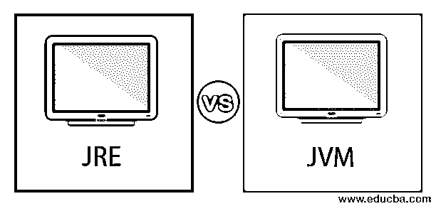
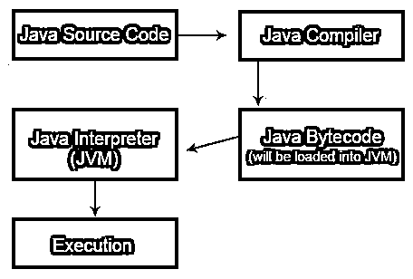

# JRE vs JVM

> 原文：<https://www.educba.com/jre-vs-jvm/>

## JRE 和 JVM 的区别

在这里，我们会明白什么是 JVM (Java 虚拟机):JRE (Java 运行时环境)。此外，我们还将研究 JVM 和 JRE 之间的主要区别。在这个主题中，我们将学习 JRE 和 JVM。

### JVM 是什么？

[Java 虚拟机](https://www.educba.com/what-is-jvm/) (JVM)是驻留在您的计算机上并执行 Java 字节代码的虚拟机。Java 虚拟机只理解字节码；这也是为什么会有 javac 编译器把源代码(。java)转换成字节码(。类)，这是 JVM 能够理解的。尽管安装在不同操作系统中的 JVM 是不同的，但是 JVM 的输出在所有操作系统中是一致的。

<small>网页开发、编程语言、软件测试&其他</small>

#### JVM 的组件

以下是 JVM 中存在的不同组件:

**1。类别载入器:**类别载入器的主要功能是读取。类文件，并将字节码保存到 JVM 的方法区域。

**2。方法区:** Java 虚拟机的方法区存储了类加载器正在加载的所有类的所有类相关信息。

**3。堆区:**堆区是 JVM 的一部分，被创建的对象位于其中。JVM 为每一个都创建了一个类对象。由类加载器加载的类文件。

**4。堆栈:**JVM 的这部分存储临时变量。

**5。PC 寄存器:** PC 寄存器记录了哪个指令已经被执行，哪个是下一个要执行的指令。

**6。原生方法栈:**原生方法栈包含原生代码信息。它是用 java 以外的其他编程语言编写的。

**7。执行引擎:**JVM 的执行引擎负责字节码或编译代码的执行。jvm 的执行引擎包含:

*   **虚拟处理器:**虚拟处理器负责顺序执行操作码。
*   **解释器:**解释器解释字节码。它负责读取字节码流，解释字节码指令，并通过虚拟处理器执行它们。但是解释器的缺点是，当一个方法被多次调用时，每次都有一个新解释的要求。
*   **Just-In-Time (JIT)编译器:**基本用于性能提升。使用它是为了克服解释器的缺点；当 JVM 发现重复的代码时，它使用 JIT 编译器，JIT 编译器编译字节码并将其转换为本机代码。这种本机代码直接用于重复的方法调用，这反过来提供了显著的性能改进。

从上面列出的组件细节来看，JVM 的功能可以概括为:

*   JVM 加载代码。
*   JVM 验证加载的代码。
*   JVM 执行有效的代码。
*   JVM 提供了运行时环境。

JVM 的工作可以通过下面的流程来解释:

### JRE 是什么？

Java 运行时环境是 [Java 开发包](https://www.educba.com/what-is-jdk/) (JDK)的一部分。

java 运行时环境(JRE)是一个安装包，它提供了运行 Java 代码的环境。需要注意的是，JRE 仅由想要运行 java 代码的最终用户使用。JRE 中包含 JVM 也就是说，JVM 是 JRE 的子集。Java 运行时环境包括以下内容:

部署技术。

1.  用户界面工具包，如抽象窗口工具包(AWT)、Swing、Java 命名和目录接口(JBDI)、Java 2D、打印服务、[拖放](https://www.educba.com/drag-and-drop-in-html/) (DND)等。
2.  Lang 和 util 库，如 lang 和 util、管理、zip、反射、JAR、首选项 API、正则表达式并发和多线程实用程序、日志记录等。
3.  基本库包括输入输出(I/o)、数学、网络、覆盖机制序列化、Java XML 解析器、Java 本地接口(JNI)。
4.  集成库，例如，接口定义语言、Java 数据库连接(JDBC)、远程方法调用(RMI)、Java 命名和目录接口(JNDI)。
5.  Java 虚拟机(JVM)。

### JRE 和 JVM 的面对面比较(信息图表)

以下是 JRE 和 JVM 之间的 8 大区别

### JRE 和 JVM 的主要区别

以下是 JRE 和 JVM 的主要区别。

*   JRE 的主要功能是提供一个运行 java 应用的运行时环境，而 JVM 则是将字节码转换成机器代码来执行，并提供平台独立性。
*   JRE 充当容器，jvm 充当内容。
*   JRE 由运行应用程序的 JVM +库组成，而 JVM 只包含执行 Java 字节码的运行时环境。

### JRE 与 JVM 的比较表

我们来讨论一下 JRE 和 JVM 的顶级对比。

| **比较的基础** | **JRE** | JVM |
| **全格式** | JRE 的完整形式是 Java 运行时环境。 | JVM 的完整形式是 Java 虚拟机。 |
| **定义** | Java 运行时环境是 Java 开发工具包(JDK)的一部分，它由 JVM、核心类和支持库组成。它的主要功能是提供运行 java 代码的运行时环境。 | Java 虚拟机(JVM)就像一台执行一组预编译语句的虚拟计算机。当 Java 编译器编译源代码时，它会生成一组称为字节码的指令。类文件)。Java 虚拟机解释字节码指令，并将它们转换成机器代码以便执行。 |
| **容器和内容物** | JRE 充当包含 JVM、库和其他文件的容器。此外，JRE 不包含像编译器和调试器这样的开发工具。 | JVM 是 JRE 的一部分。它可以被视为 JRE 的一个子集。 |
| **开发目的** | 它不用于开发目的。 | 它用于开发目的。 |
| **运行目的** | 它用于运行 java 代码。 | 它不用于运行 java 代码。 |
| **由**组成 | JRE 由 JVM +库组成，运行应用程序。 | 它只包含一个用于执行 Java 字节码的运行时环境。 |
| 的子集 | 它是 JDK 的一个子集。 | 它是 JRE 的子集。 |
| **工具** | 它包含运行程序所需的类库。 | 它不包含任何工具。 |

### 结论

从这篇文章中，我们对 Java 运行时环境(JRE)和 Java 虚拟机(JVM)有了清晰的了解，它们是 Java 开发工具包(JDK)中最重要的部分。

### 推荐文章

这是 JRE vs JVM 的指南。在这里，我们已经讨论了 JRE 和 JVM 的关键区别，包括信息图和比较表。您也可以看看以下文章，了解更多信息–

1.  [Java vs Node JS](https://www.educba.com/java-vs-node-js/)
2.  [Groovy vs Java](https://www.educba.com/groovy-vs-java/)
3.  [Java vs C#](https://www.educba.com/java-vs-c-sharp/)
4.  [Java vs JavaScript](https://www.educba.com/java-vs-javascript/)
5.  [XML 解析器|类型|示例](https://www.educba.com/xml-parsers/)

