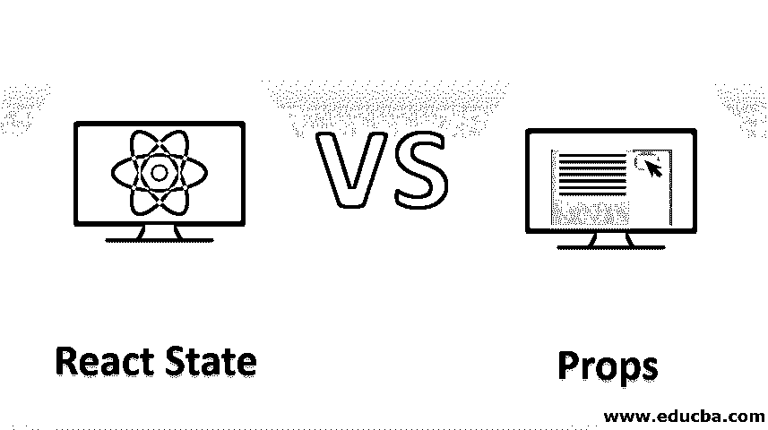
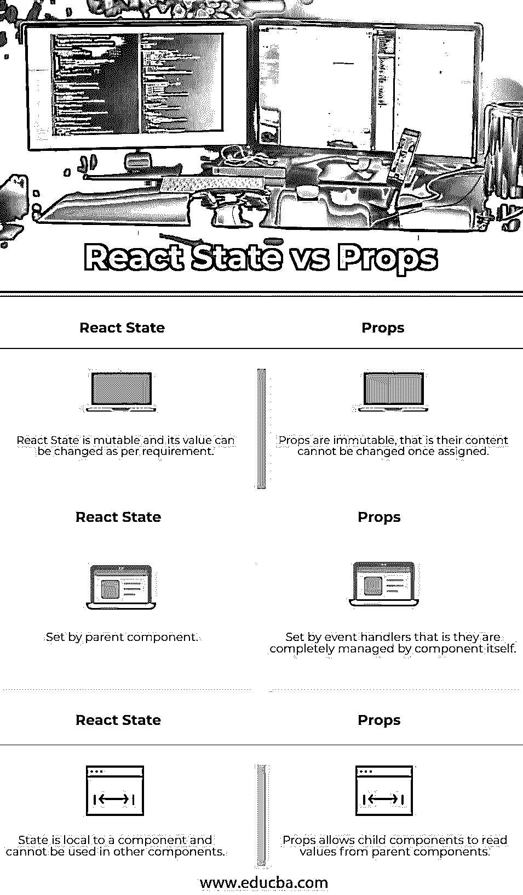

# 反应状态 vs 道具

> 原文：<https://www.educba.com/react-state-vs-props/>




## 反应状态和道具的区别

在这篇 React State vs Props 的文章中，我们将弄清楚两个非常重要的 React 组件 State 和 Props 之间的主要区别。我们将通过一些基本的例子来说明状态和道具之间的区别。此外，我们还会看到可以使用状态或道具的情况。

### 什么是反应，状态？

**State:** State 可以被认为是 react 组件类的一个实例，主要用于与组件通信。反应组件的状态是一个对象，它包含的信息在组件的生命周期中可能会更改，也可能不会更改。状态对象存储与组件相关的属性值。每当与组件相关的属性发生变化时，与状态对象相关联的值也会发生变化，并且组件会重新呈现自身，这意味着它会根据新值来改变自身。下面是一个解释反应状态的例子:

<small>网页开发、编程语言、软件测试&其他</small>

**代码:**

```
class Bike extends React.Component {
constructor(props) {
super(props);
this.state = {
Company: "Yamaha",
Modelnumber : "R15",
color: "blue",
launch-year: 2001
};
}
render() {
return (
<div>
<h1>Name {this.state. Company}</h1>
<p>
This is a {this.state.color}
{this.state. Modelnumber}
from {this.state. launch-year}.
</p>
</div>
);
}
}
```

**输出:**


现在让我们考虑我们想要改变组件属性。为了实现这一点，有一个名为 setState()的方法。请注意，您应该始终使用 setState()方法来更改组件的状态；它将确保组件将重新呈现其状态。

**代码:**

```
class Car extends React.Component {
constructor(props) {
super(props);
this.state = {
Company: "Ford",
Modelnumber : "Mustang",
color: "red",
launch-year: 1964
};
}
changeColor = () => {
this.setState({color: "green"});
}
render() {
return (
<div>
<h1>My {this.state.Company}</h1>
<p>
It is a {this.state.color}
{this.state.Modelnumber}
from {this.state.launch-year}.
</p>
<button
type="button"
onClick={this.changeColor}
>Change Bike color</button>
</div>
);
}
}
```

在上面的代码中，我们添加了一个按钮，单击该按钮将在组件上呈现新的更改。上述代码将在单击按钮时产生以下输出。

**输出:**


### 什么是道具？

**Props:**react js 中的 Props 用于向组件发送数据。道具相当于 javascript 纯函数参数。由于纯函数参数一旦赋值就不能更改，所以我们不能更改它们的值。下面的例子将展示如何使用道具:

**代码:**

```
class Bike extends React.Component {
render() {
return <h3>This is {this.props.Companyname}</h3>
}
}
const component = <Bike Companyname="Yamaha" />;
```

**输出:**


如果组件有一个构造函数，那么 props 对象应该使用 super 传递给构造函数。这里有一个例子:

**代码:**

```
class Bike extends React.Component {
constructor(props) {
super(props);
}
render() {
return <h2>This is a Bike</h2>;
}
}
```

**输出:**


### 反应状态与道具之间的直接比较(信息图)

以下是 React 状态与道具的四大对比 **:**




### 反应状态和道具之间的主要区别

让我们讨论一下反应状态和道具 **:** 之间的一些主要区别

1.  道具是不可改变的；也就是说，它们的内容一旦被分配就不能被改变，但是状态是一个用于保存将来可能改变的数据的对象；此外，状态控制组件在更改后的行为。
2.  属性和状态都用于存储与组件相关的数据。
3.  状态只能在类组件中使用，而 props 没有这样的限制。
4.  属性通常由父组件设置，而事件处理程序控制状态；组件本身管理它们。
5.  状态对于一个组件是局部的，不能在其他组件中使用，而 Props 允许子组件从父组件中读取值。

### 反应状态与道具对比表

下表总结了 React 状态与道具 **:** 之间的比较

| **反应状态** | **道具** |
| 反应状态是可变的，它的值可以根据需要改变。 | 道具是不可改变的；也就是说，它们的内容一旦分配就不能更改。 |
| 状态只能由类组件使用。 | 道具可以被类使用，也可以被其他组件使用。 |
| 由父组件设置。 | 由事件处理程序设置，也就是说，它们完全由组件本身管理。 |
| 状态是组件的本地状态，不能在其他组件中使用。 | Props 允许子组件从父组件读取值。 |

### 结论

在介绍了状态和属性特性之后，我们得出结论，只要有可能改变与组件相关的属性，我们就应该选择状态，因为它允许重新呈现属性。另一方面，props 允许子组件访问父组件中定义的方法；这最大限度地减少了子组件拥有其状态的需求。道具在子组件中是只读的。值得注意的是，状态和道具是 react 架构非常重要的组成部分。

### 推荐文章

这是一个反应状态 vs 道具的指南。在这里，我们还将讨论 React State 与 Props 的主要区别，包括信息图和比较表。您也可以看看以下文章，了解更多信息–

1.  [吉拉 vs Github](https://www.educba.com/jira-vs-github/)
2.  [ReactJs 面试问题](https://www.educba.com/reactjs-interview-questions/)
3.  React JS 的用途
4.  [反应成分](https://www.educba.com/react-components/)


