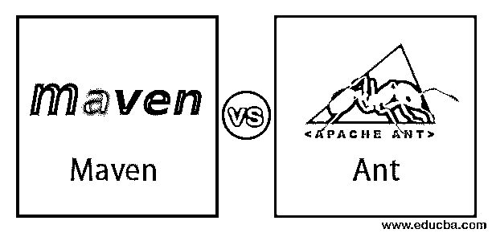

# Maven vs Ant

> 原文：<https://www.educba.com/maven-vs-ant/>

## Maven 和 Ant 的区别

Maven vs Ant 是 Apache 提供的 java 构建工具。Maven vs Ant 在项目的构建过程中提供帮助。Jason van Zyl 在 2002 年为 Apache Turbine 的子项目创建了 maven。使用的语言是 Java 和 C#。Maven 中使用了项目对象模型(POM)。它有助于项目构建和文档编制。Maven 也可以用在项目依赖中。Ant 是 2000 年开发的 Java 软件工具。它有助于自动化软件构建过程。Ant 脚本是用 XML 编写的。它也用于管理重复性任务。

### **Maven 和 Ant** 的正面比较(信息图)

以下是 Maven 与 Ant 之间的 34 大区别:

<small>网页开发、编程语言、软件测试&其他</small>

### Maven 和 Ant 的主要区别

让我们讨论一下 Maven 和 Ant 之间的一些主要区别:

*   Maven 是声明性的，要在。xml 文件；Ant 是程序性的，必须事先提供项目结构的信息。
*   Maven 遵循源代码、编译代码等的惯例。，而 Ant 不遵循任何约定。我们给出一个命令，Ant 执行它。
*   在依赖性管理方面，Maven 比 Ant 更好。Maven 能够识别所有类型的依赖关系。
*   Ant 比 Maven 需要更多的配置设置。
*   为了构建项目，Maven 提供了一致的接口，而在 Ant 中，接口并不一致。
*   在 Maven 中，可以使用中央或本地存储库，依赖项是自动下载的。但是在 Ant 中，目录被用作存储库，依赖项不会自动下载。
*   Maven 有生命周期，当运行 mvn install 命令时执行这些步骤，而 Ant 没有任何生命周期。
*   Maven 不仅仅是一个构建工具，它还是一个项目管理工具，而 Ant 只是一个构建工具。
*   Maven 被许多公司用作标准的 Java 构建工具，而 Ant 现在并不常见。
*   Maven 可以认为是运行项目的框架，而 Ant 是构建项目的工具箱。
*   Maven 脚本和插件是可重用的，而 Ant 脚本是不可重用的。

### Maven 与 Ant 对比表

我们来讨论一下 Maven 和 Ant 的顶级对比:

| **胃** | 蚂蚁 |
| Maven 有一个标准的项目布局。 | Ant 没有标准的项目布局。 |
| Maven 能够根据项目的依赖关系创建报告。 | Ant 不会自己创建报告，也可以让它创建报告。 |
| Maven 有一个预定义的项目构建结构。 | 我们需要从目录、目标、项目等方面定义一切。，在蚂蚁。 |
| Java 类文件是在基本目录中创建的。 | Java 类文件必须作为 Ant 中的一个配置来创建。 |
| Maven 提供了一个公共接口。 | Ant 不提供公共接口。 |
| 不需要手动更新依赖关系。 | 依赖关系需要手动更新。 |
| Maven 有标准的命名约定。 | Ant 没有标准的命名约定。 |
| Maven 更受用户青睐。 | Ant 不太受用户青睐。 |
| 与 Ant 相比，maven 的构建过程并不那么强大。 | Ant 更适合在构建过程中考虑。 |
| Maven 处理预定义的命令，因此不像 Ant 那样灵活。 | Ant 提供了更多的灵活性，因此一切都必须从头开始编写。 |
| Maven 工作在插件上，它可以被恰当地称为插件执行框架。 | Ant 不提供类似 Maven 的插件。 |
| 类似产品的应用程序很容易内置在 Maven 中。 | 遗留项目在 Ant 中很容易构建。 |
| 脚本没有 Ant 那么复杂，项目支持也有保证。 | 长期项目的脚本是复杂的，支持会更少。 |
| Maven 旨在让开发者轻松完成这项任务。 | Ant，因为它是第一个构建工具，所以对开发人员来说有点复杂。 |
| Maven 有内置的插件和命令来构建项目。 | Ant 接受开发人员的订单并构建项目。 |
| Maven 中的文档更多。 | Ant 中的文档较少。 |
| 团队成员发现 Maven 是一个简单的构建工具。 | 与 Maven 相比，Ant 很难学。 |
| Maven 的可靠性没那么好。 | 与 Maven 相比，Ant 更可靠。 |
| 我们不能重复 Maven 构建。 | Ant 构建是可重复的。 |
| 因为插件是为特定的任务而编写的，所以插件不能被重用。 | Ant 中的插件较少，但是工具可以组合起来完成任务。 |
| Maven 中的目录结构更好。 | Ant 中的目录结构不是很好。 |
| Maven 脚本很简单。 | Ant 的脚本是可读的。 |
| Ant 任务可以在 Maven 中使用。 | 我们不能在 Ant 中使用 Maven 任务。 |
| 同一个库中的冲突在 Maven 中处理不好。 | 同一个库中的冲突在 Ant 中处理的很好。 |
| 使用 scale 命令可以在 Zsh 中完成计算。 | Expr 和 bc 外部计算器在 Bash 中用于进行计算。 |
| 由于 Maven 中的依赖管理，很难定制构建脚本。 | 因为在 Ant 中一切都是从零开始的，所以定制构建脚本很容易。 |
| 依赖关系管理是独立完成的。 | Ant 得到了 Apache Ivy 的帮助来进行依赖管理。 |
| Maven 项目易于创建和维护。 | Ant 项目不容易创建，维护需要编写一些脚本。 |
| Maven 有一个 pom.xml 文件。 | Ant 没有 pom 文件，但是它可以使用 XML 脚本。 |
| Jar 文件不存储在系统中；相反，它们被下载到存储库中。 | Jar 文件存储在系统中，因为 Ant 没有任何存储库。 |
| Maven 的约定帮助用户使用预定义的源代码。 | Ant 中没有预定义的源代码。 |
| Maven 对文件使用基于 shell 的命令。 | Ant 对文件使用 XML。 |
| 可以在 Maven 中创建分层依赖树。 | 由于 Ant 不进行依赖关系管理，因此无法创建分层依赖关系树。 |
| 图像或其他未编译的文件可以集成到存储库或 Jar 文件中。 | 未编译的文件不会集成到 Ant 中的存储库或 jar 文件中。 |

### 结论

Ant 是在 Maven 之前开发的，因此 Maven 更新得更多。但是，如果我们使用 Maven 或 Ant，灵活性和依赖性就不能同时得到保证。Ant-maven 插件可用于使用这两种工具构建项目。这个项目可以使用任何工具来构建，这取决于用户的需求和开发人员的创造力。

### 推荐文章

这是一本 Maven vs Ant 的指南。在这里，我们讨论 Maven 和 Ant 之间的区别，信息图的主要区别，以及一个比较表。您也可以浏览我们推荐的其他文章，了解更多信息——

1.  [詹金斯 vs 梅文](https://www.educba.com/jenkins-vs-maven/)
2.  [Splunk vs Spark](https://www.educba.com/splunk-vs-spark/)
3.  [Java vs .Net](https://www.educba.com/java-vs-dot-net/)
4.  【T0 度与腹部】T1

