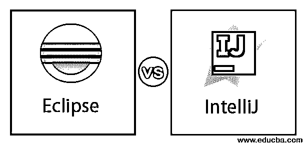

# Eclipse vs IntelliJ

> 原文：<https://www.educba.com/eclipse-vs-intellij/>

## Eclipse 和 IntelliJ 的区别

*   eclipse 基金会的战略成员包括谷歌；战略成员是使用 eclipse 作为开发平台并投入资金和资源来进一步开发 eclipse 的组织和个人。IBM 到甲骨文。当前 eclipse 版本的一个重要成员是 Photon (4.13)。它是在 Eclipse 公共许可证下发布的，这是一个免费的商业友好软件许可证，它隶属于 eclipse foundation。
*   Intellij 是 JetBrains 公司于 2000 年推出的产品，作为一家私人公司，Intellij 是 2001 年首次推出的 java IDEIntelliJ 有两种版本:社区版和终极版；IntelliJ 的社区版可供任何支持 Java、kotlin 的人免费使用，其发布版在 Apache software foundation 许可的免费许可下是免费可用和开源的。如果需要终极版，则需要激活许可。社区版是程序员使用它的基础。而终极版为程序员提供了各种内置的工具支持，以处理他们的各种任务并使开发更容易。
*   开发人员通常喜欢使用 Java 和 python 作为他们产品开发的主要编程语言。每个开发人员都选择在更好的 IDE 上进行编程和开发。应该使用哪个 IDE 以及最好使用哪个 IDE 进行开发这是我们从小、大学开始讨论的问题，并延伸到我们的工作单位。尽管 eclipse 和 IntelliJ 这两种 IDE 都有各自的优缺点，我们应该在开始使用它之前考虑一下。
*   我们应该选择哪种 IDE 并没有确定的答案，这总是取决于项目的适用性和程序员的舒适度，但要考虑适合您的开发需求的正确平台，以及您是哪种类型的程序员/开发人员。我们希望分享我们在这两个 IDE 上的经验和观点，所以让我们开始吧。

### IDE 是什么？

*   首先，作为一名程序员，选择正确的 IDE 就像选择编程语言来实现预期目标一样重要。如果不使用 IDE 的特性，大多数程序员会感到非常不舒服，如果不使用 IDE 提供的舒适性，将很难实现项目。在项目 IDE 上工作时，通常会在运行具有多个实例的企业项目时处理和处理类路径、配置、内部执行命令、命令行参数、web 服务器配置和端口复制。
*   有多种 IDE 可用，如 net beans、eclipse 和 IntelliJ 选择合适的要看需要和舒适度；一些著名的 IDE 是 eclipse 和 IntelliJ。继续讨论 IDE 对项目有多大好处跑题了，但是 IDE 通过照顾其他外在的东西，提供了工作的舒适感。让我们稍微探究一下 eclipse 的历史，正如 IBM project 所述，eclipse 的第一个版本是在 2001 年，eclipse 的主要版本是在 2004 年。那些将 eclipse 作为项目开发的人被称为 Eclipse 社区的战略成员。

### Eclipse 和 IntelliJ 之间的直接比较(信息图表)

以下是 Eclipse 和 IntelliJ 之间的 6 大区别:

<small>网页开发、编程语言、软件测试&其他</small>

### Eclipse 和 IntelliJ 之间的主要区别

让我们看看 Eclipse 和 IntelliJ 之间的主要区别如下:

*   通常，Eclipse 可以更快、更有效地处理非常大的可伸缩项目，而不需要花费太多时间来索引整个 IDE 项目。这就是为什么在 Eclipse 中打开项目通常要快得多，而在 IntelliJ 中，它在导入和启动 IDE 项目时索引整个项目；这就是为什么启动这个项目要花费相当多的时间。
*   默认和自动代码生成比 eclipse 更容易、更快、更有用。IntelliJ 提供了 IDE 中已经内置的各种选项，无需安装任何外部插件即可使用。IntelliJ 易于[理解用于自动代码生成的 GUI](https://www.educba.com/what-is-gui/) ;我们来考虑 Java 在这种情况下，IntelliJ 可以选择自动生成 to 字符串、构造函数、getter 和 setters 的代码，通过按照程序员的要求定制 condition 参数来覆盖 equals 和 hash 代码方法。
*   IDE 都提供了代码调试功能；然而，IntelliJ 在考虑调试功能方面更加丰富，例如单步执行、单步执行、移入、后退、丢帧，以及在一个地方总结所有断点，以便用户可以轻松地导航它们。而 eclipse 为调试提供的选项较少，与 IntelliJ 相比，这并不更加用户友好。
*   IntelliJ 提供了一个内置的反编译程序来读取 java 类的源代码，这使得程序员更容易使用这个 IDE，而在 eclipse 中，我们需要安装插件来使用反编译程序。
*   Intellij 用户体验好很多；学习曲线也很容易。以前使用其他 IDE 的程序员可以很容易地切换到 IntelliJ，因为它根据几乎所有的操作系统和 IDE 提供了快捷键映射工具。
*   例如，如果有一个基于 SOA 架构的[项目(这被认为是 ESB 的一个大且可伸缩的项目)并使用](https://www.educba.com/what-is-soa/) [SOAP web 服务。](https://www.educba.com/soap-web-services-interview-questions/)那么这个项目就有可能分成多个模块。用户可能需要浏览包含各种 web 服务的所有模块；在项目开发的时候。然后程序员使用 eclipse 来维护这种场景。使用 IntelliJ，开发变得更加容易，而且它还提供了像。下拉列表、代码完成、快速查看、项目向导等。这些在 IDE 和 IntelliJ 中都可用；这些功能使用起来更方便，遵循起来更令人满意。

### Eclipse 与 IntelliJ 比较表

让我们讨论一下 Eclipse 和 IntelliJ 之间的主要比较:

| **月食** | **智能 J** |
| Eclipse 不识别程序员的上下文，也不创建上下文树，因此当用户键入(例如“v”)时，它会自动完成代码，并向您建议所有从“v”开始的通用上下文。 | Intellij 对类路径中所有可用的项目及其库进行索引，甚至创建一个决策上下文树，以便用户类型(例如“v”)将自动分析上下文并插入适当的代码行。 |
| 在 eclipse 中调试代码时，如果我们需要对表达式求值，那么我们必须选择整个表达式语句，然后按 ctrl+shift+I 来获得该表达式的值。 | 在 IntelliJ 中，为了在调试代码时计算表达式，我们只需要将光标移动到要计算的表达式语句上，IntelliJ 就会自动弹出该表达式的值，因此它对用户非常友好。 |
| 为了将 SVN/GIT 这样的版本控制系统与 eclipse 集成，我们必须从 eclipse 市场下载并安装版本控制插件。 | 而在 IntelliJ ultimate 中；版本控制已经内置在 IDE 中，它具有各种特性和易于理解的 GUI。 |
| Eclipse marketplace 提供了超过 1276 个插件供使用；在推出新的技术或工具之后，那些最初主要为 eclipse 开发的插件。 | Intellij 插件库只提供了 727 个插件，如果我们考虑新的工具和技术变化来扩展 IDE 的功能，这个数量就非常少了。 |
| 通过使用插件，Eclipse 更快、更容易扩展。 | 相比之下，IntelliJ 市场提供的插件非常少，所以很难使用插件支持来扩展 IDE。 |
| Eclipse 提供了自动代码生成的机制，但是它不如 IntelliJ 提供的好，并且很难理解和熟悉它。 | 在 IntelliJ 中，自动代码生成要容易得多，因为它是可定制的；如果您是 java 开发人员，IntelliJ 可以根据您在项目结构中选择的 java 编译器来改进您的代码。 |

### 结论

总之，开发人员应该根据给定和分配的项目/任务，通过考虑上述所有因素，找到特定的 IDE。这意味着，为了更恰当地面对技术挑战，更有效地完成分配的任务，您应该让自己能够舒适地使用和接受这两种 IDE。

### 推荐文章

这是 Eclipse vs IntelliJ 的指南。这里我们用信息图和比较表来讨论 Eclipse 和 IntelliJ 的主要区别。您也可以浏览我们推荐的其他文章，了解更多信息——

1.  [WebLogic vs WebSphere](https://www.educba.com/weblogic-and-websphere/)
2.  [JIRA vs TFS](https://www.educba.com/jira-vs-tfs/)
3.  [Scala 的用途](https://www.educba.com/uses-of-scala/)
4.  [Groovy vs Scala](https://www.educba.com/groovy-vs-scala/)
5.  [clo jure 与 Scala 的 32 大差异](https://www.educba.com/clojure-vs-scala/)

