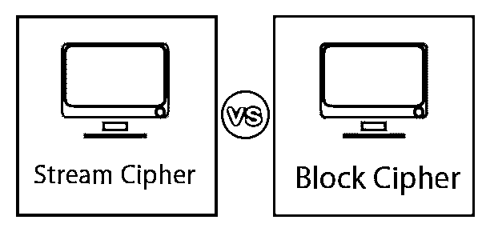

# 流密码与分组密码

> 原文：<https://www.educba.com/stream-cipher-vs-block-cipher/>

## 流密码与分组密码的区别

在本文中，流密码与分组密码，流密码和分组密码都是用于加密和解密的技术，即将明文转换为密文，将密文转换为明文。两种方法都有其目的和方法。这两种技术用于相同的目的，但是它们的方法和工作是不同的。我们还将讨论流密码和分组密码的区别。流密码是一种涉及[一次一个纯文本比特的加密](https://www.educba.com/what-is-encryption/)的技术。解密也是一次一位地进行。

分组密码是一种涉及一次加密一块明文的技术。[解密](https://www.educba.com/what-is-decryption/)也是一次一个块地进行。所以基本上有两种最流行的类型[用于文本的加密和解密](https://www.educba.com/encryption-vs-decryption/)。[块密码加密整个块](https://www.educba.com/block-cipher-modes-of-operation/)。流密码通过连续取一个数字/元素来加密，并且一次产生一个元素的输出。通过用流密码加密整个块，可以从给定的流密码创建块密码，但是不能从块密码创建流密码。

<small>网页开发、编程语言、软件测试&其他</small>

### 流密码与分组密码的面对面比较(信息图表)

以下是流密码与分组密码的 11 大比较 **:**

### 流密码与分组密码的关键区别

让我们讨论流密码和分组密码之间的一些主要的密钥差异 **:**

1.  在流密码中，加密是逐位进行的，而在分组密码中，加密是逐块进行的。
2.  在流密码中，解密也是逐位进行的，而在分组密码中，解密是逐块进行的。
3.  流密码依赖于替代技术，如凯撒密码、改进的凯撒密码、单表密码、同音密码、多表替代密码、多表密码、公平密码和希尔密码。
4.  分组密码依赖于[转置技术，如](https://www.educba.com/transposition-techniques/)栅栏技术、柱状转置技术、Vernam 密码和 book 密码。
5.  流密码使用混淆来确保它不会给出关于明文的线索，而块密码同时使用混淆和扩散。
6.  流密码比块密码快，而块密码慢。
7.  在流密码中，一个密钥只能使用一次，而在分组密码中，密钥可以重复使用。
8.  流密码比分组密码需要更少的代码。
9.  流密码不像分组密码那样包含复杂的算法或过程。
10.  用硬件实现流密码比用分组密码简单。
11.  流密码的冗余度较小，而分组密码增加了冗余度。
    流密码用于网络的 [SSL 安全连接](https://www.educba.com/what-is-ssl/)，而分组密码用于数据库、文件加密。
12.  加密可以在流密码中一点一点地实现，并且在有新数据可供处理时立即实现，因此传入的位将自动生成传出的位，而无需缓冲输入。另一方面，分组密码需要在生成第一个输出位之前通过应用填充方案来收集完整的数据块。

### 流密码与分组密码对照表

下表总结了流密码与分组密码的比较 **:**

| **流密码与分组密码的比较基础** | **流密码** | **分组密码** |
| **加密过程** | 它一次加密一位纯文本。 | 它一次加密一块纯文本。 |
| **解密过程** | 它一次解密一点纯文本。 | 它一次解密一个纯文本块。 |
| **混乱和扩散** | 流密码只使用混淆。 | 分组密码同时使用混淆和扩散。 |
| **使用的技术** | 它使用替代技术。 | 它使用换位技术。 |
| **速度** | 它比分组密码快。 | 它比流密码慢。 |
| **冗余范围** | 没有冗余的机会。 | 它增加了纯文本的冗余。 |
| **代码来源** | 它需要更少的代码。 | 它需要更多的代码。 |
| **算法模式** | 它使用电子代码块(ECB)和密码块链接(CBC)。 | 它使用密码反馈(CFB)和输出反馈(OFB)。 |
| **键的使用** | 一个密钥只使用一次。 | 一个密钥可以多次使用。 |
| **实施** | 它广泛用于硬件实现。 | 它适合于软件实现。 |
| **例子** | 一次性密码本。 | 数据加密标准。 |

### 结论

所以在这篇文章中，我们已经看到了流密码和分组密码的工作原理以及它们在关键点上的不同。我希望这篇文章对你有所帮助。

### 推荐文章

这是一个关于流密码和分组密码之间最大区别的指南。在这里，我们还讨论了流密码与分组密码密钥的差异，以及带有信息图表的比较表。您也可以看看以下文章，了解更多信息–

1.  [密码类型](https://www.educba.com/types-of-cipher/)
2.  [密码技术](https://www.educba.com/cryptography-techniques/)
3.  [吉拉 vs Github](https://www.educba.com/jira-vs-github/)
4.  [内联 vs 块](https://www.educba.com/inline-vs-block/)

