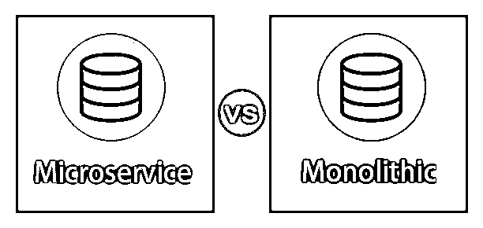

# 微服务与整体服务

> 原文：<https://www.educba.com/microservice-vs-monolithic/>

## 微服务与整体服务的区别

微服务 vs 单片是软件设计和开发的两种标准方法或架构之间的比较。微服务是当前软件行业的一种趋势，它利用一些最新的技术和编程语言进行软件开发。而 monolithic 是一种实施了数年的行业标准方法。基于微服务架构的应用可以用多种编程语言作为独立的服务来实现。而单片应用程序是基于单一编程语言的。微服务以其变化适应性和可扩展性著称。而单一应用程序的可扩展性较差，更改需要重新构建整个应用程序代码并重新部署。

### 什么是整体架构？

整体架构被认为是应用程序开发的传统方法。单片架构中的应用程序是作为单个包开发的。普通应用程序的开发从模块化分层或六边形架构开始。该架构由不同类型的层组成，如下所示:

<small>网页开发、编程语言、软件测试&其他</small>

*   **表示层:**图形用户界面层使用 HTML 或 XML/JSON 处理超文本传输协议(HTTP)请求。
*   **业务逻辑层:**应用的业务逻辑呈现在这一层。
*   **数据库访问层:**应用程序的所有数据库访问，包括 SQL 和 NoSQL，都发生在这一层。
*   **应用集成层**:所有与其他系统的软件集成都发生在这一层。

尽管整体架构具有逻辑分层架构，但最终的应用程序将被打包成一个整体，然后进行部署。单一的应用程序缺乏适当的模块化，它只有一个单一的代码库。

### 什么是微服务架构？

另一方面，微服务架构遵循模块化方法来开发各种应用。微服务架构包括一组小的、独立的和自治的模块，这些模块执行各种服务。每个服务都应该有独立实现其相应业务单元的能力。整体架构是一个单一的单位。但是微服务架构有一组小的独立单元，它们共同作为单个应用程序工作。一个应用程序的全部功能被分解成独立的可部署模块，这些模块通过称为应用程序编程接口(API)的方法相互通信。微服务架构中的每个服务都可以独立扩展、部署和轻松更新。

微服务架构是松散耦合的；每个组件相对于另一个组件是独立的。可以使用多种编程语言对它们进行编码。此外，他们可以使用不同的存储类型来存储数据。

### 微服务与整体服务的直接对比(信息图表)

以下是微服务与整体式服务的 8 大对比 **:**

### 微服务与整体服务的主要区别

让我们从以下几点来讨论微服务与整体服务之间的一些关键差异:

#### 1.对技术的承诺

**微服务:**

*   开发遵循微服务架构的应用程序的优势在于，开发人员对于操作系统、框架、编程语言等各种技术有广泛的选择。，用于构建应用程序。
*   使用一套技术就可以消除持续的承诺和依赖。
*   每当构建新服务或更新现有服务时，都可以采用更好的新技术。
*   开发团队不再依赖资源来构建或更新服务。

**单片:**

*   在整体架构中，开发人员被迫只使用一种技术，不管它有什么限制。
*   例如，当您的应用程序的框架过时时，迁移到一个新的、更好的框架将非常困难和具有挑战性。
*   在这种情况下，开发人员应该在一个新的框架上用不同的编程语言重写整个应用程序，这样做风险更大，也更耗时。

#### 2.故障隔离

**微服务:**即使任何一个流程出现错误，其余的流程也不会受到影响，可以运行，因为所有的服务都是独立的，相互隔离的。

**Monolithic:** 相反，在 Monolithic 架构中，任何组件的任何一种不当行为都可能严重影响整个应用程序的工作。

#### 3.代码管理

**微服务:**

*   另一方面，微服务有一个分裂的代码库。
*   微服务中的代码库被分解成多个代码单元，这使得它们易于管理和更新。

**单片:**

*   单一代码库的规模是巨大的。
*   由于整体代码库的规模很大，开发团队很难正确理解和管理它。
*   这进一步导致开发过程的减慢。

#### 4.开发和部署在持续进行

**微服务:**

*   微服务应用的每个组件的开发、部署、运行和扩展都是独立的。
*   应用程序的任何服务中的任何更新都不会影响任何其他服务。
*   此外，服务之间不共享实现或代码库。
*   这使得持续开发和部署复杂庞大的应用程序变得容易。

**单片:**

*   它的代码库很大，并且组件是相互依赖的。
*   这导致了持续部署和开发的限制，因为必须重新部署完整的应用程序来更新任何组件。
*   这是有风险的，会影响所有后台任务，并且连接的服务功能也会受到影响。

#### 5.应用程序的缩放

**微服务:**

*   微服务应用的所有服务都构建为不同的模块。
*   这导致团队分工不同的工作，这进一步帮助他们轻松地改变和更新生产。
*   这使得应用程序的扩展更加容易。

**单片:**

*   单片架构应用程序的扩展对开发人员来说是一个挑战，因为它是一个单一的包单元。
*   开发人员不能在单独的模块上工作。
*   如果可能的话，在部署和开发过程中将需要大量的协调工作。

### 微服务与整体比较表

下表总结了微服务与整体服务的对比 **:**

| **类别** | **微服务架构** | **单片架构** |
| **语言** | 每项服务都可以使用不同的编程语言独立开发。 | 完全用一种编程语言开发。 |
| **代码库** | 它有多个代码库。每个服务都有一个独立的代码库。 | 它只有一个代码库。 |
| **可理解性** | 它具有很高的可理解性，并且非常易于维护。 | 很难理解，很混乱。 |
| **应用扩展** | 应用程序扩展非常容易，因为每个服务都可以单独扩展，而无需扩展整个应用程序。 | 应用程序扩展非常困难，因为整个应用程序都应该进行扩展。 |
| **开发和部署** | 持续开发和部署是可能的。 | 持续开发和部署非常复杂。 |
| **服务启动** | 快速服务启动。 | 耗时服务启动。 |
| **数据模型** | 它有一个联邦数据模型，允许每个服务采用自己的数据模型。 | 它有一个集中的数据模型。 |
| **一致性和可用性** | 高度一致且随时可用。 | 一致性和可用性相对较低，因为任何更新都需要从头开始开发过程。 |

### 结论

单片架构是开发非常小、简单和轻量级应用程序的首选。由于整体架构被认为是应用程序开发的传统方式，因此了解这一点总是更好。微服务架构有利于复杂应用的开发。

### 推荐文章

这是微服务与整体服务的对比指南。在这里，我们还将通过信息图和比较表来讨论微服务与整体键的区别。您也可以看看以下文章，了解更多信息–

1.  [十大微服务面试问题](https://www.educba.com/microservices-interview-questions/)
2.  [单片内核 vs 微内核](https://www.educba.com/monolithic-kernel-vs-microkernel/)
3.  [微服务 vs 网络服务](https://www.educba.com/microservices-vs-webservices/)
4.  [微服务的优势](https://www.educba.com/advantages-of-microservices/)

