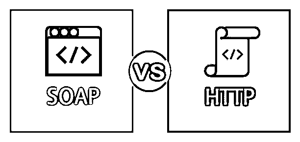

# SOAP vs HTTP

> 原文：<https://www.educba.com/soap-vs-http/>

## SOAP 和 HTTP 的区别

SOAP 最初被定义为 S-简单 O-对象 A-访问 P-协议。它是一种用于交换结构化信息的协议规范。它用于在基于计算机的网络中实现 web 服务。对于其消息格式，SOAP 依赖于 XML 信息集，有时也依赖于其他应用层协议，如超文本传输协议(HTTP)或简单邮件传输协议(SMTP)(T1)。它主要用于消息协商和传输。SOAP 构成了 web 服务协议栈的基础层。HTTP 或超文本传输协议(HTTP)是一种用于分布式、协作式和超媒体信息系统的应用协议。HTTP 被广泛认为是万维网(WWW)数据通信的基础。超文本是一种结构化文本，在包含文本的节点之间使用逻辑链接或超链接。HTTP 是交换或传输超文本的协议。当它被创新时，HTTP 的标准开发是由因特网工程任务组和万维网联盟(也称为 W3C)协调的。

### SOAP 和 HTTP 的直接比较(信息图表)

下面是 SOAP 和 HTTP 的 9 大区别

<small>网页开发、编程语言、软件测试&其他</small>

### SOAP 和 HTTP 的主要区别

两者都是市场上的热门选择；让我们来讨论一些主要的区别。

*   用户可以通过 HTTP 提供任何类型的内容，如 HTML、声音、图像、视频等。SOAP 是一种基于 XML 的消息编码，正如我们已经知道的，它通常通过 HTTP 发送，但是它也可以通过 SMTP 甚至 FTP 类型的协议发送，尽管在生产环境中很少使用这样的系统。
*   HTTP 位于 TCP/IP 之上，同样，SOAP 位于 HTTP 之上。我们可以想象一层又一层。
*   如果查看一个 SOAP 请求，我们可以看到两个层；HTTP headers 层将位于顶部，紧接着是 SOAP 消息。
*   SOAP 通常处理独立于平台的数据格式(例如 XML ),以从应用服务器请求和接收数据。
*   HTTP 处理网络级协议。
*   理解这种区别的直观类比如下:
    SOAP 是打包装运箱的人。
    HTTP 作为递送包裹的递送卡车。
*   HTTP 协议由两个元素组成:HTTP 头和 HTTP 体。当 HTTP 主体仅由纯 XML 文档组成而没有其他内容时，它被称为普通 HTTP；但是在 SOAP 格式中，HTTP Body 包含 SOAP header 和 soap body，统称为 SOAP envelope，这样的 envelope 也支持附件。
*   HTTP URL:HTTP URL 的一个例子如下。

`http://host:port/abc/xi/adapter_plain?service=BS_A&namepsace=http_test&interface=SI_A>`

*   SOAP URL:SOAP URL 的一个例子如下

`http://host:port/XISOAPAdapter/MessageServlet?channel=party:service:channel`

*   soap 消息通常会被打包在 SOAP 信封中。HTTP 不充当适配器引擎中的适配器，但 soap 实际上是一个适配器，即 HTTP 不需要通信通道来进行通信，但 SOAP 需要。用户可以使用 soap 客户端发送 SOAP 消息。
*   当用户需要将他/她的数据从 web 服务发送到 XI 时，会使用用户的 SOAP 适配器。

当用户希望将来自 web 应用程序的 HTTP 请求消息发送到 XI 时，会使用 HTTP 适配器，因此有一个重要的区别。

例如: <我>我怎样才能在不使用任何工具如 XML Spy 等的情况下使用 SOAP 发送方适配器。</我>

*   当用户向 XI 发送 SOAP 信息时，XML Spy 最常被用作测试工具。然而，为了实际发送数据，用户需要首先配置一个 web 服务，然后构造一个 SOAP 请求消息，之后提交数据。
*   SOAP 发送方适配器从整个 SOAP 信封消息本身中提取 XML 消息。用户也可以使用 HTTP 适配器及其适当的映射来实现同样的目的。HTTP 适配器比 SOAP 性能更好，也更稳定，因为其中只使用了 WAS 的 ABAP 部分，也称为本机适配器。

### SOAP 与 HTTP 对照表

下面是 9 个最上面的比较

| **肥皂** | **HTTP** |
| 它支持 web 套接字或 WS-Addressing、WS-Security 和 SOAP 头。 | HTTP 消息流从不使用 web 套接字或 WS-Addressing、WS-Security、SwA 或 MTOM。 |
| 常见的 SOAP 具有独立于比特流格式的逻辑树格式。 | HTTP 使用不同的标准，比如 REST 或 XML-RPC。 |
| SOAP 允许针对 WSDL 进行运行时检查。 | 在 HTTP 中不可用。 |
| 这里可以自动处理带附件的 SOAP(SwA)。 | 在 HTTP 中，消息流只与 Web 服务交互。 |
| 消息传输优化机制(MTOM)的自动处理也是可行的。 | HTTP 节点也可以处理 SwA 消息，但是它们必须使用 MIME 消息域，并且应该完成设计流以显式处理附件。应该编写提取和解析 SOAP 的定制逻辑。 |
| SOAP 是一种交换基于 XML 的消息的协议，SOAP 应该使用 HTTP 来传输这些消息，这一点在引言部分已经解释过了。 | 另一方面，HTTP 是一种通过网络传输消息的通信协议，不像 SOAP。 |
| 如前所述，SOAP 代表简单对象访问协议。它是一种用于访问 web 服务的基于 XML 结构的协议。 | Http 或超文本传输协议是传输使用的协议。它也被称为无状态协议，因为在 HTTP 中每个命令都是独立执行的。命令不需要知道在它们之前的命令。 |
| SOAP 提供了一种在不同操作系统上运行的应用程序之间进行通信的机制，这些应用程序使用不同的技术，大多数时候也使用不同的编程语言。 | 使用 HTTP 很难实现对用户输入做出智能反应的网站。 |
| soap 只是一个正在使用的数据交换协议，SOAP 消息在协议的 HTTP 主体里面。 | HTTP 的上述缺点正在许多新技术中得到解决，如 ActiveX、Java、JavaScript 等。 |

### 结论

SOAP 消息通常采用 XML 格式，并且通常使用 HTTP 发送。SOAP 在提供者和消费者之间使用 WSDL 通信方法；另一方面，REST 在大多数情况下只是使用 [XML 或 JSON](https://www.educba.com/json-vs-xml/) 来发送和接收数据。SOAP 首先构建一个基于 XML 的协议，然后在它之上使用 HTTP，有时也使用 TCP/IP。因此，通过这篇 SOAP 与 HTTP 的文章，解释和阐述了 SOAP 与 HTTP 的重要区别。

### 推荐文章

这是 SOAP vs HTTP 的顶级公司指南。在这里，我们还讨论了 SOAP 和 HTTP 的主要区别，并提供了信息图表和比较表。你也可以看看下面的文章来了解更多。

1.  [分析师与助理](https://www.educba.com/analyst-vs-associate/)
2.  [吉拉 vs 特雷罗](https://www.educba.com/jira-vs-trello/)
3.  [RDBMS vs DBMS](https://www.educba.com/dbms-vs-rdbms/)
4.  [RDBMS vs NoSQL](https://www.educba.com/rdbms-vs-nosql/)

