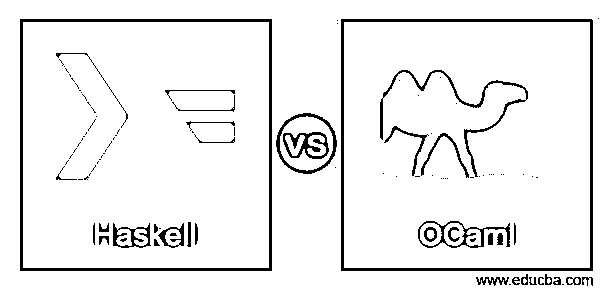

# Haskell 诉 OCaml 案

> 原文：<https://www.educba.com/haskell-vs-ocaml/>

## Haskell vs OCaml 的定义

Haskell 也是一种通用编程语言，但它是一种函数式编程语言，它也基于 lambda 演算。它于 1990 年推出。如果我们用 Haskell 编写一个程序，它将总是以数学函数的形式表示，这些函数有它们的好处。另一方面，我们有 OCaml，它也是一种通用编程语言，也为我们提供了面向对象的特性，OCaml 是开源和免费的。它提供了更多的特性，比如模式匹配、异常处理、自动垃圾收集等等，我们将在本教程的下一节中详细介绍这些特性。同样在本教程中，我们将仔细查看两种语言的内部描述，以便更好地理解。

### Haskell 与 OCaml 的正面比较(信息图)

以下是 Haskell 和 OCaml 之间的 11 大区别:

<small>网页开发、编程语言、软件测试&其他</small>

### 对照表

| 哈斯克尔 | **OCaml** |
| On the other hand, Haskell is a strictly typed programming language. IN short, we can say it is a functional programming language. | OCaml is a general-purpose programming language. |
| Haskell 像 java、c、c++一样是一种严格类型的语言，所以只在编译时检查错误是非常容易的。 | 它通常是 Caml 的扩展，Caml 进一步代表分类抽象机器语言，这里 O on OCaml 代表目标。 |
| 另一方面，Haskell 被 Wagon、thought-out 和 DoxIQ 使用 | 它被许多组织使用，包括脸书，思杰，彭博等。 |
| Haskell 基于 lambda 演算，而且我们用 Haskell 写的每个函数都是数学函数，这导致了更少的错误。 | Ocaml 用于主要集中于程序员分析器、解释器、编译器的应用程序，以及涉及自动定理证明器和符号表示的应用程序 |
| Haskel 稳定版于 2010 年由 Paul Hudak 设计 | 它是在 1996 年与几个开发者 Xavier Leroy，Didier 和许多其他人一起发布的 |
| 函数式编程语言越来越并行，因此也提供了更好的性能。 | Ocaml 是由用 LIPS 编写的解释器实现的 |
| 另一方面，Haskell 可以用来设计和处理列表处理和符号计算应用程序。 | Ocaml 为我们提供了许多特性，包括异常处理、模式匹配、类型推断、静态类型、尾部递归等等 |
| Some of the features which are provided by Haskell make it a better choice to use over Java, C, and another programming like :模块化、懒惰、函数式语言、可维护性等。 | 这种语言还具有面向对象编程语言的特点，是 CAML 的扩展。 |
| 另一方面，Haskell 被开发来非常有效地处理多线程 | 正如我们已经知道的，这是一种奇怪的语言，它只在编译时帮助我们识别错误，而且它还为我们提供了非常有效的实现。 |
| 它基于 lambda 演算和置换函数 | Ocaml 还支持和提供了如此多的数据类型，包括两类基本的和复杂的数据类型，如数组、元组、数据流等， |
| We have three types of installers available for Haskell to be installed on the machine. which area as :Haskell 平台，堆栈设置，最小设置。 | 这种语言主要用于编程教学，各种学术项目都是用 OCaml 语言编写的。 |

### Haskell 和 OCaml 的主要区别

让我们讨论 Haskell 和 OCaml 之间的一些主要区别:

到目前为止，我们已经知道两者都是通用编程语言。但两者基于不同的平台，在语法、功能等方面也有所不同。在本节中，我们将了解它们是什么以及如何使用它们。我们还将看到它们的语法如何使用两种语言定义函数和变量。下面我们开始看；

1)首先我们谈一下，Haskell 它是一种纯粹的函数式编程语言。函数是基于数学函数用 Haskell 编写的，这有利于减少错误。如果我们使用下面描述的这种语言，它提供了各种好处；

1.  a)如果我们用 Haskell 编写任何应用程序，它将为我们提供更高的可靠性和更少的错误。
2.  b)通过使用它，我们可以提高开发人员的生产力。
3.  c)用 Haskell 编写的代码易于阅读、更新、易于维护，而且非常清晰。

2))正如我们现在已经知道的，Haskell 是函数式编程，所以这提供了易于维护的优点，并且在应用程序中具有高度的可修改性。Haskell 提供的另一个优势是，如果您想用 Haskell 开发一个规范或原型，那么它可以很容易地执行、调试和测试。

3)另一方面，如果我们谈到 Ocaml 编程语言，它是一种通用的编程语言，为我们提供了面向对象的特性，也为异常处理提供了很好的支持。

现在我们将更详细地了解它的特征，以便更好地理解；

1) Ocaml 为我们提供了本机代码编译器，除了它现有的编译器之外，它还为我们提供了一个额外的编译器，帮助我们获得各种架构的机器代码。

2) Ocaml 还通过使用垃圾收集器为我们提供了自动内存管理，这是非常快速和不引人注目的。

3)它为我们提供了可移植的字节码编译器，帮助我们创建独立的应用程序。

4)它主要用于开发包括编译器、解释器、符号计算、程序分析器和定理证明器的应用程序，也广泛用于教学编程语言，一些学术项目是用 OCaml 语言编写的。

5) Ocaml 是一种函数式编程语言，我们可以使用我们想要的函数，因为对此没有限制。

6) OCaml 还为我们提供了各种内置数据类型，这些数据类型进一步分为两类

*   x)基本数据类型:包括常见的数据类型，如字符串、字符、整数、布尔等。
*   y)复杂的数据类型:这包括桩、队列、元组、数据流等等。

### 结论

这两种语言都是通用的函数式编程语言，有各自的用法和实现。根据它们的特点和优势，我们可以在应用程序中根据我们的需求使用它们。

### 推荐文章

这是 Haskell vs OCaml 的指南。这里我们分别用信息图和比较表来讨论 Haskell 和 OCaml 的主要区别。您也可以看看以下文章，了解更多信息–

1.  [WebGL vs OpenGL](https://www.educba.com/webgl-vs-opengl/)
2.  [DirectX vs Vulkan](https://www.educba.com/directx-vs-vulkan/)
3.  [AutoCAD vs SolidWorks](https://www.educba.com/autocad-vs-solidworks/)
4.  [AutoCAD vs FreeCAD](https://www.educba.com/autocad-vs-freecad/)

