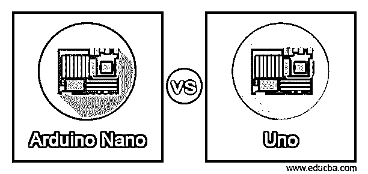
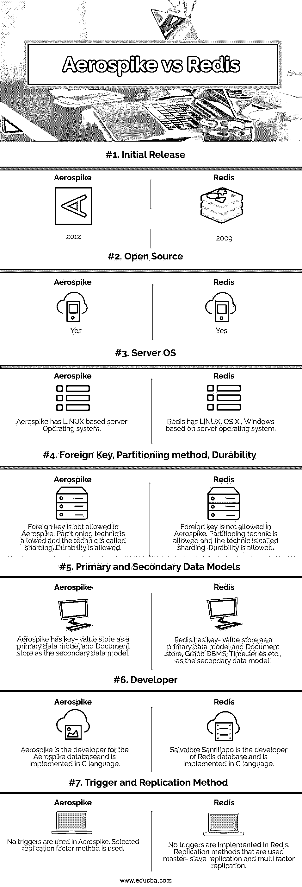

# Arduino Nano vs Uno

> 原文：<https://www.educba.com/arduino-nano-vs-uno/>

## Arduino Nano 与 Uno 的区别

基于 AT Mega 的小型试验板被称为 Arduino Nano。它有 14 个数字输入输出引脚和 8 个模拟引脚。这是 Arduino 中最小的试验板。重量仅为 7 克，功耗为 19 毫安。Uno 是采用 ATMega328P 的 Arduino 开源微控制器板。有数字和模拟输入/输出引脚，可与系统中不同的扩展板或电路连接。微控制器 Uno 中有一个在线系统编程头和一个 16MHz 陶瓷谐振器。

### Arduino Nano 与 Uno 的面对面比较(信息图)

以下是 Arduino Nano 与 Uno 的 9 大对比:

<small>网页开发、编程语言、软件测试&其他</small>

### Arduino Nano 与 Uno 的主要区别

我们来讨论一下 Arduino Nano 与 Uno 的顶级对比:

*   Nano 的尺寸是 1.7 英寸 x 0.73 英寸，Uno 是 2.7 英寸 x 2.1 英寸，这表明 Nano 比 Uno 小得多。Uno 的价格从 20 美元到 23 美元不等，而 Nano 的价格要低得多，接近 7 美元。两者都可以使用标准 A/B USB 电缆连接到计算机，该电缆是微控制器系统的一部分。如果工作空间更小，还是配 Nano 好。
*   Nano 在两者之间有大量的引脚。系统中使用了 14 个数字引脚和 8 个模拟引脚。Uno 有同样的 14 个数字引脚，只有 6 个模拟引脚。在数字引脚中，6 个在 Nano 和 Uno 中具有 PWM。Uno 使用常规 USB 端口，而 Nano 使用迷你 USB 端口。
*   Nano 和 Uno 的时钟速度都是 16MHz，内存也保持不变。Nano 的闪存为 32kB，预装了引导程序，而 Uno 的闪存为 32kB，没有引导程序。
*   静态随机存取存储器用于 Arduino 系统。Uno 具有 2kB SRAM 空间，而 Nano 在系统中具有 8kB SRAM 空间，因此它可以存储比 Uno 更多的数据。当程序启动并运行时，由于其 SRAM 空间和巨型系统，可以在 Nano 中创建和操作变量，而在 Uno 中不会发生这种情况。
*   这些程序可以用 Uno 编写，只要把它直接连接到个人电脑上就可以了。但这在纳米系统中是做不到的。在 Nano 试验板上编写程序需要一个串行到 TTL 转换器。
*   如果项目需要更少的存储空间，给出的空间也很小，那么最好使用 Nano，因为 Nano 的尺寸很小，规格或多或少与 Uno 相似。因此，它在存储和内存容量方面做了 Uno 所做的所有工作，但希望用系统中较少的空间进行调整。如果需求是虚构的，最好使用 Nano，如果开发项目和代码需要它，Uno 可以更好地利用这种能力。
*   由于 Uno 中的模拟引脚数量较少，所以为 Uno 编写的所有代码都可以与 Nano 一起工作。但为 Nano 编写的代码在 Uno 中无法工作，因为 Nano 中有 8 个模拟引脚，而 Uno 中只有 6 个模拟引脚。

### Arduino Arduino Nano 与 Uno 对比表

下表总结了 Arduino Nano 与 Uno 之间的比较:

| **Arduino Nano** | **Uno** |
| 制造商使用 Nano 来学习和分析 Arduino 的工作原理，他们从较小尺寸的试验板开始制造系统。 | Uno 是流行的 Arduino，因为它的尺寸较小，并且与系统中的软件和硬件兼容。 |
| 尺寸很小，比所有其他 Arduino 试验板都小，这有助于它将自己限制在系统中任何以空间为中心的应用程序或项目中。 | 与 Nano 相比，其尺寸相当大，但由于其在系统中的工作和所使用的特征而更受欢迎。如果应用程序不是以空间为中心的，最好使用 Uno。 |
| 在微控制器中使用集成开发环境，使其与用户协同工作。 | 没有用户界面，因此使用的界面较少。建筑是轻的。 |
| 控制器中没有电源调节器，如果需要外部电源，在使用 Nano 时，必须在系统中使用 5V 稳压电源。 | Uno 在板上有一个电源调节器来控制控制器的电源。这有助于保持董事会的权力不变。此外，它还能防止电路板短路。 |
| 所用的微控制器是 Mega 328 和 Mega 168，这取决于项目的用途和使用它的程序员。 | 在 Uno 中微控制器总是在 Mega 328。 |
| 可编程微控制器不可用，但 Nano 中的 USB UART 接口可用于管理任务。UART 接口为 FT232RL。 | 使用可编程微控制器，以便在具有 ATMega 16U2 的系统中可以容易地修改任务。 |
| 这里没有使用以太网屏蔽，这对于自动化程度较高的小程序来说更好。 | 如果应用是简单的传感器、GPS、电机控制或报警，最好使用 Uno 微控制器。 |
| 在 Nano 中，每个 I/O 的功率为 40 微安，对于交付大型项目来说，这个功率并不大。 | 在 Uno 中，每个 I/O 的功率为 20 微安，因此功率传输较少。 |
| 永久存储内存为 0.51kB EEPROM，系统中增加了工作存储和记忆存储。 | 永久存储器是 1kB EEPROM，还有其他工作存储器和闪存存储器。 |
| Nano 没有 Arduino 屏蔽，但在试验板中设置了一个引脚头，以便在可用插座的帮助下可以更容易地制作原型。 | Uno 可以连接到 Arduino shields，并具有引脚接头排列，使其与系统中的任何其他试验板兼容。 |

### 结论

如果项目简单，成本低，外形小，最好使用 Nano，它可以用于便携式电子设备和传感器采集。如果需要使用以太网屏蔽进行桌面原型制作，那么 Uno 是最佳选择，它们也可以用于 IOT 传感器。

### 推荐文章

这是 Arduino Nano vs Uno 的指南。在这里，我们还将讨论 Arduino Nano 与 Uno 的主要区别，包括信息图表和对比表。您也可以看看以下文章，了解更多信息–

1.  [网络设备类型|前 8 种类型](https://www.educba.com/types-of-network-devices/)
2.  [道德黑客工具概述](https://www.educba.com/ethical-hacking-tools/)
3.  [FTP vs SFTP | 12 强对比](https://www.educba.com/ftp-vs-sftp/)
4.  [Wi-Fi 与以太网的主要区别](https://www.educba.com/wifi-vs-ethernet/)

