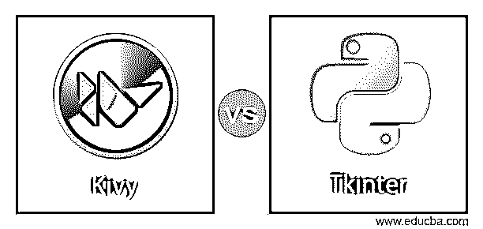

# 基维 vs 特金特

> 原文：<https://www.educba.com/kivy-vs-tkinter/>

## Kivy 与 Tkinter 的区别

Kivy 被定义为一个 python 库或工具，它是一个免费的开源 Python 框架，用于开发或设计创新而又有吸引力的用户界面应用程序，其中还包括多点触摸应用程序的附加功能，它在应用程序中提供了一个类似于移动应用程序的触摸屏选项，并且该库也可以用于任何多点触摸应用程序。Tkinter 也是一个标准的 Python 库，它是一个内置库，提供了一个 Tkinter 包，用于为 Python 附带的 Tk GUI 工具包开发图形用户界面应用程序。Tkinter 是最常用的 Python 接口，可以更快更容易地创建 GUI 应用程序。在这个话题中，我们将学习 Kivy vs Tkinter。

### Kivy 与 Tkinter 的面对面比较(信息图)

以下是 Kivy 和 Tkinter 之间的主要区别

<small>网页开发、编程语言、软件测试&其他</small>

### Kivy 和 Tkinter 的主要区别

以下是下面提到的主要区别

#### 1.安装过程

在 Kivy 中，我们需要使用 pip 命令安装这个框架，其中 Python 不是所有的版本都已经安装了 pip，所以首先我们需要安装 pip，然后我们需要安装 kivy，这是一个非常复杂的安装过程。鉴于 Tkinter 是一个内置的标准 Python GUI，这意味着它几乎在所有版本的 Python 安装中都有，并且不需要安装，因为它可以作为 tk 直接导入，以便在开发应用程序时包含 Tkinter。因此，与 Kivy 相比，Tkinter 在安装方面更好，Kivy 有时对开发人员来说学习和安装起来很复杂。

#### 2.更好的应用程序开发框架

在 kivy 中，这是一个为具有高功能的创新用户界面开发应用程序的开源软件，更适合开发移动或多点触摸应用程序，Kivy 在使用 Kivy 语言时是用户友好的。然而 Tkinter 不是任何语言，但它是一个用于开发 GUI 应用程序的跨平台框架，这意味着它主要用于为桌面应用程序创建一个完整的数据库连接 GUI，并且它不支持开发移动应用程序。

#### 3.平台和功能工具支持

Kivy 可以在各种平台上运行，如 Raspberry Pi、Android、Microsoft Windows、OS X、iOS 和许多其他支持 Kivy 的相关平台，这为开发计算机和移动应用程序以及使用其工具包开发其他多点触摸应用程序提供了各种功能，该工具包包括 20 个用于设计或开发应用程序的小部件。但是请注意，在 Kivy 中，有一些小部件的功能与其他小部件相同，这意味着相同的功能，但是小部件的名称不同。然而，Tkinter 也可以在各种平台上运行，例如 Microsoft Windows、Linux、UNIX 和 Mac OS 平台，并且该 Tkinter 提供了各种功能，它导入 tk 以将该 Tkinter 包括在 Python GUI 编程中，使用各种小部件集来开发主要在计算机或桌面设备应用上支持的应用，并且不支持移动或多点触摸应用。

### Kivy 和 Tkinter 之间的比较表

| **序列号** | **Kivy** | **Tkinter** |
| One | Kivy 是一个开源的免费 python 框架，用于开发用户界面应用和多点触控应用。 | Tkinter is also another Python library for developing GUI apps which is usually a combination of the Tk GUI toolkit and Python GUI framework. |
| Two | 要安装 Kivy，我们需要在 Python IDE 中需要安装 pip 的地方使用 pip 命令。 | 不需要安装 Tkinter，因为它是用于 GUI 开发桌面应用程序的内置 Python 标准库。 |
| Three | 在 Kivy 工具包通常是开发，备份，然后在任何商业产品中使用。 | 在 Tkinter 中，这个 Tkinter 标准 Python 库已经提供了一个 Tk 工具包。我们只需要将 Tkinter 作为 tk 导入即可。 |
| Four | 这些用于开发移动应用或多点触控应用以及桌面应用。 | Tkinter 主要用于开发桌面应用程序，因为它不像 Kivy 那样提供任何开发移动应用程序的功能。 |
| Five | Kivy 可以运行在微软 Windows，Raspberry Pi，Android，iOS 和 OS X 或任何其他支持 Kivy 的平台上。 | Tkinter 可以在 Microsoft Windows、Linux、Unix 和 Mac OS X 安装版本的 Python 等平台上运行。 |
| Six | Kivy 是一个开放源码的 100%免费版本，由 MITL 授权麻省理工学院开发商业应用程序或产品。 | Tkinter 也是 PL 下的开源免费软件版本，PL 是用于开发商业产品或应用程序的 Python 许可证。 |
| Seven | Kivy 还提供了一个工具包，其中有 20 个小部件用于控制应用程序，如标签、布局、按钮等。，它们是用 Cython 编写的，并用回归测试进行了测试。 | Tkinter 提供了许多不同的小部件，用于使用按钮、标签、文本框、框架等控制应用程序。，这使得小部件在开发应用程序时成为构建模块。 |
| Eight | Kivy 使用一些输入设备，如鼠标，双鼠标。苹果的产品，TUIO 等。 | Tkinter 只能使用键盘或鼠标作为输入设备。它不支持任何更多的输入设备，如 Kivy。 |
| Nine | Kivy 中的几何图形管理是使用 GridLayout 完成的，GridLayout 位于布局容器下，该 GridLayout 还以行和列的形式排列小部件，并根据布局的类型来确定或添加大小和位置等属性，在这种情况下，可以使用 size_hint 和 pos_hint 来计算窗口的大小和位置。 | Tkinter 中的几何管理主要使用 Python 提供的一些特殊方法来完成。Tkinter 使用 grid()将微件设计成 2D 表格形式的行和列，使用 pack()将微件打包成行和列，使用 place()设置窗口的位置和大小。 |
| Ten | Kivy 广泛用于在 Python 编程中开发更动态、更高级的应用。 | Tkinter 主要由开发 GUI 的初学者使用，他们只想为计算机开发 GUI。 |

### 结论

这篇文章的结论是，Kivy 是用户界面应用开发的开源免费软件，主要以开发需要手动安装的移动或多点触控应用而闻名。如果开发人员只想开发桌面应用程序，那么 Tkinter 更好，它对用户友好，有各种简单易学的小部件和文档。

### 推荐文章

这是基维 vs Tkinter 的攻略。这里我们用信息图和比较表来讨论 Kivy 和 Tkinter 的主要区别。您也可以看看以下文章，了解更多信息–

1.  [鲍尔 vs NPM–最大差异](https://www.educba.com/bower-vs-npm/)
2.  【WCDMA 与 GSM 的对比
3.  [找出 UMTS 与 LTE 的区别](https://www.educba.com/umts-vs-lte/)
4.  [CouchDB vs MongoDB](https://www.educba.com/couchdb-vs-mongodb/)

